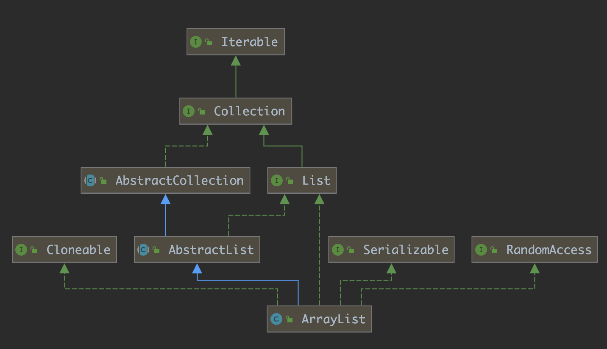

# ArrayList 源码学习

JDK 版本：1.8

Each ArrayList instance has a capacity. The capacity is the size of the array used to store the elements in the list. It is always at least as larger as the list size. As elements are added to an ArrayList, its capacity grows automatically. The details of the growth policy are not specified beyond the fact that adding an element has constant amortized time cost.

ArrayList 的简单介绍以及使用方法我就不介绍了，这里只针对它的源码分析。

首先 ArrayList 是线程不安全的，而 Vector 是线程安全版的 ArrayList。

## Hierarchy



上图是 java.util.ArrayList 的继承结构。

java.lang.Cloneable、java.io.Serializable 和 java.util.RandomAccess 都是标记接口，分别用来表示某个类或接口具备克隆、序列化和随机访问的能力。

java.util.List 接口定义了列表这种数据结构应有的能力，即接口，而 java.util.AbstractList 则为 List 提供了一种概要实现。

下面从各个角度逐渐分析ArrayList的源码。

## 成员变量

```java
/**
 * Default initial capacity.
 */
private static final int DEFAULT_CAPACITY = 10;
```

当调用无参构造方法时，该值就是 ArrayList 的默认容量，值为 10。

```java
/**
 * The array buffer into which the elements of the ArrayList are stored.
 * The capacity of the ArrayList is the length of this array buffer. Any
 * empty ArrayList with elementData == DEFAULTCAPACITY_EMPTY_ELEMENTDATA
 * will be expanded to DEFAULT_CAPACITY when the first element is added.
 */
transient Object[] elementData; // non-private to simplify nested class access
```

这是 ArrayList 存储元素的数组，它是 Object 类型的，而 ArrayList 是一个泛型类，因此我们得以知道，在对元素进行操作的时候，肯定是需要进行强制数据类型转换的。

```java
/**
 * Shared empty array instance used for empty instances.
 */
private static final Object[] EMPTY_ELEMENTDATA = {};
```

共享的空 Object 数组。

```java
/**
 * Shared empty array instance used for default sized empty instances. We
 * distinguish this from EMPTY_ELEMENTDATA to know how much to inflate when
 * first element is added.
 */
private static final Object[] DEFAULTCAPACITY_EMPTY_ELEMENTDATA = {};
```

为具有默认容量的 ArrayList 实例而准备的共享空 Object 数组，根据 DEFAULTCAPACITY_EMPTY_ELEMENTDATA 和 EMPTY_ELEMENTDATA 可以区分当添加第一个元素到 ArrayList 时如何进行扩展。

```java
/**
 * The size of the ArrayList (the number of elements it contains).
 *
 * @serial
 */
private int size;
```

size 变量描述了 ArrayList 中存储的元素数量

```java
protected transient int modCount = 0;
```

该变量从 AbstractList 中继承而来，该变量的数值大小描述了一个 list 在结构上被修改的次数。结构修改（Structural modifications）指的是改变 list 元素数量或者以其他的方式干扰 list 使得迭代过程可能产生错误的结果。

## 方法

### 构造方法

ArrayList 中有三个构造方法

第一个是有一个 int 类型参数的构造方法，这个参数就是初始化容量：

```java
/**
 * Constructs an empty list with the specified initial capacity.
 */
public ArrayList(int initialCapacity) {
    if (initialCapacity > 0) {
        this.elementData = new Object[initialCapacity];
    } else if (initialCapacity == 0) {
        this.elementData = EMPTY_ELEMENTDATA;
    } else {
        throw new IllegalArgumentException("Illegal Capacity: "+
                                           initialCapacity);
    }
}
```

可以看出，当我们的参数（initialCapacity）大于零时，直接创建一个Object数组，将引用赋值给存储元素的数组变量；当参数等于零时，使用上面的静态成员变量 EMPTY_ELEMENTDATA，即一个空数组来初始化 elementData；当参数小于零时，抛出非法参数异常。

第二个是默认的无参构造方法：

```java
/**
 * Constructs an empty list with an initial capacity of ten.
 */
public ArrayList() {
    this.elementData = DEFAULTCAPACITY_EMPTY_ELEMENTDATA;
}
```

这时是使用静态成员变量中默认的空数组来初始化 elementData。DEFAULTCAPACITY_EMPTY_ELEMENTDATA 和 EMPTY_ELEMENTDATA 虽然都是两个空数组，但是这两个的含义不一样，DEFAULTCAPACITY_EMPTY_ELEMENTDATA 只在无参构造方法中被使用，它意味着 ArrayList 的初始容量为 10，而 EMPTY_ELEMENTDATA 指的是构造方法中的 initialCapacity 参数为 0，意味着 ArrayList 的初始容量为 0。

第三个就是使用一个集合来初始化 ArrayList 对象，参数需继承 Collection 接口。

```java
public ArrayList(Collection<? extends E> c) {
    elementData = c.toArray();
    if ((size = elementData.length) != 0) {
        // c.toArray might (incorrectly) not return Object[] (see 6260652)
        if (elementData.getClass() != Object[].class)
            elementData = Arrays.copyOf(elementData, size, Object[].class);
    } else {
        // replace with empty array.
        this.elementData = EMPTY_ELEMENTDATA;
    }
}
```

该构造方法将集合中的元素都放入一个数组中。

### get

```java
// Positional Access Operations

@SuppressWarnings("unchecked")
E elementData(int index) {
    return (E) elementData[index];
}

/**
 * Returns the element at the specified position in this list.
 *
 * @param  index index of the element to return
 * @return the element at the specified position in this list
 * @throws IndexOutOfBoundsException {@inheritDoc}
 */
public E get(int index) {
    rangeCheck(index);

    return elementData(index);
}
```

get 方法非常简单，首先进行了范围检查，然后使用 index 返回对应位置的元素，会对元素进行强制类型转换。

### remove

根据索引位置删除元素

```java
public E remove(int index) {
    rangeCheck(index);

    modCount++;
    E oldValue = elementData(index);

    int numMoved = size - index - 1;
    if (numMoved > 0)
        System.arraycopy(elementData, index+1, elementData, index,
                            numMoved);
    elementData[--size] = null; // clear to let GC do its work

    return oldValue;
}
```

remove 方法首先也进行了 index 检查，随后让 modCount 自增，因为 remove 操作减少元素会改变列表的结构。在删除成员的时候，remove 采用了复制数组的方式来删除，即通过 size 和 index 计算出要移动的元素数量，再用系统拷贝函数将后面的元素都往前移动一位，将要删掉的元素覆盖，最后再将数组最后一位元素置空。

remove 还有一个重载的方法，即根据对象删除元素

```java
public boolean remove(Object o) {
    if (o == null) {
        for (int index = 0; index < size; index++)
            if (elementData[index] == null) {
                fastRemove(index);
                return true;
            }
    } else {
        for (int index = 0; index < size; index++)
            if (o.equals(elementData[index])) {
                fastRemove(index);
                return true;
            }
    }
    return false;
}

/*
 * Private remove method that skips bounds checking and does not
 * return the value removed.
 */
private void fastRemove(int index) {
    modCount++;
    int numMoved = size - index - 1;
    if (numMoved > 0)
        System.arraycopy(elementData, index+1, elementData, index,
                            numMoved);
    elementData[--size] = null; // clear to let GC do its work
}
```

该方法接受一个对象，会先遍历 list 找到这个对象（equals 返回值为 true）的 index，然后也是和上面同样的方法来删除元素。

> Removes the first occurrence of the specified element from this list, if it is present.

上面那一句是源码中对该方法的注解。我们知道，ArrayList是可以存储重复值的，因此根据对象来删除元素时，是删除第一次匹配到的元素。

### add

`add(E e)` 方法将元素追加在 list 的末尾。

```java
public boolean add(E e) {
    ensureCapacityInternal(size + 1);  // Increments modCount!!
    elementData[size++] = e;
    return true;
}
```

在这里面我们最需要关注的就是 ensureCapacityInternal 这个方法，它接受一个参数，该参数的含义是 the desired minimum capacity，即 ArrayList 所需要的最小容量。调用该方法会使 modCount 的值自增。

ArrayList 中对 list 容量管理的有好几个方法，如下：

```java
/**
 * Increases the capacity of this <tt>ArrayList</tt> instance, if
 * necessary, to ensure that it can hold at least the number of elements
 * specified by the minimum capacity argument.
 *
 * @param   minCapacity   the desired minimum capacity
 */
public void ensureCapacity(int minCapacity) {
    int minExpand = (elementData != DEFAULTCAPACITY_EMPTY_ELEMENTDATA)
        // any size if not default element table
        ? 0
        // larger than default for default empty table. It's already
        // supposed to be at default size.
        : DEFAULT_CAPACITY;

    if (minCapacity > minExpand) {
        ensureExplicitCapacity(minCapacity);
    }
}

private static int calculateCapacity(Object[] elementData, int minCapacity) {
    // 创建实例时如果调用的是无参的构造方法，并且列表中还没有元素时，返回 DEFAULT_CAPACITY（10）跟 minCapacity 的较大值，保证列表容量不会太小
    if (elementData == DEFAULTCAPACITY_EMPTY_ELEMENTDATA) {
        return Math.max(DEFAULT_CAPACITY, minCapacity);
    }
    return minCapacity;
}

private void ensureCapacityInternal(int minCapacity) {
    ensureExplicitCapacity(calculateCapacity(elementData, minCapacity));
}

private void ensureExplicitCapacity(int minCapacity) {
    modCount++;

    // 仅当要求的最小容量比当前数组的长度大时才进行数组扩容，否则 nothing to do
    // overflow-conscious code
    if (minCapacity - elementData.length > 0)
        grow(minCapacity);
}

private static final int MAX_ARRAY_SIZE = Integer.MAX_VALUE - 8;

/**
 * Increases the capacity to ensure that it can hold at least the
 * number of elements specified by the minimum capacity argument.
 *
 * @param minCapacity the desired minimum capacity
 */
private void grow(int minCapacity) {
    // overflow-conscious code
    int oldCapacity = elementData.length;

    // 新数组长度变成原来的 1.5 倍，如果新的数组长度比 minCapacity 还小，则采用 minCapacity 作为新数组的长度
    int newCapacity = oldCapacity + (oldCapacity >> 1);
    if (newCapacity - minCapacity < 0)
        newCapacity = minCapacity;
    if (newCapacity - MAX_ARRAY_SIZE > 0)
        newCapacity = hugeCapacity(minCapacity);
    // minCapacity is usually close to size, so this is a win:

    // 数组扩容并拷贝元素
    elementData = Arrays.copyOf(elementData, newCapacity);
}

/**
 * 检查数据逸出，处理大容量
 */
private static int hugeCapacity(int minCapacity) {
    if (minCapacity < 0) // overflow
        throw new OutOfMemoryError();
    return (minCapacity > MAX_ARRAY_SIZE) ?
        Integer.MAX_VALUE :
        MAX_ARRAY_SIZE;
}
```

上面的这些容量管理方法中，除了 ensureCapacity，其他方法都是私有的，ensureCapacity 方法可以让调用者主动扩容 ArrayList，当你拿到一个 ArrayList 且想要往其中添加大量元素时，为了避免频繁扩容带来的时间成本，可以调用该方法一次性扩大到你想要的容量。

### indexOf

```java
public int indexOf(Object o) {
    if (o == null) {
        for (int i = 0; i < size; i++)
            if (elementData[i]==null)
                return i;
    } else {
        for (int i = 0; i < size; i++)
            if (o.equals(elementData[i]))
                return i;
    }
    return -1;
}
```

通过对象来获取该对象在数组中的索引位置（从上面也可以看出，ArrayList是可以存储null的），如果未找到，则返回-1。当然，ArrayList中是可以存储相同的元素的，如果有多个相同的元素，从上面的源码中我们也可以看出，返回的是第一个元素在数组中的下表。

### contains

```java
public boolean contains(Object o) {
    return indexOf(o) >= 0;
}
```

判断ArrayList中是否存在某一个对象，调用了上面的获取索引的方法。

### clear

操作次数（modCount）自增，将数组内的元素都置空，等待垃圾收集器收集，不减小数组容量。

```java
public void clear() {
    modCount++;

    // clear to let GC do its work
    for (int i = 0; i < size; i++)
        elementData[i] = null;

    size = 0;
}
```

### trimToSize

```java
public void trimToSize() {
    modCount++;
    if (size < elementData.length) {
        elementData = (size == 0)
          ? EMPTY_ELEMENTDATA
          : Arrays.copyOf(elementData, size);
    }
}
```

修改次数加 1，将 elementData 数组中后面空余的空间去除，即数组缩容。例如：数组长度为10，其中只有前三个元素有值，其他为空，那么调用该方法之后，数组的长度变为3。

## 数组拷贝

之所以要提数组拷贝，是因为 ArrayList 底层是数组结构，无论是数组扩容还是元素移动，都使用到了系统拷贝函数。

- java.util.Arrays#copyOf
- java.util.Arrays#copyOfRange
- java.lang.System#arraycopy

上面三个方法便是常用的数组拷贝函数，其中 Arrays 的 copyOf 和 copyOfRange 方法内部都是调用的 System 的 arraycopy 方法。System 的 arraycopy 方法被 native 修饰，这就表示它由非 Java 代码实现。

系统拷贝函数适合用来将数组中的一个连续的子数组复制到另一个数组中，并在目标数组中也保证位置的连续性。这样做比一个个复制元素效率要高很多。我们知道数组元素是内存连续的，当我们要拷贝一片连续内存空间的数据时，可以做一次批量操作，这样就可以节约时间成本。

## java.util.ArrayList.SubList

ArrayList 中提供了下面这样一个方法，用来返回一个子列表：

```java
public List<E> subList(int fromIndex, int toIndex) {
    subListRangeCheck(fromIndex, toIndex, size);
    return new SubList(this, 0, fromIndex, toIndex);
}
```

它返回的数据类型是 List，如果我们不看源码，很可能想当然的认为返回的数据类型也是 ArrayList，从而在使用中出现一些意想不到的问题。

SubList 是 ArrayList 中定义的一个非静态的内部类，它熟悉和构造方法如下：

```java
private class SubList extends AbstractList<E> implements RandomAccess {
    private final AbstractList<E> parent;
    private final int parentOffset;
    private final int offset;
    int size;

    SubList(AbstractList<E> parent,
            int offset, int fromIndex, int toIndex) {
        this.parent = parent;
        this.parentOffset = fromIndex;
        this.offset = offset + fromIndex;
        this.size = toIndex - fromIndex;
        this.modCount = ArrayList.this.modCount;
    }

    public E set(int index, E e) {
        rangeCheck(index);
        checkForComodification();
        E oldValue = ArrayList.this.elementData(offset + index);
        ArrayList.this.elementData[offset + index] = e;
        return oldValue;
    }

    public E get(int index) {
        rangeCheck(index);
        checkForComodification();
        return ArrayList.this.elementData(offset + index);
    }

    // remainder omitted ......
```

结合 SubList 的源码以及它的调用位置代码来看，我们可以了解到，SubList 存储了原列表的引用，并使用了 offset 机制来处理 SubList 和原列表之间的数组下标关系问题，实际上的一切操作都基于原列表，所以可以把 SubList 看作是原列表的一个视图，也就是说对于 SubList 的所有操作最终会反映到原列表上。

ArrayList 的 subList 结果不可强转成 ArrayList，否则会抛出 ClassCastException 异常:java.util.RandomAccessSubList cannot be cast to java.util.ArrayList。
