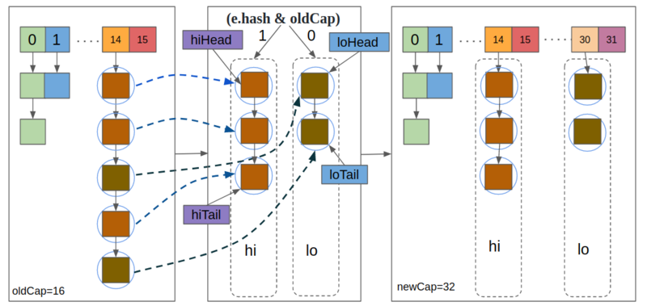

# HashMap resize之链表拆分

本文对 JDK 8 HashMap 的 resize 方法中的链表拆分做重点分析。

## resize

resize 用于以下两种情况：

- 初始化 table（table 是 HashMap 中的底层数组）
- 在 HashMap 中元素数量超过 threshold 之后进行扩容

HashMap 中的 resize 方法是 HashMap 初始化或者数组扩容时所需要调用的。

且先看 resize 方法源码：

```java
final Node<K,V>[] resize() {
    Node<K,V>[] oldTab = table;
    int oldCap = (oldTab == null) ? 0 : oldTab.length;
    int oldThr = threshold;
    int newCap, newThr = 0;

    // 原 table 已经被初始化
    if (oldCap > 0) {
        // 元素数量超过了最大限制，直接返回
        if (oldCap >= MAXIMUM_CAPACITY) {
            threshold = Integer.MAX_VALUE;
            return oldTab;
        }
        // 数组长度扩容变成两倍
        else if ((newCap = oldCap << 1) < MAXIMUM_CAPACITY &&
                    oldCap >= DEFAULT_INITIAL_CAPACITY)
            newThr = oldThr << 1; // double threshold
    }
    else if (oldThr > 0) // initial capacity was placed in threshold
        newCap = oldThr;
    else {               // zero initial threshold signifies using defaults
        newCap = DEFAULT_INITIAL_CAPACITY;
        newThr = (int)(DEFAULT_LOAD_FACTOR * DEFAULT_INITIAL_CAPACITY);
    }
    if (newThr == 0) {
        float ft = (float)newCap * loadFactor;
        newThr = (newCap < MAXIMUM_CAPACITY && ft < (float)MAXIMUM_CAPACITY ?
                    (int)ft : Integer.MAX_VALUE);
    }
    threshold = newThr;

    // 新建一个 table 来扩容
    @SuppressWarnings({"rawtypes","unchecked"})
    Node<K,V>[] newTab = (Node<K,V>[])new Node[newCap];
    table = newTab;
    if (oldTab != null) {
        for (int j = 0; j < oldCap; ++j) {
            Node<K,V> e;
            if ((e = oldTab[j]) != null) {
                oldTab[j] = null;
                if (e.next == null)
                    // 该 bin 中只有一个元素，直接放到新 table 的目标位置
                    newTab[e.hash & (newCap - 1)] = e;
                else if (e instanceof TreeNode)
                    // 如果该 bin 里是平衡树结构，则做平衡树拆分
                    ((TreeNode<K,V>)e).split(this, newTab, j, oldCap);

                // 下面是链表拆分，这是我们本文要重点解析的
                else { // preserve order
                    Node<K,V> loHead = null, loTail = null;
                    Node<K,V> hiHead = null, hiTail = null;
                    Node<K,V> next;
                    do {
                        next = e.next;
                        if ((e.hash & oldCap) == 0) {
                            if (loTail == null)
                                loHead = e;
                            else
                                loTail.next = e;
                            loTail = e;
                        }
                        else {
                            if (hiTail == null)
                                hiHead = e;
                            else
                                hiTail.next = e;
                            hiTail = e;
                        }
                    } while ((e = next) != null);
                    if (loTail != null) {
                        loTail.next = null;
                        newTab[j] = loHead;
                    }
                    if (hiTail != null) {
                        hiTail.next = null;
                        newTab[j + oldCap] = hiHead;
                    }
                }
            }
        }
    }
    return newTab;
}
```

## resize 时的链表拆分

resize 时如果遇到 bin 是链表结构，会对链表中的进行 rehash，rehash 可能会将一个链表拆分成两个子链表，并将这两个链表放到合适的 index 处。

下面我们单独来看这段链表拆分代码：

```java
Node<K,V> loHead = null, loTail = null;
Node<K,V> hiHead = null, hiTail = null;
Node<K,V> next;
do {
    next = e.next;
    if ((e.hash & oldCap) == 0) {
        if (loTail == null)
            loHead = e;
        else
            loTail.next = e;
        loTail = e;
    }
    else {
        if (hiTail == null)
            hiHead = e;
        else
            hiTail.next = e;
        hiTail = e;
    }
} while ((e = next) != null);
if (loTail != null) {
    loTail.next = null;
    newTab[j] = loHead;
}
if (hiTail != null) {
    hiTail.next = null;
    newTab[j + oldCap] = hiHead;
}
```

上面这段代码看起来比较简单，但是要理解里面其中的用意还需下点功夫，真正了解之后，才会知道其中的精妙。

### 第一段

```java
Node<K,V> loHead = null, loTail = null;
Node<K,V> hiHead = null, hiTail = null;
Node<K,V> next;
```

上面定义了五个链表引用，从变量名我们可以看出一些作者的用意。这里面定义了 lo 和 hi 两个链表，其中 loHead 和 loTail 分别指向 lo 链表的头部和尾部，hiHead 和 hiTail 依此类推。 

而 next 引用则很明显是用来遍历链表时保存下一个节点引用的变量。

### 第二段

```java
do {
    next = e.next;
    if ((e.hash & oldCap) == 0) {
        if (loTail == null)
            loHead = e;
        else
            loTail.next = e;
        loTail = e;
    }
    else {
        if (hiTail == null)
            hiHead = e;
        else
            hiTail.next = e;
        hiTail = e;
    }
} while ((e = next) != null);
```

这一段代码，外层是一个 do-while 循环，而且很容易可以看出来这个循环是在遍历数组该位置处链表。循环中的 if-else 判断语句，则是将节点插入链表的动作，当 if 条件 `(e.hash & oldCap) == 0` 满足时将节点插入 lo 链表，否则插入 hi 链表。

### 第三段

第二段弄明白之后，我们再来看第三段。

```java
if (loTail != null) {
    loTail.next = null;
    newTab[j] = loHead;
}
if (hiTail != null) {
    hiTail.next = null;
    newTab[j + oldCap] = hiHead;
}
```

这一段看上去就简单明了了。

- 如果 lo 链表非空，就把整个 lo 链表放到新 table 的 `j` 位置上
- 如果 hi 链表非空，就把整个 hi 链表放到新 table 的 `j + oldCap` 位置上

综上，我们知道这段代码的意义就是将原来的链表拆分成两个链表，并将拆分出来的两个子链表分别放到新 table 的 `j` 和 `j + oldCap` 位置上，`j` 位置就是原链表在原 table 中的位置，拆分的标准就是：

```java
(e.hash & oldCap) == 0
```

为了帮助大家理解，下面画了个示意图：



## 关于 `(e.hash & oldCap) == 0`

上面便是整个链表拆分的过程，但是这个拆分条件看起来有些奇怪，为什么要这样来拆分呢？这一节我们就来解释这一点。

首先我们要明确以下三点：

- oldCap，即原数组的长度，一定是 2 的整数次幂，这里假设是 $2^m$
- newCap，即新数组的长度，一定是 oldCap 的两倍，会是 $2^{m+1}$
- hash 对数组长度减一做与运算 `(n-1) & hash` 其实就是取 hash 的低 m 位，其中 n 是数组的长度。

下面举个例子。

我们假设 oldCap 等于 16，即 $2^4$，16-1=15，用二进制表示就是：`0000 0000 0000 0000 0000 0000 0000 1111`，可见除了低 4 位，其余位置都是 0（简洁起见，高位的 0 后面就不写了），则 `(n - 1) & hash` 自然就是取 hash 值的低四位。我们假设取得的低四位是 abcd。当我们将 oldCap 扩容为两倍时，那么新的 index 位置就变成了 `(31 - 1) & hash`，其实就是取 hash 的低 5 位，那么对于同一个 Node，低 5 位的二进制值不外乎下面两种情况：

- `1abcd`
- `0abcd`

其中 `0abcd` 与原来的 index 值是一样的，而 `1abcd = 0abcd + 10000 = 0abcd + oldCap`。

故，虽然数组长度扩大了一倍， 但是同一个 key 在新旧 table 中对应的 index 却存在一定的联系：要么一致，要么相差一个 oldCap！

而新旧 index 是否一致就体现在 hash 值的第 4 位（我们把最低位称为第 0 位），那么怎么拿到这一位的值呢？只要：

```java
hash & 0000 0000 0000 0000 0000 0000 0001 0000
```

上式就等效于

```java
hash & oldCap
```

所以，得出结论

- 如果 `(e.hash & oldCap) == 0`，则该节点在新表的下标位置与旧表一致，都为 $j$
- 如果 `(e.hash & oldCap) == 1`，则该节点在新表的下标位置为 $j + oldCap$

根据上面这个条件，我们可以将原位置的链表拆分成两个链表，然后一次性将整个链表放到新 table 对应的位置。

## 总结

resize 时的链表拆分比较巧妙，非常好的运用了数组长度为 2 的幂次方这个特性，从而快速的将一个链表拆分为两个链表。如果遇到 bin 为平衡树结构，也同样需要将平衡树拆分为两个树，其中用得到拆分条件也是一样的，只不过树的拆分更复杂一些。

