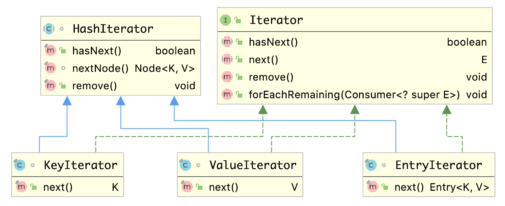

# HashMap 源码学习

## 概述

HashMap 最早出现在 JDK 1.2中，底层基于散列算法（哈希）实现。HashMap 是一个用于存储 Key-Value 键值对的集合，HashMap 允许 null 键和 null 值。HashMap 并不保证键值对的顺序，另外，需要注意的是，HashMap 是非线程安全类，在多线程环境下会存在并发问题。

在本篇文章中，我将会对 HashMap 中常用方法、重要属性及相关方法进行分析。需要说明的是，HashMap 源码中可分析的点很多，难免会有一些疏漏。

## 原理

HashMap 的每一个键值对也叫做 Entry。这些个键值对（Entry）分散存储在一个名为 table 的数组当中。

HashMap 数组每一个元素的初始值都是 Null。


要深入理解 HashMap，就要先理解 HashMap 中所用到的数据结构。HashMap 底层是一个基于数组实现的哈希表，所有元素都放在一个类型为 Node 的数组中，如下：

```java
transient Node<K,V>[] table;
```

散列算法会存在哈希冲突，为了解决哈希冲突，通常有线性探测和拉链法，HashMap 使用了拉链法，即数组中的每个元素都是一个链表结构。但是在哈希冲突频繁出现的情况下，会出现链表太长的情况，这会降低 HashMap 的查询效率，因为链表结构的查询时间复杂度跟链表的长度成正比，所以，在 JDK 1.8 中，HashMap 引入了红黑树优化过长的链表，当链表长到一定的程度，HashMap 采取了将链表结构转为平衡查找树（红黑树）的策略，从而提高查找效率。所以数组中的元素可能是链表节点，也可能是树节点。

数组的长度从一开始就确定的，我们无法去动态扩展数组。但是我们使用 HashMap 的时候好像并没有容量限制，那是因为 HashMap 内部帮我们做了扩容机制。

数组中的每个元素都是一个 bin（容器），也可以叫做 bucket（桶），这个 bin 可以是 list bin，也可以是 tree bin，list bin 可以 treeify 为 tree bin，而 tree bin 也可以 untreeify 为 list bin。

下图是 HashMap 的继承结构（hierarchy structure）：


从上图中可以看出 HashMap 的继承结构还是比较简单的，需要注意的是 HashMap 没有继承 java.util.Collection 接口，Map 接口和 Collection 接口是两个不同功能的接口。

下图是 HashMap 中的数据结构示意图：


注意 HashMap 中两个词语：capacity 和 size，size 是 HashMap 中存储的元素数量，capacity 是 HashMap 中数组的长度。

## hash

哈希表肯定少不了哈希函数，来了一个 key，需要通过哈希函数计算出这个 key 对应数组的索引。我们知道 key 都有 hashCode，那么 HashMap 是直接使用 key 的 hashCode 的吗？不是的，HashMap 中提供了这样一个静态的方法，使用该方法来计算 Entry 的 hash 值，该 hash 值将作为哈希函数的参数：

```java
static final int hash(Object key) {
    int h;
    return (key == null) ? 0 : (h = key.hashCode()) ^ (h >>> 16);
}
```

看到这个方法，应该不免有些疑惑，为什么不直接用 key 的 hashCode，还要做一些复杂的位运算操作呢？这也是很有用意的，是为了尽可能地减少哈希冲突，详细可以阅读：[HashMap hash方法原理](HashMap hash方法原理)。

从上面我们还可以看出一点东西，那就是当 key 为 null 时，该方法的返回值是0。这一点其实告诉我们，如果一个 key 为 null，那么它应该被存储在数据第一个元素对应的容器中。

该 hash 方法的返回值在 HashMap 中是作为 Node 的 hash 属性。

## Entry 的继承体系

### 静态内部类 Node&lt;K, V&gt;

我们知道 HashMap 中使用了拉链法来解决 hash 冲突问题。拉链法实际上就是链表结构，当然 HashMap 中定义了这样一个链表数据结构。此静态内部类实现了 java.util.Map.Entry&lt;K, V&gt; 接口，正是数组当中存储的数据类型。该类中维护了四个属性：

```java
static class Node<K,V> implements Map.Entry<K,V> {
    final int hash;
    final K key;
    V value;
    Node<K,V> next;
  
    // remainder omitted
} 
```

根据上面四个属性，可以很明显地看出来这是一个链表结构。我们要关注的就是这个 hash 这个属性，这个属性由上面提到的静态 hash 函数计算得出，该属性用来参与哈希函数计算来得到 index。

### 静态内部类 TreeNode&lt;K, V&gt;

HashMap 中定义了几个静态常量：

```java
/**
 * The bin count threshold for using a tree rather than list for a
 * bin.  Bins are converted to trees when adding an element to a
 * bin with at least this many nodes. The value must be greater
 * than 2 and should be at least 8 to mesh with assumptions in
 * tree removal about conversion back to plain bins upon
 * shrinkage.
 */
static final int TREEIFY_THRESHOLD = 8;

/**
 * The bin count threshold for untreeifying a (split) bin during a
 * resize operation. Should be less than TREEIFY_THRESHOLD, and at
 * most 6 to mesh with shrinkage detection under removal.
 */
static final int UNTREEIFY_THRESHOLD = 6;

/**
 * The smallest table capacity for which bins may be treeified.
 * (Otherwise the table is resized if too many nodes in a bin.)
 * Should be at least 4 * TREEIFY_THRESHOLD to avoid conflicts
 * between resizing and treeification thresholds.
 */
static final int MIN_TREEIFY_CAPACITY = 64;
```

让我们先来解读这几个常量的含义：

- TREEIFY_THRESHOLD：当链表中元素的数量要超过这个阈值的时候，就将原来的链表结构转换为平衡查找树结构（红黑树），用来降低有 hash 冲突时的查找时间复杂度。
- UNTREEIFY_THRESHOLD：当 HashMap 收缩时，比如删除了很多元素，如果一个树结构中元素个数小于这个阈值，将由树结构退化成链表。
- MIN_TREEIFY_CAPACITY：使用树结构来解决 hash 冲突的最小容量。如果 HashMap 中容量小于这个阈值，就算 hash 冲突再多，导致一个链表很长，也不会将链表转换为树。

有了上面这些引入，我们对 HashMap 中的树有了大概的了解。接下来我们看一下 HashMap 如何定义这种树结构的：

```java
// LinkedHashMap 中的 Entry
static class Entry<K,V> extends HashMap.Node<K,V> {
    Entry<K,V> before, after;
    Entry(int hash, K key, V value, Node<K,V> next) {
        super(hash, key, value, next);
    }
}

// HashMap 中的 TreeNode
static final class TreeNode<K,V> extends LinkedHashMap.Entry<K,V> {
    TreeNode<K,V> parent;  // red-black tree links
    TreeNode<K,V> left;
    TreeNode<K,V> right;
    TreeNode<K,V> prev;    // needed to unlink next upon deletion
    boolean red;
  
    // remainder omitted
}
```

它是红黑树的实现，内部代码很复杂。

### Entry 小结

上面介绍了 Node 和 TreeNode，下图总结了这些类的继承顺序：


HashMap 的内部类 TreeNode 继承了 LinkedHashMap 内部类 Entry，这样做是有一定原因的，这里先不说。LinkedHashMap 内部类 Entry 继承自 HashMap 内部类 Node，并新增了两个引用，分别是 before 和 after，这两个引用的用途不难理解，也就是用来维护双向链表。

## put 原理

调用Put方法的时候发生了什么呢？

比如调用 hashMap.put("apple", 0) ，插入一个Key为“apple"的元素。这时候我们需要利用一个哈希函数来确定Entry的插入位置（index）：

index =  Hash（“apple”）

假定最后计算出的index是2，那么结果如下：


但是，因为 HashMap 的长度是有限的，当插入的Entry越来越多时，再完美的 Hash 函数也难免会出现哈希冲突的情况。比如下面这样：


这时候该怎么办呢？我们可以利用链表来解决（实际上就是散列表的拉链法）。

HashMap 数组的每一个元素不止是一个 Entry 对象，也是一个链表的头节点。每一个Entry对象通过Next指针指向它的下一个Entry节点。当新来的Entry映射到冲突的数组位置时，只需要插入到对应的链表即可：


HashMap对象的key、value值均可为null。

上面的情形还比较简单，我们从源码层面上来看 put 操作，put 方法实际上调用的是 putVal 方法：

```java
final V putVal(int hash, K key, V value, boolean onlyIfAbsent,
                boolean evict) {
    Node<K,V>[] tab; Node<K,V> p; int n, i;
    if ((tab = table) == null || (n = tab.length) == 0)
        // 进行数组初始化
        n = (tab = resize()).length;
    // 寻找数组索引的哈希算法
    if ((p = tab[i = (n - 1) & hash]) == null)
        // 数组对应位置没有元素，直接放入
        tab[i] = newNode(hash, key, value, null);
    else {
        Node<K,V> e; K k;
        if (p.hash == hash &&
            ((k = p.key) == key || (key != null && key.equals(k))))
            // 数组对应位置的key和要插入的key相等
            e = p;
        else if (p instanceof TreeNode)
            // 该位置的已有节点是个树节点，将当前元素插入到平衡树中
            e = ((TreeNode<K,V>)p).putTreeVal(this, tab, hash, key, value);
        else {
            // 该位置的已有节点是链表节点，将其插入链表尾部，或者遇到相同的key
            for (int binCount = 0; ; ++binCount) {
                if ((e = p.next) == null) {
                    p.next = newNode(hash, key, value, null);
                    if (binCount >= TREEIFY_THRESHOLD - 1) // -1 for 1st
                        // 将元素插入链表尾部后，判断是否需要将链表结构转换为平衡树
                        treeifyBin(tab, hash);
                    break;
                }
                if (e.hash == hash &&
                    ((k = e.key) == key || (key != null && key.equals(k))))
                    break;
                p = e;
            }
        }
        if (e != null) { // existing mapping for key
            V oldValue = e.value;
            if (!onlyIfAbsent || oldValue == null)
                e.value = value;
            afterNodeAccess(e);
            return oldValue;
        }
    }
    // modification count increase
    ++modCount;
    // 是否需要 resize
    if (++size > threshold)
        resize();
    afterNodeInsertion(evict);
    return null;
}
```

在 putVal 方法的最后，会对 size 和 threshold 的大小进行比较从而判断是否需要对数组进行 resize。

## get 原理

使用Get方法根据Key来查找Value的时候，发生了什么呢？

首先会把输入的Key做一次Hash映射，得到对应的index：

index =  Hash（“apple”）

由于刚才所说的Hash冲突，同一个位置有可能匹配到多个Entry，这时候就需要顺着对应链表的头节点，一个一个向下来查找。假设我们要查找的Key是“apple”：


第一步，我们查看的是头节点Entry6，Entry6的Key是banana，显然不是我们要找的结果。

第二步，我们查看的是Next节点Entry1，Entry1的Key是apple，正是我们要找的结果。

再看源码层面：

```java
public V get(Object key) {
    Node<K,V> e;
    return (e = getNode(hash(key), key)) == null ? null : e.value;
}

// remainder omitted

final Node<K,V> getNode(int hash, Object key) {
    Node<K,V>[] tab; Node<K,V> first, e; int n; K k;
    if ((tab = table) != null && (n = tab.length) > 0 &&
        (first = tab[(n - 1) & hash]) != null) {
        // 容器的头节点
        if (first.hash == hash && // always check first node
            ((k = first.key) == key || (key != null && key.equals(k))))
            return first;
        if ((e = first.next) != null) {
            // 该容器为树结构，从平衡树中查找
            if (first instanceof TreeNode)
                return ((TreeNode<K,V>)first).getTreeNode(hash, key);
            do {
                // 该容器为链表结构，从链表中查找
                if (e.hash == hash &&
                    ((k = e.key) == key || (key != null && key.equals(k))))
                    return e;
            } while ((e = e.next) != null);
        }
    }
    // 未找到对应的key
    return null;
}
```

源码中首先对 key 进行 hash 计算得到 hash 值，进而用这个 hash 值和 key 去哈希表中进行查找。

## remove 原理

HashMap 的删除操作并不复杂，仅需三个步骤即可完成。第一步是定位 bin 的位置，第二步遍历链表或者查找树并找到键值相等的节点，第三步删除节点。相关源码如下：

```java
/**
 * Removes the mapping for the specified key from this map if present.
 *
 * @param  key key whose mapping is to be removed from the map
 * @return the previous value associated with <tt>key</tt>, or
 *         <tt>null</tt> if there was no mapping for <tt>key</tt>.
 *         (A <tt>null</tt> return can also indicate that the map
 *         previously associated <tt>null</tt> with <tt>key</tt>.)
 */
public V remove(Object key) {
    Node<K,V> e;
    return (e = removeNode(hash(key), key, null, false, true)) == null ?
        null : e.value;
}

/**
 * Implements Map.remove and related methods.
 *
 * @param hash hash for key
 * @param key the key
 * @param value the value to match if matchValue, else ignored
 * @param matchValue if true only remove if value is equal
 * @param movable if false do not move other nodes while removing
 * @return the node, or null if none
 */
final Node<K,V> removeNode(int hash, Object key, Object value,
                            boolean matchValue, boolean movable) {
    Node<K,V>[] tab; Node<K,V> p; int n, index;
    if ((tab = table) != null && (n = tab.length) > 0 &&
        // 定位桶位置
        (p = tab[index = (n - 1) & hash]) != null) {
        Node<K,V> node = null, e; K k; V v;
        // 如果键的值与链表第一个节点相等，则将 node 指向该节点
        if (p.hash == hash &&
            ((k = p.key) == key || (key != null && key.equals(k))))
            node = p;
        else if ((e = p.next) != null) {
            // 如果是 TreeNode 类型，调用红黑树的查找逻辑定位待删除节点
            if (p instanceof TreeNode)
                node = ((TreeNode<K,V>)p).getTreeNode(hash, key);
            else {
                // 链表结构，遍历链表，找到待删除节点
                do {
                    if (e.hash == hash &&
                        ((k = e.key) == key ||
                            (key != null && key.equals(k)))) {
                        node = e;
                        break;
                    }
                    p = e;
                } while ((e = e.next) != null);
            }
        }

        // 删除节点，并修复链表或红黑树
        if (node != null && (!matchValue || (v = node.value) == value ||
                                (value != null && value.equals(v)))) {
            if (node instanceof TreeNode)
                ((TreeNode<K,V>)node).removeTreeNode(this, tab, movable);
            else if (node == p)
                tab[index] = node.next;
            else
                p.next = node.next;
            ++modCount;
            --size;
            afterNodeRemoval(node);
            return node;
        }
    }
    return null;
}
```

删除操作本身并不复杂，有了前面的基础，理解起来也就不难了，这里就不多说了。

## 数组

数组长度是有限的，因此数组能存储的元素个数也是有限的。在 HashMap 数组中每个元素都可以是链表结构或者平衡查找树结构，这样以来，理论上 HashMap 可以存储无限的元素。

先了解 HashMap 中的几个属性：

```java
// The default initial capacity - MUST be a power of two.
static final int DEFAULT_INITIAL_CAPACITY = 1 << 4; // aka 16

// The maximum capacity
static final int MAXIMUM_CAPACITY = 1 << 30;

// The load factor used when none specified in constructor.
static final float DEFAULT_LOAD_FACTOR = 0.75f;

// 底层数组
transient Node<K,V>[] table;

// HashMap中存储的元素个数
transient int size;

// The next size value at which to resize (capacity * load factor).
int threshold;

// The load factor for the hash table.
final float loadFactor;
```

- DEFAULT_INITIAL_CAPACITY：默认的数组长度
- MAXIMUM_CAPACITY：数组最大的长度
- DEFAULT_LOAD_FACTOR：默认的加载因子
- table：存储元素的数组
- size：HashMap 中存储的元素数量
- threshold：阈值。当 size 大小达到了 threshold，HashMap 将会 resize，它的计算公式为 $threshold=capacity*loadfactor$。当 HashMap 初始化后，table 并不会立马就初始化，在往里面 put 元素之前 table 一直都是 null，而当第一次往里面 put 的时候，table 会被初始化，大小为 threshold 此时的值。每一次 resize 之后，会通过公式重新计算 threshold。
- loadFactor：当前使用的加载因子

HashMap 提供了四个构造方法：

```java
public HashMap(int initialCapacity, float loadFactor) {
		// remainder omitted
}

public HashMap(int initialCapacity) {
		// remainder omitted
}

public HashMap() {
		// remainder omitted
}

public HashMap(Map<? extends K, ? extends V> m) {
  	// remainder omitted
}
```

前三个构造方法调用之后，都会设置 HashMap 的 loadFactor 和 threshold 这两个属性，此时数组 table 还是 null，只有当第一次调用 put 方法才会去 resize 数组，数组的长度会等于 threshold。

数组的长度，这是值得我们深入研究的地方。HashMap数组的默认初始长度为 16，不管是自动扩展或是手动初始化，长度一定会是 2 的幂，之所以这样做，是为了服务于从 key 到 index 的 Hash 算法。

前面说过，有一个静态的 hash 方法，用来计算 key 对应的 Entry 的 hash 值，该值是哈希算法的参数。

如何实现一个尽量均匀分布的 Hash 函数呢？为了实现高效的 Hash 算法，HashMap 的编写者采用了位运算的方法。

如何进行位运算呢？有如下的公式（length 是 HashMap 中数组的长度）：

```java
index =  hash(Key) & (length - 1)
```

下面我们以值为 “book” 的 Key 来演示整个过程：

1. `hash("book")`，结果为十进制的 3029737，二进制的 101110001110101110 1001。

2. 假定 HashMap 数组长度是默认的16，计算 length-1 的结果为十进制的 15，二进制的 1111。

3. 把以上两个结果做与运算，101110001110101110 1001 & 1111 = 1001，十进制是9，所以 index=9。

从上面，Hash 算法最终得到的 index 结果，完全取决于 hash 值的最后几位。

这样做不但效果上等同于取模，而且还大大提高了性能。至于为什么采用16（2的幂次方），我们可以试试其他长度会出什么问题。

假设 HashMap 数组的长度是10，重复刚才的运算步骤：


单独看这个结果，表面上并没有问题。我们再来尝试一个新的 hash 值 101110001110101110 1011 ：


让我们再换一个 hash 值 101110001110101110 1111 试试  ：


是的，虽然 hash 值的倒数第二第三位从0变成了1，但是运算的结果都是1001。也就是说，当HashMap 长度为 10 的时候，有些 index 结果的出现几率会更大，而有些 index 结果永远不会出现（比如0111）！

这样，显然不符合 Hash 算法均匀分布的原则。

反观长度16或者其他2的幂，length-1 的值是所有二进制位全为 1，这种情况下，index 的结果等同于 hash 值后几位的值。只要输入的 hash 值本身分布均匀，Hash算法的结果就是均匀的，而我们知道Entry 的 hash 值基于 key 的 hashCode 计算得来。

我们知道了 HashMap 数组的长度为什么应该是 2 的幂次方，如果我们在构造方法中指定的 initialCapacity 参数是 11，那么这个数组的长度会是 11 吗？我们且看构造方法：

```java
public HashMap(int initialCapacity, float loadFactor) {
    if (initialCapacity < 0)
        throw new IllegalArgumentException("Illegal initial capacity: " +
                                            initialCapacity);
    if (initialCapacity > MAXIMUM_CAPACITY)
        initialCapacity = MAXIMUM_CAPACITY;
    if (loadFactor <= 0 || Float.isNaN(loadFactor))
        throw new IllegalArgumentException("Illegal load factor: " +
                                            loadFactor);
    this.loadFactor = loadFactor;
    this.threshold = tableSizeFor(initialCapacity);
}
```

这里面调用了一个关键方法：tableSizeFor，tableSizeFor 方法运用位运算技巧返回一个大于或则等于入参的最小的 2 的幂次方数，比如输入 11 就会返回 16，输入 16 就会返回 16。当数组 table 还没有初始化的时候，threshold 值就是下一次数组 table 初始化后的长度。所以，数组的长度也还是 2 的幂次方。

## resize

resize 是 HashMap 中的数组扩容方法。在调用 put 方法（内部调用 putVal 方法）之后，会对 HashMap 做检查：

```java
final V putVal(int hash, K key, V value, boolean onlyIfAbsent,
                boolean evict) {
    Node<K,V>[] tab; Node<K,V> p; int n, i;
    if ((tab = table) == null || (n = tab.length) == 0)
        n = (tab = resize()).length;

    // remainder omitted

    ++modCount;
    if (++size > threshold)
        resize();
    afterNodeInsertion(evict);
    return null;
}
```

首先判断 table 数组是否被初始化，否则进行 resize，put 成功后，再判断 HashMap 中的元素数量是否超过了 threshold，超过了也进行 resize。

先看 resize 方法的注释：

```java
/**
 * Initializes or doubles table size.  If null, allocates in
 * accord with initial capacity target held in field threshold.
 * Otherwise, because we are using power-of-two expansion, the
 * elements from each bin must either stay at same index, or move
 * with a power of two offset in the new table.
 *
 * @return the table
 */
```

resize 方法用于初始化数组或者将数组的长度翻倍。因为 HashMap 使用的是 2 的幂次方扩展策略，即数组的长度始终是 2 的幂次方，所以来自同一个 bin（list bin 或者 tree bin）的元素都要么待在数组原索引处，要么都发生 2 的幂次方偏移。

上面这一点不难理解。假设 HashMap 中数组的长度为 16，那么 length-1 的二进制就是 1111，现在有一个 hash 二进制值为 1001 的 Node，它们做与运算得到的十进制为 9，也就是说所有 hash 二进制为 1001 的 Node 都将被放到 index 为 9 的 bin 中。如果 HashMap 的数组长度翻倍扩展到 32，则 length-1 的二进制就是 11111，这时  hash 二进制为 1001 的 Node 经过哈希函数重新得到的 index 还是 9，就是所有 hash 二进制为 1001 的 key 还处在和之前相同的 index。另一种情况，如果是 hash 二进制为 11001 的 Node，当数组长度从 16 翻倍到 32 时，这些 key 经过哈希函数得到的 index 都是 25，偏移量为 16，为 2 的幂次方。通过例子自己计算一遍二进制位运算比较容易理解。

上述说的这种特性看似好像没什么用，但是在 ConcurrentHashMap 中却发挥了很大的作用。

在看 resize 的具体源码：

```java
final Node<K,V>[] resize() {
    Node<K,V>[] oldTab = table;
    int oldCap = (oldTab == null) ? 0 : oldTab.length;
    int oldThr = threshold;
    int newCap, newThr = 0;

    // 原 table 已经被初始化
    if (oldCap > 0) {
        // 元素数量超过了最大限制，直接返回
        if (oldCap >= MAXIMUM_CAPACITY) {
            threshold = Integer.MAX_VALUE;
            return oldTab;
        }
        // 数组长度扩容变成两倍
        else if ((newCap = oldCap << 1) < MAXIMUM_CAPACITY &&
                    oldCap >= DEFAULT_INITIAL_CAPACITY)
            newThr = oldThr << 1; // double threshold
    }
    else if (oldThr > 0) // initial capacity was placed in threshold
        newCap = oldThr;
    else {               // zero initial threshold signifies using defaults
        newCap = DEFAULT_INITIAL_CAPACITY;
        newThr = (int)(DEFAULT_LOAD_FACTOR * DEFAULT_INITIAL_CAPACITY);
    }
    if (newThr == 0) {
        float ft = (float)newCap * loadFactor;
        newThr = (newCap < MAXIMUM_CAPACITY && ft < (float)MAXIMUM_CAPACITY ?
                    (int)ft : Integer.MAX_VALUE);
    }
    threshold = newThr;

    // 新建一个 table 来扩容
    @SuppressWarnings({"rawtypes","unchecked"})
    Node<K,V>[] newTab = (Node<K,V>[])new Node[newCap];
    table = newTab;
    if (oldTab != null) {
        for (int j = 0; j < oldCap; ++j) {
            Node<K,V> e;
            if ((e = oldTab[j]) != null) {
                oldTab[j] = null;
                if (e.next == null)
                    // 该 bin 中只有一个元素，直接放到新 table 的目标位置
                    newTab[e.hash & (newCap - 1)] = e;
                else if (e instanceof TreeNode)
                    // 如果该 bin 里是平衡树结构，则做平衡树拆分
                    ((TreeNode<K,V>)e).split(this, newTab, j, oldCap);
                
                // 下面是链表拆分，这是我们本文要重点解析的
                else { // preserve order
                    Node<K,V> loHead = null, loTail = null;
                    Node<K,V> hiHead = null, hiTail = null;
                    Node<K,V> next;
                    do {
                        next = e.next;
                        if ((e.hash & oldCap) == 0) {
                            if (loTail == null)
                                loHead = e;
                            else
                                loTail.next = e;
                            loTail = e;
                        }
                        else {
                            if (hiTail == null)
                                hiHead = e;
                            else
                                hiTail.next = e;
                            hiTail = e;
                        }
                    } while ((e = next) != null);
                    if (loTail != null) {
                        loTail.next = null;
                        newTab[j] = loHead;
                    }
                    if (hiTail != null) {
                        hiTail.next = null;
                        newTab[j + oldCap] = hiHead;
                    }
                }
            }
        }
    }
    return newTab;
}
```

resize 这里将数组长度进行了两倍扩容，其中涉及到节点的 rehash，这里面还有一些巧妙的操作，详细可以参阅：[HashMap resize 之链表拆分](HashMap resize 之链表拆分)。

## iterator

我们知道 Map 接口提供了三种方式供我们迭代其中的元素：

- `Set<K> keySet()`
- `Collection<V> values()`
- `Set<Map.Entry<K, V>> entrySet()`

那么 HashMap 是怎么实现这些方法的呢？

大家在遍历 HashMap 的过程中会发现，多次对 HashMap 进行遍历时，遍历结果顺序都是一致的。但这个顺序和插入的顺序一般都是不一致的。产生上述行为的原因是怎样的呢？HashMap 究竟是怎样迭代元素的呢？

我们先从 keySet 方法开始：

```java
public Set<K> keySet() {
  Set<K> ks = keySet;
  if (ks == null) {
    ks = new KeySet();
    keySet = ks;
  }
  return ks;
}
```

HashMap 继承了 AbstractMap，AbstractMap 中提供了两个属性：

```java
/**
 * Each of these fields are initialized to contain an instance of the
 * appropriate view the first time this view is requested.  The views are
 * stateless, so there's no reason to create more than one of each.
 *
 * <p>Since there is no synchronization performed while accessing these fields,
 * it is expected that java.util.Map view classes using these fields have
 * no non-final fields (or any fields at all except for outer-this). Adhering
 * to this rule would make the races on these fields benign.
 *
 * <p>It is also imperative that implementations read the field only once,
 * as in:
 *
 * <pre> {@code
 * public Set<K> keySet() {
 *   Set<K> ks = keySet;  // single racy read
 *   if (ks == null) {
 *     ks = new KeySet();
 *     keySet = ks;
 *   }
 *   return ks;
 * }
 *}</pre>
 */
transient Set<K>        keySet;
transient Collection<V> values;
```

当我们迭代访问 Map 中的 key 或者 value 时，Map 返回给我们的是 Map 的视图（view）。这两个字段都分别在第一次请求视图被初始化并返回相应的视图。视图是无状态的，所以视图实例只创建一次就好了（对应了 HashMap 上面方法中先判断为空的代码）。

了解了 keySet 这个属性，我们还需要看 KeySet 这个普通内部类。

```java
final class KeySet extends AbstractSet<K> {
  public final int size()                 { return size; }
  public final void clear()               { HashMap.this.clear(); }
  public final Iterator<K> iterator()     { return new KeyIterator(); }
  public final boolean contains(Object o) { return containsKey(o); }
  public final boolean remove(Object key) {
    return removeNode(hash(key), key, null, false, true) != null;
  }
  public final Spliterator<K> spliterator() {
    return new KeySpliterator<>(HashMap.this, 0, -1, 0, 0);
  }
  public final void forEach(Consumer<? super K> action) {
    Node<K,V>[] tab;
    if (action == null)
      throw new NullPointerException();
    if (size > 0 && (tab = table) != null) {
      int mc = modCount;
      for (int i = 0; i < tab.length; ++i) {
        for (Node<K,V> e = tab[i]; e != null; e = e.next)
          action.accept(e.key);
      }
      if (modCount != mc)
        throw new ConcurrentModificationException();
    }
  }
}
```

当我们迭代访问时实际调用的是 iterator 方法，该方法会返回一个迭代器，KeySet 的 iterator 方法返回的是 KeyIterator。我们再来看看 KeyIterator。

```java
final class KeyIterator extends HashIterator
  implements Iterator<K> {
  public final K next() { return nextNode().key; }
}

final class ValueIterator extends HashIterator
  implements Iterator<V> {
  public final V next() { return nextNode().value; }
}

final class EntryIterator extends HashIterator
  implements Iterator<Map.Entry<K,V>> {
  public final Map.Entry<K,V> next() { return nextNode(); }
}
```

HashMap 在这一块代码中连续定义了三个迭代器的实现。它们分别用于迭代 Key、Value 和 Map.Entry。从它们的内部实现可以看出，他们都继承了 HashIterator 这个迭代器，并都重写了 next 方法，从上面的介绍我们知道 HashMap 中的 Node 实现了 Map.Entry，而 Map.Entry 中包含了 key 和 value 属性，因此 HashInterator 实际上提供了一种迭代 HashMap 中的 Node 的能力，而这三个迭代器都基于这种能力之上迭代特定的内容。

下面给出这些类的继承结构：



再来看 HashIterator。

```java
abstract class HashIterator {
  Node<K,V> next;        // next entry to return
  Node<K,V> current;     // current entry
  int expectedModCount;  // for fast-fail
  int index;             // current slot

  HashIterator() {
    expectedModCount = modCount;
    Node<K,V>[] t = table;
    current = next = null;
    index = 0;
    if (t != null && size > 0) { // advance to first entry
      do {} while (index < t.length && (next = t[index++]) == null);
    }
  }

  public final boolean hasNext() {
    return next != null;
  }

  // 提供迭代 Node 的能力。HashIterator 没有实现 next 方法，next 方法由子类去实现。
  final Node<K,V> nextNode() {
    Node<K,V>[] t;
    Node<K,V> e = next;
    if (modCount != expectedModCount)
      throw new ConcurrentModificationException();
    if (e == null)
      throw new NoSuchElementException();
    if ((next = (current = e).next) == null && (t = table) != null) {
      do {} while (index < t.length && (next = t[index++]) == null);
    }
    return e;
  }

  public final void remove() {
    Node<K,V> p = current;
    if (p == null)
      throw new IllegalStateException();
    if (modCount != expectedModCount)
      throw new ConcurrentModificationException();
    current = null;
    K key = p.key;
    removeNode(hash(key), key, null, false, false);
    expectedModCount = modCount;
  }
}
```

HashIterator 并不复杂，在 HashIterator 初始化时，会先去寻找第一个 Entry，即数组中第一个有元素的索引位置（bin）。而在 nextNode 方法中，会通过 Node 的 next 引用来访问链表或者平衡树结构的下一个Node，当一个链表或者平衡树被迭代完成后，就再通过构造方法中那样的循环去寻找数组中下一个有元素的位置，然后再迭代该位置的 bin。

假设我们遍历下图的结构：


HashIterator 在初始化时，会先遍历桶数组，找到包含节点引用的 bin，对应图中就是3号桶。随后由 nextNode 方法遍历该桶所指向的链表。遍历完3号桶后，nextNode 方法继续寻找下一个不为空的 bin，对应图中的7号桶。之后流程和上面类似，直至遍历完最后一个桶。以上就是 HashIterator 的核心逻辑的流程，对应下图：


在 JDK 1.8 版本中，为了避免过长的链表对 HashMap 性能的影响，特地引入了红黑树优化性能。但在上面的源码中并没有发现红黑树遍历的相关逻辑，这是为什么呢？对于被转换成红黑树的链表该如何遍历呢？

其实，再仔细看看 HashIterator 的源码，我们发现 nextNode 中只用到了节点的 next 引用，HashMap.Node 和 HashMap.TreeNode 都有 next 引用，在链表结构中 next 引用指向下个节点，从而可以遍历链表，在红黑树节点中 next 引用不是必须的，但在 HashMap.TreeNode 的代码中维护了节点的 next 引用，其实这就为我们维护了红黑树的遍历方式。

## 其他

### 被 transient 所修饰 table 变量

如果大家细心阅读 HashMap 的源码，会发现数组 table 被声明为 transient。transient 表示易变的意思，在 Java 中，被该关键字修饰的变量不会被默认的序列化机制序列化。我们再回到源码中，考虑一个问题：数组 table 是 HashMap 底层重要的数据结构，不序列化的话，别人还怎么还原呢？

这里简单说明一下吧，HashMap 并没有使用默认的序列化机制，而是通过实现 `readObject/writeObject` 两个方法自定义了序列化的内容。这样做是有原因的，试问一句，HashMap 中存储的内容是什么？不用说，大家也知道是键值对。所以只要我们把键值对序列化了，我们就可以根据键值对数据重建 HashMap。有的朋友可能会想，序列化 table 不是可以一步到位，后面直接还原不就行了吗？这样一想，倒也是合理。但序列化 talbe 存在着两个问题：

1. table 多数情况下是无法被存满的，序列化未使用的部分，浪费空间
2. 同一个键值对在不同 JVM 下，所处的桶位置可能是不同的，在不同的 JVM 下反序列化 table 可能会发生错误。

以上两个问题中，第一个问题比较好理解，第二个问题解释一下。HashMap 的`get/put/remove`等方法第一步就是根据 hash 找到键所在的桶位置，但如果键没有覆写 hashCode 方法，计算 hash 时最终调用 Object 中的 hashCode 方法。但 Object 中的 hashCode 方法是 native 型的，不同的 JVM 下，可能会有不同的实现，产生的 hash 可能也是不一样的。也就是说同一个键在不同平台下可能会产生不同的 hash，此时再对在同一个 table 继续操作，就会出现问题。

综上所述，大家应该能明白 HashMap 不序列化 table 的原因了。

## 总结

本章对 HashMap 常见操作相关代码进行了详细分析。在本章中，插入操作一节的内容说的最多，主要是因为插入操作涉及的点特别多，一环扣一环。包含但不限于“table 初始化、扩容、树化”等，总体来说，插入操作分析起来难度还是很大的。好在，最后分析完了。

本章篇幅虽比较大，但仍未把 HashMap 所有的点都分析到。比如，红黑树的增删查等操作。当然，我个人看来，以上的分析已经够了。毕竟大家是类库的使用者而不是设计者，没必要去弄懂每个细节。所以如果某些细节实在看不懂的话就跳过吧，对我们开发来说，知道 HashMap 大致原理即可。

