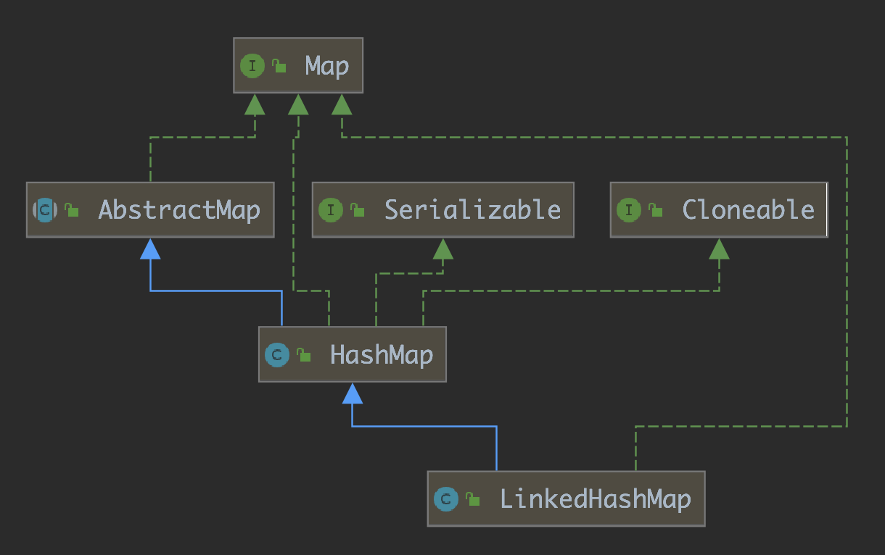
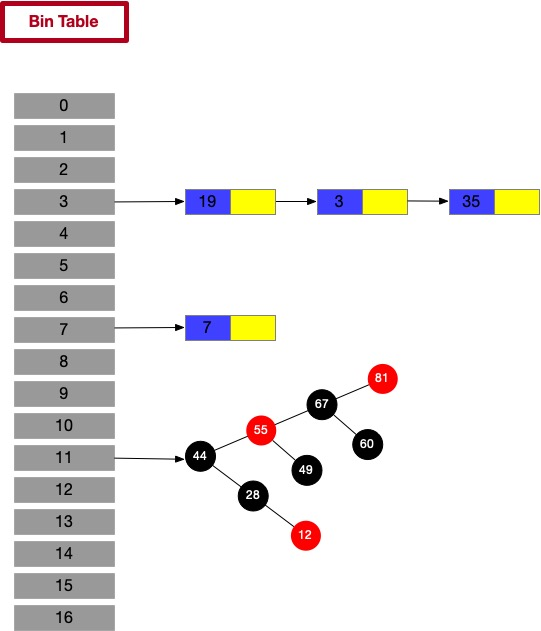
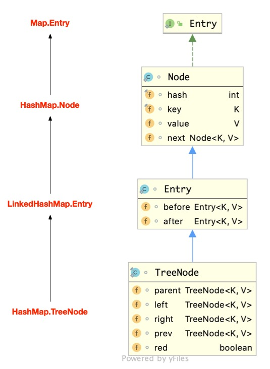
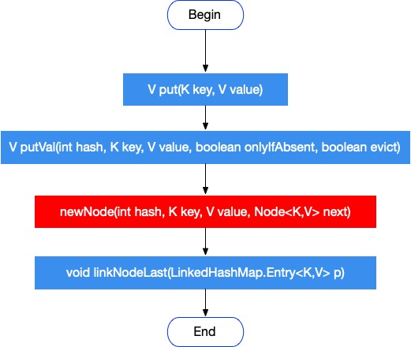
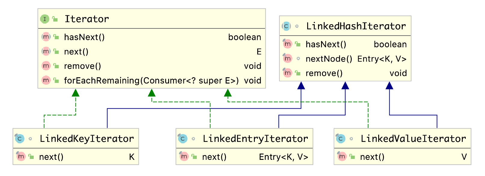

# LinkedHashMap原理

基于 JDK 1.8 版本

## 概述

LinkedHashMap 继承了 HashMap，在 HashMap 的基础之上，还维护了一条双向链表（doubly linked list），解决了 HashMap 不能随时保持遍历顺序和插入顺序一致的问题。



LinkedHashMap 在实现上很多方法都直接继承自 HashMap，仅为维护双向链表重写了部分方法，所以，要看懂 LinkedHashMap 的源码首先就应该深入了解 HashMap 的源码。关于 HashMap 的源码，这里就不多讲了。

## 应用场景

HashMap 是无序的，当我们希望有顺序地去存储 key-value 时，就需要使用 LinkedHashMap 了。下面通过一个对比例子来让大家对 LinkedHashMap 有个初步的印象。

```java
public static void main(String[] args) {
  Map<String, String> map = new HashMap<>();
  map.put("name1", "one");
  map.put("name2", "two");
  map.put("name3", "three");
  map.put("name4", "four");

  iterator(map);
}

private static void iterator(Map<String, String> map) {
  Set<Map.Entry<String, String>> set = map.entrySet();
  Iterator<Map.Entry<String, String>> iterator = set.iterator();
  while (iterator.hasNext()) {
    Map.Entry<String, String> entry = iterator.next();
    String key = entry.getKey();
    String value = entry.getValue();
    System.out.println("key=" + key + ", value=" + value);
  }
}
```

Output

```language
key=name4, value=four
key=name3, value=three
key=name2, value=two
key=name1, value=one
```

可以看出，HashMap 的迭代顺序并不是按照我们的插入顺序来进行的。

下面我们使用 LinkedHashMap。

```java
public static void main(String[] args) {
  Map<String, String> map = new LinkedHashMap<>();
  map.put("name1", "one");
  map.put("name2", "two");
  map.put("name3", "three");
  map.put("name4", "four");

  iterator(map);
}

private static void iterator(Map<String, String> map) {
  Set<Map.Entry<String, String>> set = map.entrySet();
  Iterator<Map.Entry<String, String>> iterator = set.iterator();
  while (iterator.hasNext()) {
    Map.Entry<String, String> entry = iterator.next();
    String key = entry.getKey();
    String value = entry.getValue();
    System.out.println("key=" + key + ", value=" + value);
  }
}
```

Output

```language
key=name1, value=one
key=name2, value=two
key=name3, value=three
key=name4, value=four
```

结果可知，LinkedHashMap 是有序的，且默认为插入顺序。

## 原理

前面说到，LinkedHashMap 继承自 HashMap，所以它的底层仍然是基于拉链式散列结构。该结构由数组和列表或平衡查找树组成。结构示意图如下。



LinkedHashMap 在上面结构的基础上，增加了一条双向链表，使得上面的结构可以保持键值对的插入顺序。同时，通过对双向链表进行相应的操作，实现了访问顺序相关逻辑，其结构可能如下图：

上图中，新增了双向链表的前驱引用和后继引用。每当有新的节点插入，新节点最终会接在 tail 引用指向的节点后面，而 tail 引用则会移动到新的节点上，这样一个双向链表就建立起来了。

上面的结构并不复杂，虽然引入了红黑树，导致结构看起来略微复杂了一点，但是我们在分析 LinkedHashMap 的时候，完全可以忽略红黑树复杂的原理，而只关注链表结构。

## Entry 的继承体系

在对核心内容展开分析之前，这里先分析一下节点的继承体系，下面是继承体系的结构图：



上面的继承体系乍一看还是挺复杂的，同时还有点让人迷惑。HashMap.TreeNode 不继承 HashMap.Node 却继承了 HashMap.Node 的子类 LinkedHashMap.Entry。如果你熟知了 HashMap 而没有看 LinkedHashMap，那么你一定不熟悉为什么 HashMap.TreeNode 为什么要继承 LinkedHashMap.Entry。到了这里，我们现在应该要明白为什么要这样继承，HashMap.TreeNode 继承了 LinkedHashMap.Entry 就获得了 before 和 after 两个属性，也就是说获得了构成双向链表的能力。HashMap.TreeNode 也需要构成双向链表吗？当然需要，因为 LinkedHashMap 基于 HashMap，它里面的链表结构也可能会转换为红黑树，因此，为了利用双向链表有序，红黑树的节点也需要加入到双向链表中。


我们先来看 LinkedHashMap.Entry 的类结构：

```java
static class Entry<K,V> extends HashMap.Node<K,V> {
  Entry<K,V> before, after;
  Entry(int hash, K key, V value, Node<K,V> next) {
    super(hash, key, value, next);
  }
}
```

该类继承了 HashMap.Node 并新增了 before 和 after 引用用来实现双向链表。

我们再回顾下 HashMap.TreeNode 的类结构：

```java
static final class TreeNode<K,V> extends LinkedHashMap.Entry<K,V> {
    TreeNode<K,V> parent;  // red-black tree links
    TreeNode<K,V> left;
    TreeNode<K,V> right;
    TreeNode<K,V> prev;    // needed to unlink next upon deletion
    boolean red;
}
```

一定要熟记并且理解 HashMap 和 LinkedHashMap 的 Entry 继承体系结构。如果你熟知了 HashMap 而没有看 LinkedHashMap，那么你一定不熟悉为什么 HashMap.TreeNode 为什么要继承 LinkedHashMap.Entry。到了这里，我们现在应该要明白为什么要这样继承，HashMap.TreeNode 继承了 LinkedHashMap.Entry 就获得了 before 和 after 两个属性，也就是说获得了构成双向链表的能力。HashMap.TreeNode 也需要构成双向链表吗？当然需要，因为 LinkedHashMap 基于 HashMap，它里面的链表结构也可能会转换为红黑树，因此，为了利用双向链表有序，红黑树的节点也需要加入到双向链表中。

## LinkedHashMap Fields

LinkedHashMap 继承自 HashMap，继承过来的属性就不提了，这里讲 LinkedHashMap 自己新增的属性。

```java
/**
 * The head (eldest) of the doubly linked list.
 */
transient LinkedHashMap.Entry<K,V> head;

/**
 * The tail (youngest) of the doubly linked list.
 */
transient LinkedHashMap.Entry<K,V> tail;

/**
 * The iteration ordering method for this linked hash map: <tt>true</tt>
 * for access-order, <tt>false</tt> for insertion-order.
 *
 * @serial
 */
final boolean accessOrder;
```

LinkedHashMap 新定义了上面三个属性。

前面两个属性是双向链表的头节点和尾节点，head 指向的是双向链表中的最老的节点，taiil 指向的是双向链表中最新的节点，这里的新老让人不太好理解，但要记住 LinkedHashMap 就依赖这一概念来维持节点的有序性。

accessOrder 定义了 LinkedHashMap 使用哪种迭代顺序方式。在 LinkedHashMap 中有两种迭代顺序方式：

- insertion-order：插入顺序。这是默认的方式。也就是迭代 LinkedHashMap 中元素的顺序是元素的插入顺序。
- access-order：访问顺序。这种方式下，当访问了一个元素后，迭代时会将该元素放到最后。

当 accessOrder 为 false 时，采用 insertion-order 方式，当 accessOrder 为 true 时，采用 access-order 方式。下面给出 accessOrder 为 true 的示例。

```java
public static void main(String[] args) {
  Map<String, String> map = new LinkedHashMap<>(16, .75f, true);
  map.put("name1", "one");
  map.put("name2", "two");
  map.put("name3", "three");
  map.put("name4", "four");

  iterator(map);

  System.out.println("------ after access ------");

  map.get("name1");
  map.get("name3");
  map.put("name5", "five");

  iterator(map);
}

private static void iterator(Map<String, String> map) {
  Set<Map.Entry<String, String>> set = map.entrySet();
  Iterator<Map.Entry<String, String>> iterator = set.iterator();
  while (iterator.hasNext()) {
    Map.Entry<String, String> entry = iterator.next();
    String key = entry.getKey();
    String value = entry.getValue();
    System.out.println("key=" + key + ", value=" + value);
  }
}
```

Output

```language
key=name1, value=one
key=name2, value=two
key=name3, value=three
key=name4, value=four
------ after access ------
key=name2, value=two
key=name4, value=four
key=name1, value=one
key=name3, value=three
key=name5, value=five
```

从输出结果来看，点那个我们访问了 `name1` 和 `name3` 后，他们的访问顺序依次被放到末尾，当新加入一个元素后，该元素被放到末尾访问。 

## Construction

```java
public LinkedHashMap(int initialCapacity, float loadFactor) {
  super(initialCapacity, loadFactor);
  accessOrder = false;
}

public LinkedHashMap(int initialCapacity) {
  super(initialCapacity);
  accessOrder = false;
}

public LinkedHashMap() {
  super();
  accessOrder = false;
}

public LinkedHashMap(Map<? extends K, ? extends V> m) {
  super();
  accessOrder = false;
  putMapEntries(m, false);
}

public LinkedHashMap(int initialCapacity,
                     float loadFactor,
                     boolean accessOrder) {
  super(initialCapacity, loadFactor);
  this.accessOrder = accessOrder;
}
```

LinkedHashMap 提供了上面五个构造方法，更多的是调用父类 HashMap 去做一些事情，只有只有一个方法可以自己来设置 accessOrder。

## put

链表的建立过程是插入键值对节点时开始的。初始情况下，让 LinkedHashMap 的 head 和 tail 引用都指向新节点，这样链表就算建立起来了。随后不断有新的节点插入，通过将新节点拼接在 tail 节点后面，再将 tail 后移，即可实现链表的插入。

Map 类型的集合是通过 put 方法插入键值对的，让人第一样觉得奇怪的是 LinkedHashMap 并没有重写父类 HashMap 中的 put 方法，而是直接使用了父类的实现。但在 HashMap 中，put 方法插入的是 HashMap 内部类 Node 类型的节点，该类型的节点并不具备与 LinkedHashMap 内部类 Entry 及其子类型节点组成链表的能力。那么，LinkedHashMap 时怎么建立链表的呢？在展开说明之前，我们先看一下 LinkedHashMap 插入操作相关的代码。

```java
// HashMap 中实现
public V put(K key, V value) {
    return putVal(hash(key), key, value, false, true);
}

// HashMap 中实现
final V putVal(int hash, K key, V value, boolean onlyIfAbsent,
               boolean evict) {
    Node<K,V>[] tab; Node<K,V> p; int n, i;
    if ((tab = table) == null || (n = tab.length) == 0)
        n = (tab = resize()).length;
    // 通过节点 hash 定位节点所在的桶位置，并检测桶中是否包含节点引用
    if ((p = tab[i = (n - 1) & hash]) == null)
        // 新建一个节点
        tab[i] = newNode(hash, key, value, null);
    else {
        Node<K,V> e; K k;
        if (p.hash == hash &&
            ((k = p.key) == key || (key != null && key.equals(k))))
            e = p;
        else if (p instanceof TreeNode)
            // 是树节点，则插入到红黑树中，并返回该节点
            e = ((TreeNode<K,V>)p).putTreeVal(this, tab, hash, key, value);
        else {
            // 插入到链表节点中
            for (int binCount = 0; ; ++binCount) {
                if ((e = p.next) == null) {
                    p.next = newNode(hash, key, value, null);
                    if (binCount >= TREEIFY_THRESHOLD - 1) // -1 for 1st
                        treeifyBin(tab, hash);
                    break;
                }
                if (e.hash == hash &&
                    ((k = e.key) == key || (key != null && key.equals(k))))
                    break;
                p = e;
            }
        }

        if (e != null) { // existing mapping for key
            V oldValue = e.value;
            if (!onlyIfAbsent || oldValue == null)
                e.value = value;
            // 如果已经存在且 value 相同，则当作访问一次，回调方法，后续说明
            afterNodeAccess(e);
            return oldValue;
        }
    }
    ++modCount;
    if (++size > threshold)
        resize();
    // 插入成功后的回调方法，后续说明
    afterNodeInsertion(evict);
    return null;
}

// HashMap 中实现
// Create a regular (non-tree) node
Node<K,V> newNode(int hash, K key, V value, Node<K,V> next) {
    return new Node<>(hash, key, value, next);
}

// LinkedHashMap 中覆盖
Node<K,V> newNode(int hash, K key, V value, Node<K,V> e) {
    LinkedHashMap.Entry<K,V> p =
        new LinkedHashMap.Entry<K,V>(hash, key, value, e);
    // 将 Entry 接在双向链表的尾部
    linkNodeLast(p);
    return p;
}

// LinkedHashMap 中提供的方法
// link at the end of list
private void linkNodeLast(LinkedHashMap.Entry<K,V> p) {
    LinkedHashMap.Entry<K,V> last = tail;
    tail = p;
    if (last == null)
        head = p;
    else {
        // 将新节点接在链表尾部
        p.before = last;
        last.after = p;
    }
}
```

上面就是 LinkedHashMap 插入相关的源码，根据上面的代码，我们精简调用过程，如下图：



我把 newNode 方法用红色背景标出来了，这一步狠关键。LinkedHashMap 覆盖了从 HashMap 继承而来的该方法。在重写的这个方法中，LinkedHashMap 创建了 Entry，并在 newNode 方法中调用 linkNodeLast 方法将 Entry 接在双向链表的尾部，实现了双向链表的建立和维护。双向链表建立之后，我们就可以顺着双向链表去遍历 LinkedHashMap。

以上就是 LinkedHashMap 维护插入顺序的相关分析。但在本节最后，还想提一提里面的几个重要方法。如果仔细看的话，会发现有三个以 after 开头的方法，它们在 JDK 1.8 中的 HashMap都是空方法，如下：

```java
// Callbacks to allow LinkedHashMap post-actions
void afterNodeAccess(Node<K,V> p) { }
void afterNodeInsertion(boolean evict) { }
void afterNodeRemoval(Node<K,V> p) { }
```

根据方法的名称和上面的注释，可以看出这三个待 LinkedHashMap 实现的操作后续的回调方法。

- afterNodeAccess：该方法是访问 HashMap 一个元素后的回调方法
- afterNodeInsertion：该方法是插入 HashMap 一个元素后的回调方法
- afterNodeRemoval：该方法是删除 HashMap 一个元素后的回调方法

上面的三个方法的具体实现在 LinkedHashMap 中，本节先不分析这些方法，相关分析会在后续章节中进行。

## get

LinkedHashMap 重写了访问元素的 get 方法，源码如下：

```java
// HashMap 中的方法
public V get(Object key) {
    Node<K,V> e;
    return (e = getNode(hash(key), key)) == null ? null : e.value;
}

// LinkedHashMap 重写的方法
public V get(Object key) {
    Node<K,V> e;
    if ((e = getNode(hash(key), key)) == null)
        return null;
    if (accessOrder)
        // 如果设置为 accessOrder 为 true，即迭代元素的顺序为访问元素的顺序，则在访问元素之后调用后置回调方法
        afterNodeAccess(e);
    return e.value;
}
```

可以看到，LinkedHashMap 和 HashMap 中的实现的差异就在后面那个判断，这也涉及到后置操作，我们后面讲这个后置操作。

## remove

与插入操作一样，LinkedHashMap 删除操作相关的代码也是直接使用父类的实现。在删除节点时，父类的删除逻辑并不会修复 LinkedHashMap 所维护的双向链表，这不是它的指责。那么删除节点后，被删除的节点该如何双向链表中移除呢？在前面提到 HashMap 中的三个回调方法，其实，在删除节点后，回调方法 afterNodeRemoval 会被调用，只不过该方法在 HashMap 中是空实现，而 LinkedHashMap 重写了该方法。相关源码如下。

```java
// HashMap 中提供的方法
public V remove(Object key) {
    Node<K,V> e;
    // 删除节点
    return (e = removeNode(hash(key), key, null, false, true)) == null ?
        null : e.value;
}

// HashMap 中提供的方法
final Node<K,V> removeNode(int hash, Object key, Object value,
                            boolean matchValue, boolean movable) {
    Node<K,V>[] tab; Node<K,V> p; int n, index;
    if ((tab = table) != null && (n = tab.length) > 0 &&
        (p = tab[index = (n - 1) & hash]) != null) {
        Node<K,V> node = null, e; K k; V v;

        // ......

        if (node != null && (!matchValue || (v = node.value) == value ||
                                (value != null && value.equals(v)))) {
            if (node instanceof TreeNode)
                ((TreeNode<K,V>)node).removeTreeNode(this, tab, movable);
            else if (node == p)
                tab[index] = node.next;
            else
                p.next = node.next;
            ++modCount;
            --size;

            // 节点删除后的后置操作
            afterNodeRemoval(node);
            return node;
        }
    }
    return null;
}

// LinkedHashMap 重写的方法
void afterNodeRemoval(Node<K,V> e) { // unlink
    LinkedHashMap.Entry<K,V> p =
        (LinkedHashMap.Entry<K,V>)e, b = p.before, a = p.after;
    // 将 p 节点的前驱和后继引用置空
    p.before = p.after = null;
    // b 为 null，表明 p 是头节点
    if (b == null)
        head = a;
    else
        b.after = a;
    // a 为 null，表明 p 是尾节点
    if (a == null)
        tail = b;
    else
        a.before = b;
}
```

上面的过程并不复杂，其中涉及到三件事情：

1. 根据 hash 定位到桶到位置
2. 遍历链表或调用红黑树的删除方法，将其从链表或树结构中脱离出来
3. 从 LinkedHashMap 维护的双向链表中移除要删除的节点

## post action 与 accessOrder

前面提到 HashMap 中的三个回调方法，这三个回调方法跟 LinkedHashMap 有序具有很直接的关系。

```java
// Callbacks to allow LinkedHashMap post-actions
void afterNodeAccess(Node<K,V> p) { }
void afterNodeInsertion(boolean evict) { }
void afterNodeRemoval(Node<K,V> p) { }
```

双向链表维护了所有的实体，头节点 head 所标记的是链表中最旧的元素，尾节点 tail 所标记的是链表中最新的元素。

这三个方法在 HashMap 中都是空实现。让我们来看一下他们在 LinkedHashMap 重写的方法。

```java
void afterNodeAccess(Node<K,V> e) { // move node to last
    LinkedHashMap.Entry<K,V> last;
    if (accessOrder && (last = tail) != e) {
        LinkedHashMap.Entry<K,V> p =
            (LinkedHashMap.Entry<K,V>)e, b = p.before, a = p.after;
        p.after = null;
        if (b == null)
            head = a;
        else
            b.after = a;
        if (a != null)
            a.before = b;
        else
            last = b;
        if (last == null)
            head = p;
        else {
            p.before = last;
            last.after = p;
        }
        tail = p;
        ++modCount;
    }
}

// 调用该方法的地方 evict 始终为 true
void afterNodeInsertion(boolean evict) { // possibly remove eldest
    LinkedHashMap.Entry<K,V> first;
    // removeEldestEntry 返回 boolean 判断是否需要最旧的 Entry
    if (evict && (first = head) != null && removeEldestEntry(first)) {
        // 如果需要删除最旧的的元素，则删除头节点
        K key = first.key;
        removeNode(hash(key), key, null, false, true);
    }
}

void afterNodeRemoval(Node<K,V> e) { // unlink
    LinkedHashMap.Entry<K,V> p =
        (LinkedHashMap.Entry<K,V>)e, b = p.before, a = p.after;
    // 将 p 节点的前驱和后继引用置空
    p.before = p.after = null;
    // b 为 null，表明 p 是头节点
    if (b == null)
        head = a;
    else
        b.after = a;
    // a 为 null，表明 p 是尾节点
    if (a == null)
        tail = b;
    else
        a.before = b;
}
```

- afterNodeAccess
  该方法在一个节点被访问之后被回调，如果 accessOrder 为 true，则会将节点移动到双向链表到尾部，即将节点变成最新的节点。在前面的分析中知道了当新节点插入时，节点始终接在双向链表的尾部，也就是说新插入的节点时最新的节点。
  如果 accessOrder 为 false，则节点被访问之后不会被移动到链表尾部，则迭代时的元素顺序是元素插入的顺序；如果 accessOrder 为 true，则节点被访问之后会被移动到链表尾部，则迭代时的元素顺序是元素访问的顺序。

- afterNodeInsertion
  该方法在一个节点被插入之后被回调。它的动作就是可能会删除最旧的元素，这是我们后面用 LinkedHashMap 来实现 LRU 缓存的一个重要方法。

- afterNodeRemoval
  当节点被删除后该方法被回调，将节点从双向链表中删除。

## Iteration

在 HashMap 的分析中，提到了 HashMap Iteration 的原理。HashMap 的 key、value 和 entry 迭代都依赖 HashIterator，HashIterator 迭代节点都原理是先按照 bin 桶的数组 index 顺序再按照节点的 next 引用来迭代 HashMap，这种方式迭代是无序的。

LinkedHashMap 中维护了一条双向链表用来实现有序访问，那么 LinkedHashMap 的迭代元素的实现方式肯定和 HashMap 是不一样的。不过，LinkedHashMap 和 HashMap 中迭代器的继承体系结构是一样的。

先来看 LinkedHashMap 中迭代器的继承顺序：



很明显 LinkedKeyIterator、LinkedValueIterator 和 LinkedEntryIterator 分别用来迭代 key、value 和 entry。这三个 Iterator 中的 next 方法都调用了 LinkedHashIterator 的 nextNode 方法。

让我们来看看 LinkedHashIterator 的源码：

```java
abstract class LinkedHashIterator {
  LinkedHashMap.Entry<K,V> next;
  LinkedHashMap.Entry<K,V> current;
  int expectedModCount;

  LinkedHashIterator() {
    next = head;
    expectedModCount = modCount;
    current = null;
  }

  public final boolean hasNext() {
    return next != null;
  }

  // nextNode 是关键方法，这里根据 after 引用遍历双向链表来访问节点
  final LinkedHashMap.Entry<K,V> nextNode() {
    LinkedHashMap.Entry<K,V> e = next;
    if (modCount != expectedModCount)
      throw new ConcurrentModificationException();
    if (e == null)
      throw new NoSuchElementException();
    current = e;
    next = e.after;
    return e;
  }

  public final void remove() {
    Node<K,V> p = current;
    if (p == null)
      throw new IllegalStateException();
    if (modCount != expectedModCount)
      throw new ConcurrentModificationException();
    current = null;
    K key = p.key;
    removeNode(hash(key), key, null, false, false);
    expectedModCount = modCount;
  }
}
```

LinkedHashIterator 初始化时 next 变量指向 head节点，在遍历过程中不断用 after 引用更新 next，实现了双向链表的遍历。head 指向的为链表最旧的元素，所以，LinkedHashIterator 是从旧元素到新元素迭代的。

给出以下示例：

```java
public static void main(String[] args) {
  Map<String, String> map = new LinkedHashMap<>();
  map.put("name1", "one");
  map.put("name2", "two");
  map.put("name3", "three");
  map.put("name4", "four");

  iterator(map);
}

private static void iterator(Map<String, String> map) {
  Set<Map.Entry<String, String>> set = map.entrySet();
  Iterator<Map.Entry<String, String>> iterator = set.iterator();
  while (iterator.hasNext()) {
    Map.Entry<String, String> entry = iterator.next();
    String key = entry.getKey();
    String value = entry.getValue();
    System.out.println("key=" + key + ", value=" + value);
  }
}
```

Output

```language
key=name1, value=one
key=name2, value=two
key=name3, value=three
key=name4, value=four
```

依次往 LinkedHashMap 插入元素，accessOrder 为 false，那么最先插入的元素就是最旧的元素，最后插入的元素就成为最新的元素。这样一来，上面的 Output 就很好理解了。

## 用 LinkedHashMap 实现 LRU

LRU 是一种常用的操作系统页面置换算法（缓存淘汰策略），即选择最近最久未使用的页面予以淘汰。

理解了 LinkedHashMap 之后，可以发现 LinkedHashMap 很适合用来实现 LRU。首先它具备 O(1) 时间复杂度的查找效率，另外它是一个双向链表结构，可以非常方便快速地在头部和尾部进行插入或删除元素。

要想用 LinkedHashMap 来实现 LRU，我们要讲 accessOrder 赋值为 true，这样 LinkedHashMap 就会用访问顺序来维护元素在链表中的顺序。

- 当访问了某一个元素之后（调用 get 方法），LinkedHashMap 会调用 afterNodeAccess 方法将对应的节点移动到链表的尾部，从而该节点成为最新的数据。
- 链表的头部始终是最旧的数据。当插入一个元素之后（调用 put 方法），LinkedHashMap 会调用 afterNodeInsertion 方法来判断是否需要删除最旧的节点，其中依赖 `removeEldestEntry` 方法。

我们需要重写 removeEldestEntry 方法，该方法的默认实现如下：

```java
protected boolean removeEldestEntry(Map.Entry<K,V> eldest) {
  return false;
}
```

它默认返回 false，也就是默认不会删除最旧的节点，我们只需覆盖这个方法即可：

```java
import java.util.LinkedHashMap;
import java.util.Map.Entry;

public class LRUCache < K, V > extends LinkedHashMap < K, V > {

    private int capacity; // Maximum number of items in the cache.

    public LRUCache(int capacity) { 
        super(capacity, 0.75f, true); // Pass 'true' for accessOrder.
        this.capacity = capacity;
    }

    @Override
    protected boolean removeEldestEntry(Entry entry) {
        return size() > this.capacity;
    } 
}
```

这样我们就用 LinkedHashMap 快速的实现了 LRU。

## 总结

本文着重从 LinkedHashMap 维护双向链表的角度对 LinkedHashMap 的源码进行了分析。对其中的 put、get、remove 和迭代的原理进行了探讨，并在末尾利用 LinkedHashMap 简单地实现了 LRU 缓存。