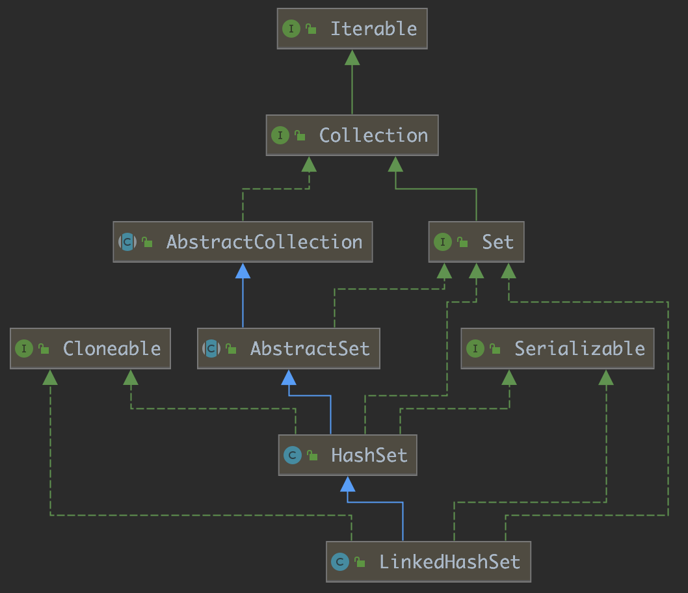

# LinkedHashSet原理

在阅读本文之前，建议阅读 LinkedHashMap：[LinkedHashMap原理](LinkedHashMap原理)

本文基于 JDK 1.8

## 概述

HashSet 是 Java 提供的一个集合类，它能存储不重复的元素。HashSet 迭代元素是无序的，如果我们需要一个 HashSet 这样的集合并且能够有序的迭代元素，这时候我们就可以使用 LinkedHashSet。

下面先来看一段代码：

```java
public static void main(String[] args) {
  Set<String> set = new HashSet<>();
  set.add("one");
  set.add("two");
  set.add("three");
  set.add("four");
  set.add("five");
  set.add("six");

  iterator(set);
}

private static <E> void iterator(Collection<E> collection) {
  Iterator<E> iterator = collection.iterator();
  while (iterator.hasNext()) {
    E e = iterator.next();
    System.out.println(e);
  }
}

```

Output

```language
six
four
one
two
three
five
```

使用 HashSet 时，迭代元素的顺序是无序的。

再来看 LinkedHashSet。

```java
public static void main(String[] args) {
  Set<String> set = new LinkedHashSet<>();
  set.add("one");
  set.add("two");
  set.add("three");
  set.add("four");
  set.add("five");
  set.add("six");

  iterator(set);
}

private static <E> void iterator(Collection<E> collection) {
  Iterator<E> iterator = collection.iterator();
  while (iterator.hasNext()) {
    E e = iterator.next();
    System.out.println(e);
  }
}
```

Output

```language
one
two
three
four
five
six
```

使用 LinkedHashSet 时，迭代元素的顺序是有序的，它按照元素插入的顺序来迭代元素。

## 结构

下图是 LinkedHashSet 的继承结构，可以看出来，LinkedHashSet 直接继承了 HashSet。



然而 HashSet 是无序的，那么 LinkedHashSet 是怎么实现有序的呢？如果看看 LinkedHashSet 的源码，你会发现 LinkedHashSet 中不过是写了几个构造方法，没什么其他的可探究的。

```java
public LinkedHashSet(int initialCapacity, float loadFactor) {
    super(initialCapacity, loadFactor, true);
}

public LinkedHashSet(int initialCapacity) {
    super(initialCapacity, .75f, true);
}

public LinkedHashSet() {
    super(16, .75f, true);
}

public LinkedHashSet(Collection<? extends E> c) {
    super(Math.max(2*c.size(), 11), .75f, true);
    addAll(c);
}
```

仔细看上面的四个构造方法，它们都调用了父类的构造方法，并且都传了一个布尔参数 true，这是值得我们注意的地方。

下面给出第一个构造方法调用的父类构造方法：

```java
HashSet(int initialCapacity, float loadFactor, boolean dummy) {
  map = new LinkedHashMap<>(initialCapacity, loadFactor);
}
```

熟悉 HashSet 的人都知道 HashSet 是基于 HashMap 来直接实现的，可是这里竟然用到了 LinkedHashMap，有点让人疑惑。但是回过头来想一想，似乎是这个道理，无序访问的 HashMap 用来实现 HashSet，有序访问的  LinkedHashMap 用来实现 LinkedHashSet。

HashSet 中特意提供了上面这个构造方法，在这个构造方法中，第三个布尔参数是多余，它始终是 true，而且也没有被实际用到，主要作用就是用来区别 HashSet 的其他方法，因为 HashSet还提供了下面这个构造方法：

```java
public HashSet(int initialCapacity, float loadFactor) {
  map = new HashMap<>(initialCapacity, loadFactor);
}
```

在这个构造方法中，这两个参数和上一个构造方法的前两个参数是一样的，不一样的是，两个构造方法中一个 map 使用了 HashMap 实例，另一个 map 使用了 LinkedHashMap 实例。

拥有 dummy 参数的构造方法是专门提供给 LinkedHashSet 调用的，它内部用 LinkedHashMap 来实例化 map，从而为 LinkedHashSet 提供了按插入顺序来遍历元素的能力。该构造方法是 default 的，外部无法调用。

