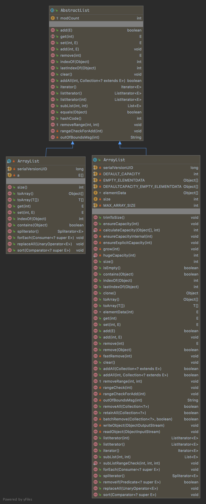

# List的五个大坑

List可谓是我们经常使用的集合类之一，几乎所有代码都离不开List，既然天天在用，那就没准就会踩中这几个 List 常见坑。

## Arrays#asList() 不支持增删

我们可能有时为了方便用过这个方法，通过 Arrays#asList 将数组转化为 List 集合。

```java
String[] arrays = {"1", "2", "3", "4"};
List<String> list = Arrays.asList(arrays);
list.add("other element");
```

这段代码表面看起来没有任何问题，编译也能通过，但是真正测试运行的时候将会在第 3 行抛出 java.lang.UnsupportedOperationException。

刚开始很不解，Arrays#asList 返回明明也是一个 ArrayList，为什么添加一个元素就会报错？这以后还能好好新增元素吗？

最后通过 Debug 才发现这个 Arrays#asList 返回的 ArrayList，仅仅只是 Arrays 一个内部类，并非真正的 java.util.ArrayList。



从上图我们发现，`add/remove` 等方法实际都来自 `AbstractList`，而 `java.util.Arrays$ArrayList` 并没有重写父类的方法。而父类方法恰恰都会抛出 `UnsupportedOperationException`。

```java
public void add(int index, E element) {
    throw new UnsupportedOperationException();
}
```

这就是为什么这个 `java.util.Arrays$ArrayList` 不支持的增删的实际原因。

## Arrays#asList() 改动内部元素将会同步影响原数组

`java.util.Arrays$ArrayList` 除了不支持增删操作这个坑以外，还存在另外一个大坑，改动内部元素将会同步影响原数组。

```java
String[] arrays = {"1", "2", "3", "4"};
List<String> list = Arrays.asList(arrays);
list.set(0, "modify_1");
arrays[1] = "modify_2";

System.out.println("arrays: " + Arrays.toString(arrays));
System.out.println("list: " + list);
```

输出结果：

```language
arrays: [modify_1, modify_2, 3, 4]
list: [modify_1, modify_2, 3, 4]
```

从日志输出可以看到，不管我们是修改原数组，还是新 List 集合，两者都会互相影响。

查看 `java.util.Arrays$ArrayList` 实现，我们可以发现底层实际使用了原始数组。

```java
public static <T> List<T> asList(T... a) {
    return new ArrayList<>(a);
}

......

/**
 * @serial include
 */
private static class ArrayList<E> extends AbstractList<E>
    implements RandomAccess, java.io.Serializable
{
    private static final long serialVersionUID = -2764017481108945198L;
    private final E[] a;

    ArrayList(E[] array) {
        a = Objects.requireNonNull(array);
    }
```

可以看到 `java.util.Arrays$ArrayList` 里面也维护了一个数组，当我们调用 `Arrays#asList()` 方法时，`java.util.Arrays$ArrayList` 中的数组和原数组引用了同一个对象。

知道了实际原因，修复的办法也很简单，套娃一层 `java.util.ArrayList` 呗！

```java
List<String> list = new ArrayList<>(Arrays.asList(arrays));
```

在 `public ArrayList(Collection<? extends E> c)` 构造方法中，会执行 `elementData = c.toArray();` 这样一行代码，即把源集合转换成数组并赋值给当前的 ArrayList，Arrays.ArrayList 类中重写了 toArray 方法，如下：

```java
@Override
public Object[] toArray() {
    return a.clone();
}
```

因此，它是一个数组拷贝，套娃了之后就不会有影响。

不过这么写感觉十分繁琐，推荐使用 **Guava Lists** 提供的方法。

```java
List<String> list = Lists.newArrayList(arrays);
```

通过上面两种方式，我们将新的 List 集合与原始数组解耦，不再互相影响，同时由于此时还是真正的 `ArrayList`，不用担心 `add/remove`报错了。

除了 `Arrays#asList`产生新集合与原始数组互相影响之外，JDK 另一个方法 `List#subList` 生成新集合也会与原始 `List` 互相影响。

我们来看一个例子：

```java
List<Integer> integerList = new ArrayList<>();
integerList.add(1);
integerList.add(2);
integerList.add(3);

List<Integer> subList = integerList.subList(0, 2);

subList.set(0, 10);
integerList.set(1, 20);

System.out.println("integerList: " + integerList);
System.out.println("subList: " + subList);
```

输出结果：

```language
integerList:[10, 20, 3]
subList:[10, 20]
```

查看  List#subList  实现方式，可以发现这个 SubList 内部有一个 parent 字段保存保存最原始 List 。

```java
public List<E> subList(int fromIndex, int toIndex) {
    subListRangeCheck(fromIndex, toIndex, size);
    return new SubList(this, 0, fromIndex, toIndex);
}

......


SubList(AbstractList<E> parent,
        int offset, int fromIndex, int toIndex) {
    this.parent = parent;
    this.parentOffset = fromIndex;
    this.offset = offset + fromIndex;
    this.size = toIndex - fromIndex;
    this.modCount = ArrayList.this.modCount;
}
```

所有外部读写动作看起来是在操作 SubList ，实际上底层动作却都发生在原始 List 中。

```java
private static List<List<Integer>> data = new ArrayList<>();

private static void oom() {
    for (int i = 0; i < 1000; i++) {
        List<Integer> rawList = IntStream.rangeClosed(1, 100000).boxed().collect(Collectors.toList());
        data.add(rawList.subList(0, 1));
    }
}
```

data 看起来最终保存的只是 1000 个具有 1 个元素的 List，不会占用很大空间。但是程序很快就会 OOM。

OOM 的原因正是因为每个 SubList 都强引用个一个 10 万个元素的原始 List，导致 GC 无法回收。

这里修复的办法也很简单，跟上面一样，也来个套娃呗，加一层 ArrayList 。

## 不可变集合，说好不变，你怎么就变了

为了防止 List 集合被误操作，我们可以使用 Collections#unmodifiableList 生成一个不可变（immutable）集合，进行防御性编程。

这个不可变集合只能被读取，不能做任何修改，包括增加，删除，修改，从而保护不可变集合的安全。

```java
// 不可变集合添加元素
List<String> list = new ArrayList<>(Arrays.asList("one", "two", "three"));
List<String> unmodifiableList = Collections.unmodifiableList(list);

// 以下操作将抛出 java.lang.UnsupportedOperationException
unmodifiableList.add("four");
unmodifiableList.remove(1);
unmodifiableList.set(0, "test");
```

上面最后三行写操作都将会抛出 UnsupportedOperationException 异常

但是你以为这样就安全了吗？

如果有谁不小心改动原始 List，你就会发现这个不可变集合，竟然就变了。。。

```java
// 不可变集合添加元素
List<String> list = new ArrayList<>(Arrays.asList("one", "two", "three"));
List<String> unmodifiableList = Collections.unmodifiableList(list);

// 修改源集合
list.set(0, "modify_one");
list.add("four");

System.out.println("list: " + list);
System.out.println("unmodifiableList: " + unmodifiableList);
```

输出结果：

```language
list: [modify_one, two, three, four]
unmodifiableList: [modify_one, two, three, four]
```

查看  `Collections#unmodifiableList`  底层实现方法：

```java
/**
 * @serial include
 */
static class UnmodifiableList<E> extends UnmodifiableCollection<E>
                                implements List<E> {
    private static final long serialVersionUID = -283967356065247728L;

    final List<? extends E> list;

    UnmodifiableList(List<? extends E> list) {
        super(list);
        this.list = list;
    }
}
```

可以看到这跟上面 SubList 其实是同一个问题，新集合底层实际使用了原始 List。

由于不可变集合所有修改操作都会报错，所以不可变集合不会产生任何改动，所以并不影响的原始集合。但是反过来，却不行，原始 List 随时都有可能被改动，从而影响不可变集合。

可以使用如下两种方式防止上面出现的情况。

使用 JDK9 List#of 方法。

```java
List<String> list = new ArrayList<>(Arrays.asList("one", "two", "three"));
List<String> unmodifiableList = List.of(list.toArray(new String[]{}));
```

使用 Guava immutable list

```java
List<String> list = new ArrayList<>(Arrays.asList("one", "two", "three"));
List<String> unmodifiableList = ImmutableList.copyOf(list);
```

相比而言 Guava 方式比较清爽，使用也比较简单，推荐使用 Guava 这种方式生成不可变集合。

## foreach 增加/删除元素大坑

先来看一段代码：

```java
String[] arrays = {"1", "2", "3"};
List<String> list = new ArrayList<>(Arrays.asList(arrays));
for (String str : list) {
    if (str.equals("1")) {
        list.remove(str);
    }
}
```

上面的代码我们使用 `foreach` 方式遍历 List 集合，如果符合条件，将会从集合中删除改元素。

这个程序编译正常，但是运行时，程序将会发生异常，日志如下：

```java
java.util.ConcurrentModificationException
	at java.base/java.util.ArrayList$Itr.checkForComodification(ArrayList.java:939)
	at java.base/java.util.ArrayList$Itr.next(ArrayList.java:893)
```

可以看到程序最终错误是由 `ArrayList$Itr.next` 处的代码抛出，但是代码中我们并没有调用该方法，为什么会这样?

实际是因为 `foreach` 这种方式实际上 Java 给我们提供的一种语法糖，编译之后将会变为另一种方式。 `foreach` 这种方式实际就是 `Iterator` 迭代器实现方式，这就是为什么 `foreach` 被遍历的类需要实现 `Iterable`接口的原因，Iterable 接口的 iterator 方法返回一个 Iterator。

`java.util.ArrayList` 内部通过一个非静态内部类来实现了 `java.util.Iterator` 接口，重写的 next() 方法里做了检查：

```java
public E next() {
    checkForComodification();
    int i = cursor;
    if (i >= size)
        throw new NoSuchElementException();
    Object[] elementData = ArrayList.this.elementData;
    if (i >= elementData.length)
        throw new ConcurrentModificationException();
    cursor = i + 1;
    return (E) elementData[lastRet = i];
}
```

接着我们来看下抛出异常方法：

```java
final void checkForComodification() {
    if (modCount != expectedModCount)
        throw new ConcurrentModificationException();
}
```

expectedModCount 来源于 list#iterator 方法：

```java
public Iterator<E> iterator() {
    return new Itr();
}

/**
    * An optimized version of AbstractList.Itr
    */
private class Itr implements Iterator<E> {
    int cursor;       // index of next element to return
    int lastRet = -1; // index of last element returned; -1 if no such
    int expectedModCount = modCount;
}
```

也就是说刚开始遍历循环的时候 expectedModCount==modCount，下面我们来看下 modCount。

modCount 来源于 ArrayList 的父类  AbstractList，可以用来记录 List 集合被修改的次数。

> The number of times this list has been <i>structurally modified</i>.

ArrayList#remove 之后将会使 modCount 加一，expectedModCount与 modCount 将会不相等，这就导致迭代器遍历时将会抛错。

```java
private void fastRemove(int index) {
    // modCount 自增
    modCount++;
    int numMoved = size - index - 1;
    if (numMoved > 0)
        System.arraycopy(elementData, index+1, elementData, index,
                            numMoved);
    elementData[--size] = null; // clear to let GC do its work
}
```

modCount 计数操作将会交子类自己操作，ArrayList 每次修改操作（增、删）都会使 modCount 加 1。但是如 CopyOnWriteArrayList 并不会使用 modCount 计数。

所以 CopyOnWriteArrayList 使用 foreach 删除是安全的，但是还是建议使用如下两种删除元素，统一操作。

修复的办法有两种：

### 使用 Iterator#remove 删除元素

```java
// 不可变集合添加元素
List<String> list = new ArrayList<>(Arrays.asList("one", "two", "three"));

Iterator<String> it = list.iterator();

while (it.hasNext()) {
    String s = it.next();
    if ("one".equals(s)) {
        it.remove();
    }
}
```

### JDK1.8 List#removeIf

```java
// 不可变集合添加元素
List<String> list = new ArrayList<>(Arrays.asList("one", "two", "three"));

list.removeIf(s -> "one".equals(s));
```

## 思考

如果我将上面 foreach 代码判断条件简单修改一下：

```java
String[] arrays = {"1", "2", "3"};
List<String> list = new ArrayList<>(Arrays.asList(arrays));
for (String str : list) {
    if (str.equals("2")) {
        list.remove(str);
    }
}
```

运行这段代码，可以发现这段代码又不会报错了，有没有很意外？

如果我将上面 foreach 代码再修改一下：

```java
String[] arrays = {"1", "2", "2", "3"};
List<String> list = new ArrayList<>(Arrays.asList(arrays));
for (String str : list) {
    if (str.equals("2")) {
        list.remove(str);
    }
}
```

运行这段代码，可以发现这段代码报错了，是不是有点迷惑？要理解这些问题，需要深入理解源码中是如何删除一个元素的以及迭代器内部变量的变化。

## 总结

第一，我们不要先入为主，想当然就认为 Arrays.asList 和 List.subList 就是一个普通，独立的 ArrayList。

如果没办法，使用了 Arrays.asList 和 List.subList ，返回给其他方法的时候，一定要记得再套娃一层真正的 java.util.ArrayList。

第二 JDK 的提供的不可变集合实际非常笨重，并且低效，还不安全，所以推荐使用 Guava 不可变集合代替。

最后，切记，不要随便在 foreach 增加/删除元素。
