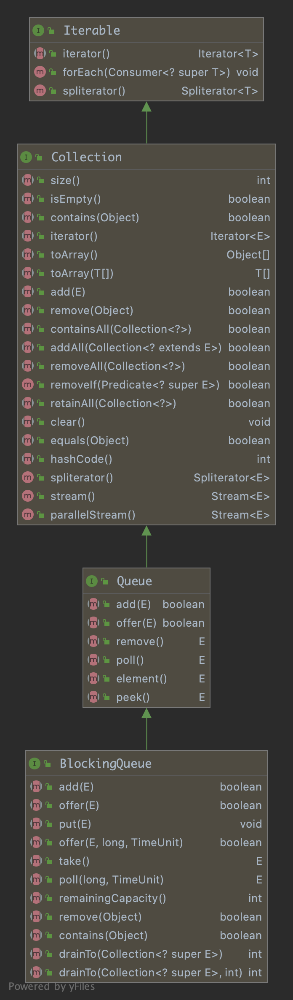

# BlockingQueue接口详解

java.util.concurrent.BlockingQueue 接口为 JUC 提供的阻塞队列接口，阻塞队列实现类都需要实现该接口。

## 1. Architecture

 BlockingQueue 的结构如下图：

## 2. Summary of BlockingQueue methods

> BlockingQueue methods come in four forms, with different ways of handleing operations that cannot be satisfied immediately, but may be satisfied at some point in the future:
>
> one throws a exception, the second returns a special value (either {@code null} or {@code false}, depending on the operation), the third blocks the current thread indefinitely until the operation can be succeed, and the fourth blocks for only a given maximum time limit before given up.

下表是 BlockingQueue 的方法总结：

|         | Throws exception | Special value |     Blocks     |      Times out       |
| :-----: | :--------------: | :-----------: | :------------: | :------------------: |
| Insert  |      add(e)      |   offer(e)    |     put(e)     | offer(e, time, unit) |
| Remove  |     remove()     |    poll()     |     take()     |   poll(time, unit)   |
| Examine |    element()     |    peek()     | not applicable |    not applicable    |

> A BlockingQueue does not accept null elements. Implementations throw NullPointerException on attempts to add, put or offer a null. A null is used as a sentinel value to indicate failure of poll operations.
>
> A BlockingQueue may be capacity bounded. At any given time it may have a remainingCapacity beyond which no additional elements can be put without blocking. A BlockingQueue without any intrinsic capacity constraints always reports a remaining capacity of Integer.MAX_VALUE.

