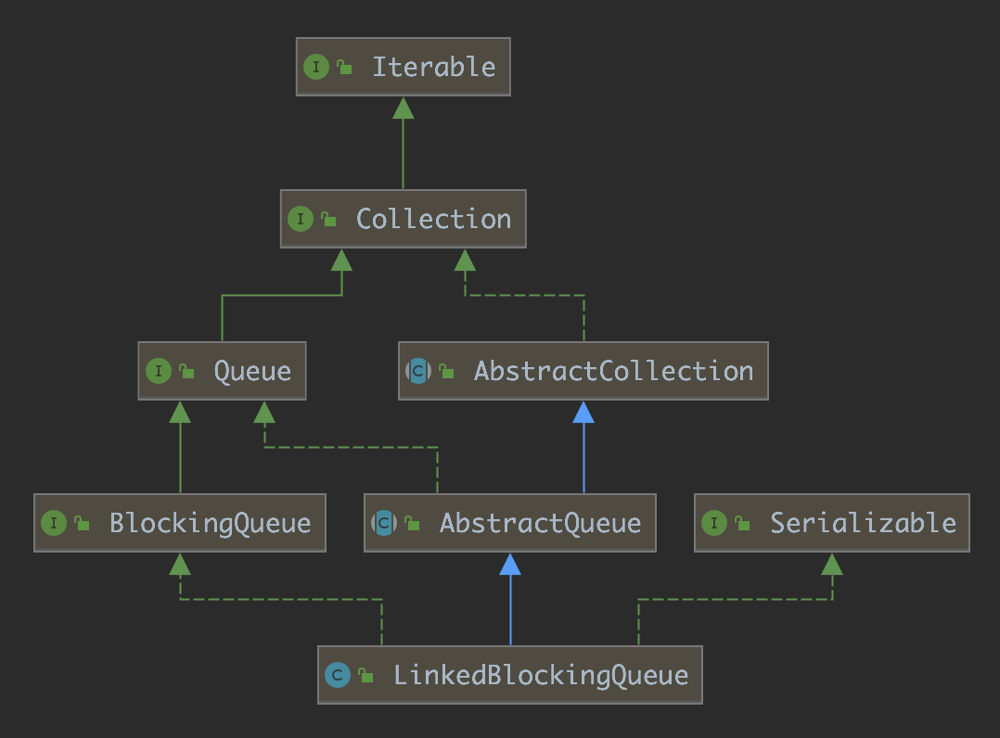

# LinkedBlockingQueue详解

LinkeBlockingQueue 是 JUC 包下提供的一种阻塞队列，它的实现基于链表结构。

## 1. 对比 ArrayBlockingQueue

ArrayBlockingQueue 的实现利用了一个 ReentrantLock 和从 ReentrantLock 创建出来的两个 Condition，而在 LinkedBlockingQueue 中，使用了两个 ReentrantLock 和两个 Condition 对象。这又是为什么呢？不同的数据结构有不同的特性，这种不同的特性可以让我们缩小锁的力度从而提高阻塞队列的效率。

## 2. Architecture

LinkedBlockingQueue 类的继承结构如下图所示：



AbstractQueue 封装了队列的基本操作，而 BlockingQueue 接口提供了阻塞队列必须实现的方法。

## 3. Node

Node 是 LinkedBlockingQueue 中提供的一个内部类。

```java
/**
 * Linked list node class
 */
static class Node<E> {
    E item;

    /**
     * One of:
     * - the real successor Node
     * - this Node, meaning the successor is head.next
     * - null, meaning there is no successor (this is the last node)
     */
    Node<E> next;

    Node(E x) { item = x; }
}
```

## 4. Constructor

LinkedBlockingQueue 提供了三个构造方法。

```java
public LinkedBlockingQueue() {
    this(Integer.MAX_VALUE);
}

public LinkedBlockingQueue(int capacity) {
    if (capacity <= 0) throw new IllegalArgumentException();
    this.capacity = capacity;
    last = head = new Node<E>(null);
}

public LinkedBlockingQueue(Collection<? extends E> c) {
    this(Integer.MAX_VALUE);
    final ReentrantLock putLock = this.putLock;
    putLock.lock(); // Never contended, but necessary for visibility
    try {
        int n = 0;
        for (E e : c) {
            if (e == null)
                throw new NullPointerException();
            if (n == capacity)
                throw new IllegalStateException("Queue full");
            enqueue(new Node<E>(e));
            ++n;
        }
        count.set(n);
    } finally {
        putLock.unlock();
    }
}

```

LinkedBlockingQueue 的三个构造方法，都初始化了队列的头部和尾部同时指向一个无用空节点，这是为了便于处理空队列而不至于每次处理都判断头部或者尾部为空的情况。

有一点始终成立的是：`head.item == null`，因为 head 始终指向一个无用的空节点。

从 LinkedBlockingQueue 的构造方法中可以看出，LinkedBlockingQueue 是有界的，当未指定容量时则默认为 Integer.MAX_VALUE 为队列容量。

## 5. Fields

```java
/** The capacity bound, or Integer.MAX_VALUE if none */
private final int capacity;

/** Current number of elements */
private final AtomicInteger count = new AtomicInteger();

/**
 * Head of linked list.
 * Invariant: head.item == null
 */
transient Node<E> head;

/**
 * Tail of linked list.
 * Invariant: last.next == null
 */
private transient Node<E> last;

/** Lock held by take, poll, etc */
private final ReentrantLock takeLock = new ReentrantLock();

/** Wait queue for waiting takes */
private final Condition notEmpty = takeLock.newCondition();

/** Lock held by put, offer, etc */
private final ReentrantLock putLock = new ReentrantLock();

/** Wait queue for waiting puts */
private final Condition notFull = putLock.newCondition();
```

LinkedBlockingQueue 中定义了上面的属性，capacity 为阻塞队列的容量，count 是阻塞队列中存储的元素数量，head 和 last 分别是队列的头节点和尾节点。后面定义了两个 ReentrantLock 对象，这是两把独立的锁，分别用来同步取出和插入操作，并且从两个 ReentrantLock 对象分别创建了一个 Condition 对象，用来等待某些条件。

## 6. enqueue and dequeue

LinkedBlockingQueue 中提供了 enqueue 和 dequeue 方法，用来操作队列的入队和出队操作，所有的插入或者取出元素的方法都需要这两个方法中的一个。

```java
/**
 * Links node at end of queue.
 *
 * @param node the node
 */
private void enqueue(Node<E> node) {
    // assert putLock.isHeldByCurrentThread();
    // assert last.next == null;
    last = last.next = node;
}

/**
 * Removes a node from head of queue.
 *
 * @return the node
 */
private E dequeue() {
    // assert takeLock.isHeldByCurrentThread();
    // assert head.item == null;
    Node<E> h = head;
    Node<E> first = h.next;
    h.next = h; // help GC
    head = first;
    E x = first.item;
    first.item = null;
    return x;
}
```

入队列会调用 enqueue 方法，该方法会将节点添加到队列尾部。

出队列会调用 dequeue 方法，该方法会将头节点移出队列头部。

前面在构造方法中说到，队列中始终有一个无用的头节点，当出队时，dequeue 将头节点移出，并返回 head.next 节点存储的元素，然后 head.next 将作为队列的头节点，这也是一个无实际用处的头节点。

## 7. signalNotEmpty and signalNotFull

```java
/**
 * Signals a waiting take. Called only from put/offer (which do not
 * otherwise ordinarily lock takeLock.)
 */
private void signalNotEmpty() {
    final ReentrantLock takeLock = this.takeLock;
    takeLock.lock();
    try {
        notEmpty.signal();
    } finally {
        takeLock.unlock();
    }
}

/**
 * Signals a waiting put. Called only from take/poll.
 */
private void signalNotFull() {
    final ReentrantLock putLock = this.putLock;
    putLock.lock();
    try {
        notFull.signal();
    } finally {
        putLock.unlock();
    }
}
```

这是两个便捷方法，用来唤醒那些等待条件的线程，在入队操作和出队操作中将会使用到。

## 8. 入队

入队操作有几个方法：

- put(e)
- offer(e)
- add(e)
- offer(e, time, unit)

这里只分析两个入队方法。

### 8.1. put

put方法往队列尾部插入元素，如果队列已满，则线程阻塞直到队列不满。该方法响应中断。

```java
public void put(E e) throws InterruptedException {
    if (e == null) throw new NullPointerException();
    // Note: convention in all put/take/etc is to preset local var
    // holding count negative to indicate failure unless set.
    int c = -1;
    Node<E> node = new Node<E>(e);
    final ReentrantLock putLock = this.putLock;
    final AtomicInteger count = this.count;
    putLock.lockInterruptibly();
    try {
        /*
         * Note that count is used in wait guard even though it is
         * not protected by lock. This works because count can
         * only decrease at this point (all other puts are shut
         * out by lock), and we (or some other waiting put) are
         * signalled if it ever changes from capacity. Similarly
         * for all other uses of count in other wait guards.
         */
        while (count.get() == capacity) {
            notFull.await();
        }
        enqueue(node);
        c = count.getAndIncrement();
        if (c + 1 < capacity)
            notFull.signal();
    } finally {
        putLock.unlock();
    }
    if (c == 0)
        signalNotEmpty();
}
```

上面是 put 方法的源码，在 put 的时候，首先获取了 putLock 的锁，然后判断队列是否已满，如果已满，则 put 线程等待，等待 notFull 条件满足后被唤醒。

这里需要格外注意上面的注释，count 变量是 AtomicInteger 类型，它的一切操作都是原子的，然而所有操作并没有被锁同步，那么是否存在多个 put 线程判断队列非空后都往队列 put 元素而导致队列容量溢出的情况呢？这是不会出现的，上面的注释已经说明了，由于入队时都要获取 putLock 的锁，因此同一时刻只能有一个线程进行入队操作，其他入队线程都会等待，另一个重要的点是，在入队时，阻塞队列可以进行出队操作（例如 take、poll），这不会有什么冲突吗？也不会！入队时都需要获取 putLock 的锁，出队时都需要获取 takeLock 的锁，因此入队和出队需获取的锁是不同的的锁，而链表这种数据结构，从头部获取，从尾部插入，当插入元素时，count 值只会减少，因此队列不会向上溢出，当取出元素时，count 值只会增大，因此队列不会向下溢出。

所以，LinkedBlockingQueue 这种结构是可以同时进行入队和出队，并且入队和出队是不相冲突的，入队不会因为出队操作而阻塞，出队也不会因为入队操作而阻塞。这也是和 ArrayBlockingQueue 不同的地方。

put 方法是这样的，其他的入队操作和出队操作也都是相同的道理。

put 方法调用 enqueue 入队成功后，如果 `c + 1 < capacity` 则说明队列未满，此时调用 `notFull.signal()` 让那些阻塞的入队线程被唤醒来获取 putLock 的锁再重新入队。

入队操作的最后再判断如果队列之前是空的，而现在入队了一个元素，就调用 signalNotEmpty 方法唤醒那些等待 notEmpty 条件的线程。

### 8.2. offer

offer方法往队列尾部插入元素，如果插入成功则返回true，否则队列已满则返回false。

## 9. 出队

出队操作有几个方法：

- remove()
- poll()
- take()
- poll(time, unit)

这里只分析两个出队方法。

### 9.1. take

take方法从队列头部中获取元素，如果队列为空，则线程阻塞直到队列非空。该方法响应中断。

```java
public E take() throws InterruptedException {
    E x;
    int c = -1;
    final AtomicInteger count = this.count;
    final ReentrantLock takeLock = this.takeLock;
    takeLock.lockInterruptibly();
    try {
        while (count.get() == 0) {
            notEmpty.await();
        }
        x = dequeue();
        c = count.getAndDecrement();
        if (c > 1)
            notEmpty.signal();
    } finally {
        takeLock.unlock();
    }
    if (c == capacity)
        signalNotFull();
    return x;
}
```

### 9.2. poll

poll方法从队列头部中获取元素，如果队列为空，则直接返回null。

## 10. fullyLock and fullyUnlock

在 LinkedBlockingQueue 中还有 fullyLock 和 fullyUnlock 两个方法。

```java
/**
 * Locks to prevent both puts and takes.
 */
void fullyLock() {
    putLock.lock();
    takeLock.lock();
}

/**
 * Unlocks to allow both puts and takes.
 */
void fullyUnlock() {
    takeLock.unlock();
    putLock.unlock();
}
```

从这两个方法的注释来看，它们都是便捷方法，用来同时获取或者释放 putLock 和 takeLock。当需要对队列做遍历时，就需要用到这两个方法，因为对队列做遍历时需要从头到尾，这个时候既不能插入元素也不能取出元素，所以需要完全加锁。

例如 `remove(Object o)` 和 `contains(Object o)` 方法。

```java
public boolean remove(Object o) {
    if (o == null) return false;
    fullyLock();
    try {
        for (Node<E> trail = head, p = trail.next;
                p != null;
                trail = p, p = p.next) {
            if (o.equals(p.item)) {
                unlink(p, trail);
                return true;
            }
        }
        return false;
    } finally {
        fullyUnlock();
    }
}

public boolean contains(Object o) {
    if (o == null) return false;
    fullyLock();
    try {
        for (Node<E> p = head.next; p != null; p = p.next)
            if (o.equals(p.item))
                return true;
        return false;
    } finally {
        fullyUnlock();
    }
}
```

