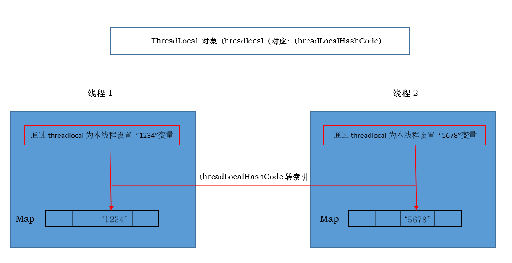

# ThreadLocal 源码分析

JDK版本：1.8

ThreadLocal 类位于 java.lang 包下。

我们先来看看这个类的注释：

> This class provides thread-local variables.  These variables differ from their normal counterparts in that each thread that accesses one (via its {@code get} or {@code set} method) has its own, independently initialized copy of the variable.  {@code ThreadLocal} instances are typically private static fields in classes that wish to associate state with a thread (e.g., a user ID or Transaction ID).
Each thread holds an implicit reference to its copy of a thread-local variable as long as the thread is alive and the {@code ThreadLocal} instance is accessible; after a thread goes away, all of its copies of thread-local instances are subject to garbage collection (unless other references to these copies exist).

这个类（指 ThreadLocal）提供了线程本地变量，这些变量和平常的副本变量不同之处在于，每个访问一个线程（通过其 {@code get} 或 {@code set} 方法）都有它自己的独立初始化的变量副本。ThreadLocal 实例通常是被希望是和线程的状态关联起来（例如，用户ID或事物ID），并且在类中扮演者一个私有静态字段的角色。

只要线程还是存活的，且 ThreadLocal 实例是可访问的，那么每个线程就持有线程本地变量的隐式引用（为什么是隐式引用，且看后面源码），在线程消亡之后，所有的线程本地变量都将是垃圾收集器的对象（除非这些本地变量有其他的引用存在）。

## 一、threadLocalHashCode

这个变量在源码中的声明如下：

```java
private final int threadLocalHashCode = nextHashCode();
```

看到这个变量我们不难猜想出，这是一个线程中每个 ThreadLocal 实例区分的标志，为什么这么说呢？因为每个线程中都维护这一个 threadLocals 变量，它是 `ThreadLocal.ThreadLocalMap` 类型变量。

threadLocalHashCode 的注释如下：

> ThreadLocals rely on per-thread linear-probe hash maps attached to each thread (Thread.threadLocals and inheritableThreadLocals).  The ThreadLocal objects act as keys, searched via threadLocalHashCode.  This is a custom hash code (useful only within ThreadLocalMaps) that eliminates collisions in the common case where consecutively constructed ThreadLocals are used by the same threads, while remaining well-behaved in less common cases.

ThreadLocas 依赖它所附属的线程线性探测 Hash 映射。ThreadLocal对象作为 map 的键（key），通过 threadLocalHashCode 来搜索（联想到 Hash 表的线性探测法），这是一个自定义的 hashcode（仅仅在 ThreadLocalMap 内部使用），它消除了在同一个线程中连续构造的 ThreadLocal 实例的常见情况下的冲突，同时在不太常见的情况下保持良好的性能。

下面的几个静态的成员变量就是用来自动生成 threadLocalHashCode 的：

```java
/**
 * The next hash code to be given out. Updated atomically. Starts at
 * zero.
 */
private static AtomicInteger nextHashCode = new AtomicInteger();

private static final int HASH_INCREMENT = 0x61c88647;

/**
 * Returns the next hash code.
 */
private static int nextHashCode() {
    return nextHashCode.getAndAdd(HASH_INCREMENT);
}
```

第一个成员变量给出下一个 ThreadLocal 的 hashcode，它是一个原子变量，因此 ThreadLocal 不会存在 hash 冲突，第二个变量是 hashcode 的增量，第三个变量通过调用第一个成员变量，并传入增量，返回下一个 ThreadLocal 的 hashcode。

## 二、ThreadLocalMap

我为什么不先说 ThreadLocal 中的 set 和 get 方法而先说这个嵌套的静态内部类呢？因为 set 和 get 方法都在在这个 ThreadLocalMap 的基础上进行操作的。

这是 ThreadLocal 中的静态内部类，该静态内部类中还有一个嵌套的静态内部类 Entry，通常来说，这个 Entry 就是存储键值的地方。它的代码如下：

```java
static class Entry extends WeakReference<ThreadLocal<?>> {
    /** The value associated with this ThreadLocal. */
    Object value;

    Entry(ThreadLocal<?> k, Object v) {
        super(k);
        value = v;
    }
}
```

对于这个 Entry 的注释如下：

> The entries in this hash map extend WeakReference, using its main ref field as the key (which is always a ThreadLocal object).  Note that null keys (i.e. entry.get() == null) mean that the key is no longer referenced, so the entry can be expunged from table.  Such entries are referred to as "stale entries" in the code that follows.

在该哈希表中的实体（指 Entry）继承了 WeakReference （Java中的弱引用），它使用ThreadLocal对象作为 key，我们需要注意的是空键的情况，即 `entry.get() == null`，出现这种情况就意味着这个 Entry 的 key，也就是对应的 ThreadLocal 实例不再被引用了，所以这个 entry 可以从哈希表中删除掉。

从 Entry 的构造方法中我们能看出，程序中为 ThreadLocal 对象创建了弱引用，这是一个隐藏的地方，很值得我们注意，会有相关的内存泄漏问题，后续分析。而 value 这是存储变量的地方，它是一个 Object 变量。

我们还可以看看 ThreadLocalMap 其他的一些成员变量：

```java
private static final int INITIAL_CAPACITY = 16;

private Entry[] table;

private int size = 0;

private int threshold; // Default to 0
```

我想，这些应该很熟悉了，ThreadLocalMap 底层使用的数组来存储 Entry，它的初始化容量时 16，也维护着一个阈值（threshold），还有扩容机制，这里我就不多说了，源码中有。

接下来看看 ThreadLocalMap 的构造方法：

```java
ThreadLocalMap(ThreadLocal<?> firstKey, Object firstValue) {
	table = new Entry[INITIAL_CAPACITY];
	int i = firstKey.threadLocalHashCode & (INITIAL_CAPACITY - 1);
	table[i] = new Entry(firstKey, firstValue);
	size = 1;
	setThreshold(INITIAL_CAPACITY);
}
```

该构造方法中透露给我们那些信息呢？第一，使用初始化容量初始化了底层数组；第二，通过 ThreadLocal 的 hashcode 的与运算计算其在数组中对应的索引，在数组相应的索引位置新插入这个 Entry。

这下我们能够清楚了，ThreadLocal 对象和对应的变量是如何关联在一起并存入 ThreadLocalMap 中的：通过 ThreadLocal 对象自定义的 hashcode，找到在数组中的索引位置，在该位置存储变量，很明显，这里使用的 Hash 策略是线性探测法。

我们可以通过下面一张图来看看 ThreadLocal 的工作原理：



## Methods

这里解析几个比较重要的方法：

- set
- get
- initialValue
- remove

### set

我们先来看看 set 方法：

```java
public void set(T value) {
	Thread t = Thread.currentThread();
	ThreadLocalMap map = getMap(t);
	if (map != null)
		map.set(this, value);
	else
		createMap(t, value);
}
```

这个方法为该 ThreadLocal 设置当前线程下的指定的变量，需要先获取当前的线程，并通过当前线程获取当前线程维护的 ThreadLocalMap 对象，实际上，Thread 类中维护着一个变量，如下：

```java
/* ThreadLocal values pertaining to this thread. This map is maintained
 * by the ThreadLocal class. */
ThreadLocal.ThreadLocalMap threadLocals = null;
```

而 getMap() 方法如下：

```java
ThreadLocalMap getMap(Thread t) {
	return t.threadLocals;
}
```

这下，一目了然：**每个线程都维护了一个 ThreadLocalMap对象，里面存储着 ThreadLocal 对象及其对应的变量值。**

我们再回到 set 方法，第一次调用 set 方法，map 肯定为 null，所以需要调用 createMap() 方法：

```java
void createMap(Thread t, T firstValue) {
	t.threadLocals = new ThreadLocalMap(this, firstValue);
}
```

该方法对线程的 threadLocals 进行初始化。

### get

```java
/**
 * Returns the value in the current thread's copy of this
 * thread-local variable.  If the variable has no value for the
 * current thread, it is first initialized to the value returned
 * by an invocation of the {@link #initialValue} method.
 *
 * @return the current thread's value of this thread-local
 */
public T get() {
	Thread t = Thread.currentThread();
	ThreadLocalMap map = getMap(t);
	if (map != null) {
		ThreadLocalMap.Entry e = map.getEntry(this);
		if (e != null) {
			@SuppressWarnings("unchecked")
			T result = (T)e.value;
			return result;
		}
	}
	return setInitialValue();
}
```

返回当前线程存储的和此 ThreadLocal 对象相关的值，由于 Entry 中的 value 是 Object类型的变量，所以需要强转。如果 ThreadLocalMap 还没有初始化就调用了 get 方法（如，还没有调用 set 就调用 get 方法），则需要调用设置初始值的方法，setInitialValue()：

```java
private T setInitialValue() {
	T value = initialValue();
	Thread t = Thread.currentThread();
	ThreadLocalMap map = getMap(t);
	if (map != null)
		map.set(this, value);
	else
		createMap(t, value);
	return value;
}
```

在该方法中，首先调用了 initialValue() 方法，实际上在该方法中只有一条语句，就是 `return null;`，随后再调用 createMap 方法初始化 ThreadLocalMap，并把 null 存进 map 中，因此，如果我们在调用 set 之前就调用 get 方法，会返回 null，并设置 该 ThreadLocal 对象在 ThreadLocalMap 中的值为 null。

### initialValue

> Returns the current thread's "initial value" for this thread-local variable. This method will be invoked the first time a thread accesses the variable with the {@link #get} unless the thread previously invoked the {@link #set} method, in which case the {@code initialValue} method will not be invoked for the thread. Normally, this method is invoked at most once per thread, but may be invoked again in case of subsequent invocations of {@link #remove} followed by {@link #get}.

```java
protected T initialValue() {
	return null;
}
```

initialValue 方法在 ThreadLocal 中被 protected 修饰符修饰，一般用来被子类重写。一般来说，线程在未调用 set 方法设置值时就调用 get 方法来获取值，获取到的是 null，而如果我们想得到一个初始值而不是 null 呢？那么就需要重写 initialValue 方法。

ThreadLocal 的类注释中给出了一个例子，例子中就继承了 ThreadLocal 并重写了该方法：

```java
public class ThreadId {

    /**
     * Atomic integer containing the next thread ID to be assigned
     */
    private static final AtomicInteger NEXT_ID = new AtomicInteger(0);

    private static final ThreadLocal<Integer> THREAD_ID = new ThreadLocal<Integer>() {
        @Override
        protected Integer initialValue() {
            return NEXT_ID.getAndIncrement();
        }
    };

    /**
     * Returns the current thread's unique ID, assigning it if necessary
     */
    public static int get() {
        return THREAD_ID.get();
    }

	public static void main(String[] args) {
        Runnable runnable = () -> {
            Thread current = Thread.currentThread();
            System.out.print("the thread " + current.getName() + "'s id: " + get());
        };

        for (int i = 0; i < 2; i++) {
            new Thread(runnable, "thread" + i).start();
        }
    }
}
```

注意，当调用 ThreadLocal 的 remove 方法之后再调用 get 方法，此时还会触发 initialValue 方法的执行。

### remove 方法

```java
public void remove() {
	 ThreadLocalMap m = getMap(Thread.currentThread());
	 if (m != null)
		 m.remove(this);
 }
```

当我们不需要使用目前线程中的 ThreadLocal 对象及其对应的变量时，**一定要调用 remove 方法**，这是一个好习惯。
