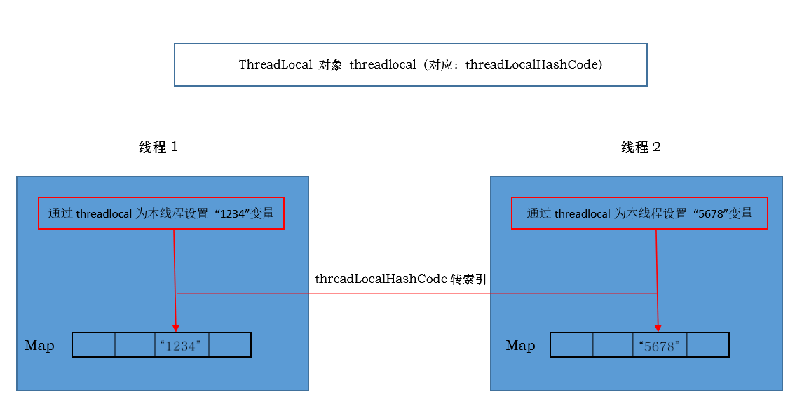

# ThreadLocal 简介与使用

JDK版本：1.8

## 一、问题引出

大胖 遇到了一个棘手的问题，他在一个 AccountService 中写了一段类似这样的代码：

```java
Context ctx = new Context();
ctx.setTrackerID(......);
```

然后这个 AccountService 调用了其他Java类，不知道经过了多少层调用以后，最终来到了一个叫做 AccountUtil 的地方，在这个类中需要使用Context中的trackerID来做点儿事情。

很明显，这个AccountUtil没有办法拿到Context对象，怎么办？大胖想到，要不把Context对象一层层地传递下去，这样AccountUtil不就可以得到了吗？

可是这么做改动量太大！涉及到的每一层函数调用都得改动，有很多类都不属于自己的小组管理，还得和别人协调。

更要命的是有些类根本就没有源码，想改都改不了。

这也难不住我，大胖想：可以把那个 set/get TrackerID 的方法改成静态(static)的，这样不管跨多少层调用都没有问题！

```java
public class Context{
    public static String getTrackerID(){
        ......
    }
    public static void setTrackerID(String id){
        ......
    }
}
```

这样就不用一层层地传递了，Perfect！

大胖得意洋洋地把代码提交给Bill做Review。

Bill看了一眼就指出了致命的问题： 多线程并发的时候出错！

张大胖恨不得找个地缝钻进去：又栽在多线程上面了，这次犯的还是低级错误！

线程1调用了Context.setTrackerID()， 线程2 也调用了Context.setTrackerID()，数据互相覆盖，不出乱子才怪。

张大胖感慨地说：“像我这样中情况，需要在某处设置一个值，然后经过重重方法调用，到了另外一处把这个值取出来，又要线程安全，实在是不好办啊， 对了，我能不能把这个值就放到线程中？ 让线程携带着这个值到处跑，这样我无论在任何地方都可以轻松获得了！”

Bill说：“有啊，每个线程都有一个私家领地！ 在Thread这个类中有个专门的数据结构，你可以放入你的TrackerID，然后到任何地方都可以把这个TrackerID给取出来。”

## ThreadLocal 类

简洁地说，ThreadLocal 类是用来维护本线程的变量的。那么如何使用呢？非常简单， 你可以轻松创建一个ThreadLocal类的实例：

```java
ThreadLocal<String> threadLocalA= new ThreadLocal<String>();

线程1： threadLocalA.set("1234");
线程2： threadLocalA.set("5678");
```

像 "1234"，"5678" 这些值都会放到自己所属的线程对象中。如下图：


每个线程中都维护着一个 ThreadLocalMap 对象，相当于把各自的数据放入到了各自 Thread 这个对象中去了，每个线程的值自然就区分开了，可是那个数据结构 map 呢？想想，假设你创建了另外一个threadLocalB：

```java
ThreadLocal<Integer> threadLocalB = new ThreadLocal<Integer>();

线程1： threadLocalB.set(30);
线程2： threadLocalB.set(40);
```

那线程对象的 map 就起到作用了：


明白了，这个私家领地还真是好用，我现在就把我那个Context给改了，让它使用ThreadLocal：

```java
package com.vin.common;

/**
 * @author Vintage
 * 2018/11/4
 */
public class Context {

    private static final ThreadLocal<String> THREAD_LOCAL = new ThreadLocal<String>();

    public static void setTrackerID(String id) {
        THREAD_LOCAL.set(id);
    }

    public static String getTrackerID() {
        return THREAD_LOCAL.get();
    }
}

```

**注意 Context 实例在每个线程中只有一个实例，才让 ThreadLocal 变量为 static的。**

## 模拟运行

IDE 环境：Intellij IDEA

Context 类还是我们上面的类，没有变化，现在新增一个执行程序：

```java
package com.vin.common;

import java.lang.reflect.Field;

/**
 * @author Vintage
 * 2018/11/5
 */
public class ContextTest implements Runnable{

    private String id;

    public void setId(String id) {
        this.id = id;
    }

    @Override
    public void run() {
        Context.setTrackerID(id);
        System.out.println("设置完毕");
        try {
            Thread.sleep(20000);
        } catch (InterruptedException e) {
            e.printStackTrace();
        }
        System.out.println(Context.getTrackerID());
    }

    public static void main(String[] args) {
        ContextTest test1 = new ContextTest();
        ContextTest test2 = new ContextTest();
        test1.setId("1234");
        test2.setId("5678");
        Thread t1 = new Thread(test1);
        Thread t2 = new Thread(test2);
        t1.start();
        t2.start();
    }
}
```

当两个线程各自设置完自己的 Context 后，我让他们都进入线程休眠状态。我们在 `t1.start();` 语句出设置一个断点，进入多线程调试模式。

我们看看线程1中的状态


我们看看线程2中的状态


**如果展开每个线程中的 threadLocals 中的 referent，它们都是同一个 ThreadLocal 对象（因为我声明为 static 修饰），对于同一个 ThreadLocal 对象的 threadLocalHashCode 的也是一样的。因此，对于一个 ThreadLocal 对象，其实例只有一个，但是在 Thread 的 ThreadLocalMap 对象中，存储着 ThreadLocal 对象的 threadLocalHashCode 和与当前线程关联的变量。**



## 总结

ThreadLocal这个名字起得有点让人误解， 很容易让人认为是“本地线程”， 其实是用来维护本线程的变量。 对照着上面的原理讲解，我想大家可以自行去看ThreadLocal的源码，轻松理解。

ThreadLocal 并不仅仅是Java中的概念，其他语言例如Python,C#中也有，作用类似。

ThreadLocal在日常工作中用得不多，但是在框架（如Spring）中是个基础性的技术，在事务管理，AOP等领域都能找到。
