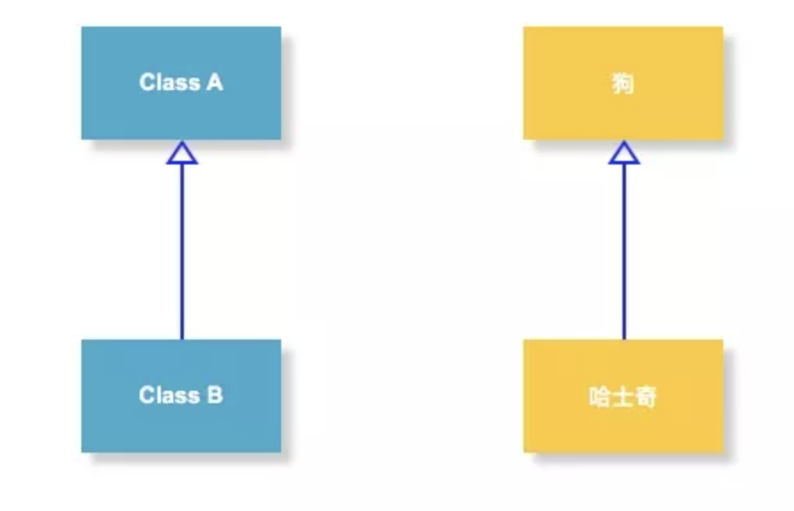
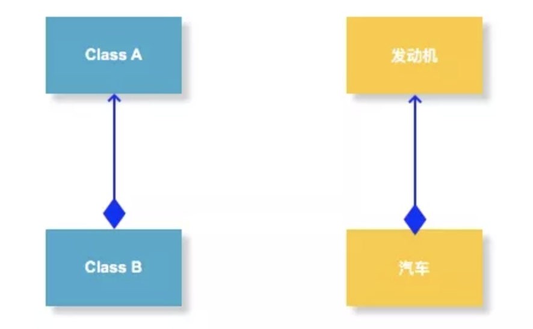

# 慎用继承

从学习Java的第一天起，我们就知道Java是一种面向对象的语言，而学习Java的第二天我们就知道了面向对象的三大特性：封装、继承、多态。

所以，对于很多开发者来说，继承肯定都是不陌生的。但是，继承一定适合所有的场景吗？毫无忌讳的使用继承来做代码扩展真的好吗？为什么《阿里巴巴Java开发手册》中有一条规定：谨慎使用继承的方式进行扩展，优先使用组合的方式实现。

## 1. 面向对象的复用技术

每个人在刚刚学习继承的时候都会或多或少的有这样一个印象：继承可以帮助我实现类的复用。所以，很多开发人员在需要复用一些代码的时候会很自然的使用类的继承的方式，因为书上就是这么写的（老师就是这么教的）。

但是，其实这样做是不对的。长期大量的使用继承会给代码带来很高的维护成本。

前面提到复用，这里就简单介绍一下面向对象的复用技术。复用性是面向对象技术带来的很棒的潜在好处之一。如果运用的好的话可以帮助我们节省很多开发时间，提升开发效率。但是，如果被滥用那么就可能产生很多难以维护的代码。

作为一门面向对象开发的语言，代码复用是Java引人注意的功能之一。Java代码的复用有继承，组合以及代理三种具体的表现形式。

### 1.1. 继承

继承（Inheritance）是一种联结类与类的层次模型。指的是一个类（称为子类、子接口）继承另外的一个类（称为父类、父接口）的功能，并可以增加它自己的新功能的能力，继承是类与类或者接口与接口之间最常见的关系。

继承是一种is-a关系。如苹果是水果，狗是动物，哈士奇是狗。

### 1.2. 组合

组合（Composition）体现的是整体与部分、拥有的关系。

组合是一种has-a的关系。如汽车有一个发动机，学校有一个老师等。

### 1.3. 组合与继承的关系

首先，从类的关系确定时间点上，组合和继承是有区别的：

继承，在写代码的时候就要指名具体继承哪个类，所以，**类的继承关系是在编译期就确定的**。并且从基类继承来的实现是无法在运行期动态改变的，因此降低了应用的灵活性。

组合，在写代码的时候可以采用面向接口编程。所以，**类的组合关系一般在运行期确定**。

另外，代码复用方式上也有一定区别：

继承结构中，父类的内部细节对于子类是可见的。所以我们通常也可以说**通过继承的代码复用是一种白盒式代码复用。**

如果基类的实现发生改变，那么派生类的实现也将随之改变。这样就导致了子类行为的不可预知性。

组合是通过对现有的对象进行拼装（组合）产生新的、更复杂的功能。因为在对象之间，各自的内部细节是不可见的，所以我们也说**通过组合的代码复用是黑盒式代码复用。**

因为组合中一般都定义一个类型，所以在编译期根本不知道具体会调用哪个实现类的方法，这就是面向接口编程。

最后，**Java中不支持多继承，而组合是没有限制的**。就像一个人只能有一个父亲，但是他可以有很很多辆车。

### 1.4. 优缺点对比

| **组合关系**                                                 | **继承关系**                                                 |
| ------------------------------------------------------------ | ------------------------------------------------------------ |
| 优点：不破坏封装，整体类与局部类之间松耦合，彼此相对独立     | 缺点：破坏封装，子类与父类之间紧密耦合，子类依赖于父类的实现，子类缺乏独立性 |
| 优点：具有较好的可扩展性                                     | 缺点：支持扩展，但是往往以增加系统结构的复杂度为代价         |
| 优点：支持动态组合。在运行时，整体对象可以选择不同类型的局部对象 | 缺点：不支持动态继承。在运行时，子类无法选择不同的父类       |
| 优点：整体类可以对局部类进行包装，封装局部类的接口，提供新的接口 | 缺点：子类不能改变父类的接口                                 |
| 缺点：整体类不能自动获得和局部类同样的接口                   | 优点：子类能自动继承父类的接口                               |
| 缺点：创建整体类的对象时，需要创建所有局部类的对象           | 优点：创建子类的对象时，无须创建父类的对象                   |

### 1. 5. 为什么组合优于继承

相信很多人都知道面向对象中有一个比较重要的原则『多用组合、少用继承』或者说『组合优于继承』。

从前面的介绍已经优缺点对比中也可以看出，组合比继承更加灵活，也更有助于代码维护。其具有不破坏封装性、具有更好的可扩展性、支持动态组合、整体类可以改变局部类的行为等优点。

所以，建议在同样可行的情况下，优先使用组合而不是继承。因为组合更安全，更简单，更灵活，更高效。

注意，并不是说继承就一点用都没有了，前面说的是【在同样可行的情况下】。有一些场景还是需要使用继承的，或者是更适合使用继承。

另外，除了《阿里巴巴Java开发手册》，在很多其他资料中也有关于组合和继承的介绍和使用约束：

> 继承要慎用，其使用场合仅限于你确信使用该技术有效的情况。一个判断方法是，问一问自己是否需要从新类向基类进行向上转型。如果是必须的，则继承是必要的。反之则应该好好考虑是否需要继承。《Java编程思想》
> 只有当子类真正是超类的子类型时，才适合用继承。换句话说，对于两个类A和B，只有当两者之间确实存在is-a关系的时候，类B才应该继续类A。《Effective Java》
