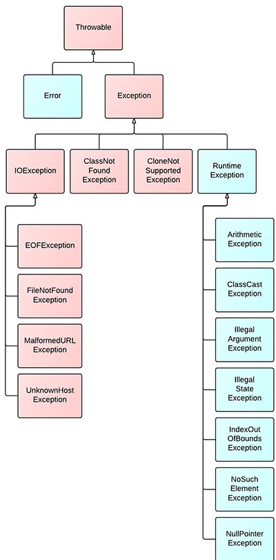

# Java 异常

异常（Exception）是正常程序流程所不能处理或者没有处理的异常情况或异常事件。(开发过程中的语法错误和逻辑错误不是异常)

按异常在编译时是否被检测来分，Java程序异常件可分为两类：

1. 受检异常（Checked Exception）：受检异常在编译时就能被Java编译器所检测到。

2. 非受检异常（Unchecked Exception）：非受检异常不能在编译时检测到。非受检异常包括运行时异常（Runntime Exception）和错误异常（Error）。

运行时异常只能在程序运行时被检测到，如：除数为0。一般来说，只有在计算出具体的数值之后，才能知道除数是否为0。

错误异常（Error）是不能在编译时被检测或根本就不可能由程序来恢复或处理，例如：Java虚拟机出现严重错误（Virtual Machine Error）。

在Java语言中，异常是以类的形式进行封装的。程序可以处理对应的类是 `java.lang.Exception` 及其子类，错误异常对应的类是 `java.lang.Error` 及其子类，运行时异常对应的类是 `java.lang.RunntimeException` 及其子类，其中，类 `java.lang.RunntimeException` 是类 `java.lang.Exception` 的子类。在类 `java.lang.Exception` 的子类中，除了类 `java.lang.Exception` 及其子类之外，都是受检异常对应的类。上面所说的类都是 `java.lang.Throwable` 的子类。它们之间的层次关系图如下：



## 一、异常对象的生成

Java程序的执行过程中如出现异常，会生成一个异常类对象，该异常对象将被提交给Java运行时系统，这个过程称为抛出(throw)异常。

1. 由虚拟机自动生成：程序运行过程中，虚拟机检测到程序发生了问题，如果在当前代码中没有找到相应的处理程序，就会在后台自动创建一个对应异常类的实例对象并抛出——自动抛出。

2. 由开发人员手动创建，如下：

	```java
	Exception exception = new ClassCastException();
	```

	创建好的异常对象不抛出对程序没有任何影响，和创建一个普通对象一样。

## 二、处理异常的机制

Java采用异常处理机制，将异常处理的程序代码集中在一起，与正常的程序代码分开，使得程序简洁，并易于维护。

Java提供的是异常处理机制的抓抛模型，通常有两种处理方式：

1. 捕获并处理：在异常的代码附近显示用try/catch/finally进行处理(不合理)，运行时系统捕获后会查询相应的catch处理块，在catch处理块中对该异常进行处理。

2. 查看发生异常的方法是否有向上声明异常，如果有向上声明抛出异常，则向上级查询处理语句，如果没有向上声明，JVM中断程序的运行并处理。在方法上用 throws 关键字向外声明异常(合理的处理方法)。

如果一个方法内抛出异常，该异常对象会被抛给调用者方法中处理。如果异常没有在调用者方法中处理，它继续被抛给这个调用方法的上层方法。这个过程将一直继续下去，直到异常被处理。这一过程称为捕获(catch)异常。

如果一个异常回到main()方法，并且main()也不处理，则程序运行终止。

程序员通常只能处理Exception，而对Error无能为力。

对非受检异常(unchecked exception )的几种处理方式：

1. 捕获
2. 继续抛出
3. 不处理

对受检异常(checked exception)的几种处理方式：

1. 继续抛出，消极的方法，一直可以抛到java虚拟机来处理
2. 用 try...catch 捕获

注意，对于受检异常必须处理，或者必须捕获或者必须抛出，而非受检异常可以不做处理。

## 三、异常关键字

| 关键字 | 作用 |
|--------|--------|
| try | 用于封装可能出现异常的代码段 |
| catch | 捕获异常区域，如果被封装到try中的代码真的出现异常，程序将跳转到catch区域，并且在catch区域中可以得到异常的信息 |
| throw | 抛出异常到其调用者 |
| throws | 用于声明当前方法可能会出现异常，但是方法体内并没有处理异常的机制，如果要使用该方法，需要调用者处理可能发生的异常信息 |
| finally | 即使程序出现异常，仍然要执行的代码段 |


## 四、自定义异常

自定义一个余额不足异常并继承RuntimeException异常

```java
package com.Exception;


/**
 * 自定义：余额不足异常
 * 形成来自父类的构造方法：右键->source->Generate Constructors from Superclass
 * @author Vinsmoke
 *
 */
public class InsufficiFundException extends RuntimeException{

	public InsufficiFundException() {
		super();
	}

	public InsufficiFundException(String arg0, Throwable arg1, boolean arg2, boolean arg3) {
		super(arg0, arg1, arg2, arg3);
	}

	public InsufficiFundException(String arg0, Throwable arg1) {
		super(arg0, arg1);
	}

	public InsufficiFundException(String arg0) {
		super(arg0);
	}

	public InsufficiFundException(Throwable arg0) {
		super(arg0);
	}
	

}

```

抛出异常

```java
package com.Exception;

public class StuSystemManager {

	public static void main(String[] args) {

		payMoney();

	}

	/* 用于声明当前方法可能会出现异常 */
	public static void payMoney() throws InsufficiFundException {
		double money = 25.34;
		if (money < 240) {
			// 提示用户余额不足
			throw new InsufficiFundException("余额不足，请充值！");
		}
	}

}

```

## 常见的异常抛出与处理

#### 自己捕获异常并处理异常

```java
package com.general;

public class Test {
	
	public static void exception(){
		try {
			int a=1/0;
			System.out.println(a);
		} catch (Exception e) {
			e.printStackTrace();
		}finally{
        	System.out.println("出现异常也要执行的代码");
        }
		System.out.println("后面执行的代码");
		
	}
	
	
	public static void main(String[] args) {
		exception();
	}
}
```

运行结果：

```language
java.lang.ArithmeticException: / by zero
	at com.general.Test.exception(Test.java:7)
	at com.general.Test.main(Test.java:20)
出现异常也要执行的代码
后面执行的代码

```

我们可以看到，在方法中自己捕获异常并输出异常，而调用者不需要来处理，且在方法中，异常之后的代码仍然可以执行到。

#### 声明可能出现异常，但不处理

我们在方法中声明可能出现的异常，但是方法体内并没有处理异常的机制，如果要使用该方法，需要调用者处理可能发生的异常信息。

```java
package com.general;

public class Test {
	
	public static void exception() throws Exception{
		int a=1/0;
		System.out.println(a);
		System.out.println("后面执行的代码");
	}
	
	
	public static void main(String[] args) {
		try {
			exception();
		} catch (Exception e) {
			e.printStackTrace();
		}
	}
}

```

运行结果：

```
java.lang.ArithmeticException: / by zero
	at com.general.Test.exception(Test.java:6)
	at com.general.Test.main(Test.java:14)

```

我们可以看到，出现异常，后面的代码并不会被执行，并且还需要调用者来捕获异常。

#### 抛出异常

将方法可能出现的异常给抛出，一旦抛出，程序不再运行。

```java
package com.general;

public class Test {
	
	public static void exception(){
		try {
			int a = 1 / 0;
			System.out.println(a);
		} catch (Exception e) {
			throw new ArithmeticException();
		}
		System.out.println("后面执行的代码");
	}
	
	
	public static void main(String[] args) {
		exception();
		System.out.println("主方法");
	}
}

```

运行结果：

```language
Exception in thread "main" java.lang.ArithmeticException
	at com.general.Test.exception(Test.java:10)
	at com.general.Test.main(Test.java:17)

```