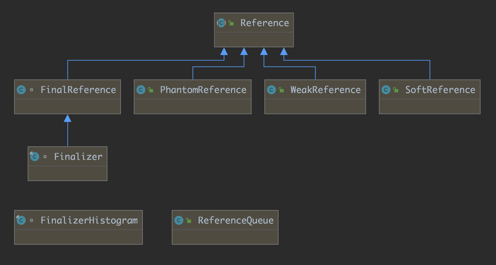

# Java中四种引用类型

我们都知道在JVM垃圾回收中，GC判断堆中的对象实例或者数据是不是垃圾的方法有引用计数法和可达性算法两种。

无论是通过引用计数算法判断对象的引用数量，还是通过根搜索算法判断对象的引用链是否可达，判定对象是否存活都与“引用”有关。

对象的强、软、弱和虚引用。

在JDK 1.2以前的版本中，若一个对象不被任何变量引用，那么程序就无法再使用这个对象。也就是说，只有对象处于可触及（reachable）状态，程序才能使用它。从JDK 1.2版本开始，把对象的引用分为4种级别，从而使程序能更加灵活地控制对象的生命周期。这4种级别由高到低依次为：强引用、软引用、弱引用和虚引用。

虽然垃圾回收的具体运行是由JVM来控制的，但是开发人员仍然可以在一定程度上与垃圾回收器进行交互，其目的在于更好的帮助垃圾回收器管理好应用的内存，这种交互方式就是使用JDK 1.2 引入的 java.lang.ref 包。

这四种引用类型都定义在 java.lang.ref 包下，在这个包下的类有：

- Finalizer：与对象的终结机制有关
- FinalReference：强引用相关
- PhantomReference：虚引用相关
- Reference：引用
- ReferenceQueue：引用队列
- SoftReference：软引用
- WeakReference：弱引用

JDK 8中的 UML 关系图



FinalReference 类是包内可见，其他三种引用类型均为 public，可以在应用程序中直接使用。

## 一、强引用（Final Reference）

强引用是最普遍的引用。如果一个对象具有强引用，那垃圾回收期绝不会回收它。当内存空间不足时，Java虚拟机宁愿抛出 OutOfMemoryError 错误使程序终止，也不会靠随意回收具有强引用的对象来解决内存不足的问题。

那么强引用是什么呢？其实当我们创建一个对象时就是强引用，也就是说，该引用直接指向某个对象并可以直接访问对象，如：

```java
Date date = new Date()
```

其中的 date 就是一个实例的强引用。对象的强引用可以在程序中到处传递。很多情况下，会同时有多个引用指向同一个对象。强引用的存在限制了对象在内存中的存活时间。假如对象A中包含了一个对象B的强引用，那么一般情况下，对象B的存活时间就不会短于对象A。如果对象A没有显式的把对象B的引用设为null的话，就只有当对象A被垃圾回收之后，对象B才不再有引用指向它，才可能获得被垃圾回收的机会。

从上面的描述中，我们可以推出：强引用可能导致内存泄漏。

除了强引用之外，java.lang.ref包中提供了对一个对象的不同的引用方式。JVM的垃圾回收器对于不同类型的引用有不同的处理方式。

整个FinalReference类的定义如下（有些API中并没有加入FinalReference类的说明，只能看源码了）：

```java
class FinalReference<T> extends Reference<T> {

    public FinalReference(T referent, ReferenceQueue<? super T> q) {
        super(referent, q);
    }
}
```

从类定义中可以看出，只有一个构造函数，根据所给的对象的应用和应用队列构造一个强引用。

## 二、软引用（Soft Reference）

如果一个对象只具有软引用，则内存空间足够，垃圾回收器就不会回收它；如果内存空间不足了，就会回收这些对象的内存。只要垃圾回收期没有回收它，该对象就可以被程序引用。软引用可用来实现内存敏感的告诉缓存。

软引用可以和一个引用队列（ReferenceQueue）联合使用，如果软引用所引用的对象被垃圾回收器回收，Java虚拟机就会把这个软引用加入到与之关联的引用队列中。

软引用（soft reference）在强度上弱于强引用，通过类SoftReference来表示。它的作用是告诉垃圾回收器，程序中的哪些对象是不那么重要，当内存不足的时候是可以被暂时回收的。当JVM中的内存不足的时候，垃圾回收器会释放那些只被软引用所指向的对象。如果全部释放完这些对象之后，内存还不足，才会抛出OutOfMemory错误。软引用非常适合于创建缓存。当系统内存不足的时候，缓存中的内容是可以被释放的。比如考虑一个图像编辑器的程序。该程序会把图像文件的全部内容都读取到内存中，以方便进行处理。而用户也可以同时打开多个文件。当同时打开的文件过多的时候，就可能造成内存不足。如果使用软引用来指向图像文件内容的话，垃圾回收器就可以在必要的时候回收掉这些内存。

在 JDK 1.2 之后，提供了 SoftReference 类来实现软引用。软引用可用来实现内存敏感的高速缓存。软引用可以和一个引用队列（ReferenceQueue）联合使用，如果软引用所引用的对象被垃圾回收器回收，Java虚拟机就会把这个软引用加入到与之关联的引用队列中。

案例一：

```java
package com.test;

import java.lang.ref.Reference;
import java.lang.ref.ReferenceQueue;
import java.lang.ref.SoftReference;

/**
 * @author Vintage
 * 2018/11/2
 */
public class SoftReferenceTest {

    private static ReferenceQueue<MyObject> softQueue = new ReferenceQueue<MyObject>();

    /**
     * Class definition
     */
    public static class MyObject{

        @Override
        protected void finalize() throws Throwable {
            super.finalize();
            System.out.println("MyObject' s finalize() called");
        }

        @Override
        public String toString() {
            return "This is MyObject";
        }
    }

    public static class CheckRefQueue implements Runnable {

        // 引用类
        Reference<MyObject> obj = null;

        @Override
        public void run() {
            try {
				        // 删除队列中的下一个引用，该方法会一直阻塞直到有一个可用
                obj = (Reference<MyObject>)softQueue.remove();
            } catch (InterruptedException e) {
                e.printStackTrace();
            }

			     /*
            当软引用被回收了，softQueue.remove()中就加入了一个引用而脱离阻塞状态，obj此时不会为null。
             */
            if(obj != null) {
                System.out.println("Object for SoftReference is " + obj.get());
            }
        }
    }

    public static void main(String[] args) {

        MyObject object = new MyObject();
        // 使用软引用队列实现软引用
        SoftReference<MyObject> softRef = new SoftReference<>(object, softQueue);

        // 线程开启
        new Thread(new CheckRefQueue()).start();

        // 删除强引用
        object = null;

        // 显式调用垃圾回收器：Runs the garbage collector.
        System.gc();

        // 调用软引用的get()方法，取得MyObject对象的引用
        System.out.println("After GC: Soft Get = "+softRef.get());

        System.out.println("此时，请求大块的内存：");
        byte[] b = new byte[5*1024*692];

        // 再调用软引用的get()方法，取得MyObject对象的引用
        System.out.println("After new byte[]:Soft Get = "+softRef.get());
        System.gc();
    }
}
```

运行参数1：

```language
-Xmx5M
```

该参数设置堆的最大空间大小，如果使用的IDE是 IDEA，可以在 Run/Debug Configuration 中的 VM Options 中可以加入这些配置，我们在上面设置的大小是 5M，即 `5*1024*1024 Byte。`

运行结果：

```
After GC: Soft Get = This is MyObject
此时，请求大块的内存：
MyObject' s finalize() called
Object for SoftReference is null
After new byte[]:Soft Get = null
```

出现这样的结果跟我们在程序中请求的内存大小有关，这需要根据各自的实际程序来调整。

运行参数2：

```language
-Xmx5M -XX:+PrintGCDetails
```

加入 `-XX:+PrintGCDetails` 参数运行可以更形象的看到GC回收的细节。

**下面对上面的例子进行解释**：我们首先构造一个 MyObject 对象，并将其赋值给 object 变量，这样就构成了强引用。然后使用 SoftReference 构造这个 MyObject 对象的软引用 softRef，并注册到 softQueue 引用队列。当 softRef 被回收时，MyObject 对象会被加入 softQueue 队列。设置obj=null，删除这个强引用，因此，系统内对 MyObject 对象的引用只剩下软引用。此时，显示调用GC，通过软引用的 get() 方法，取得 MyObject 对象的引用，发现对象并未被回收（因为输出了 “This is MyObject”），这说明GC在内存充足的情况下，不会回收软引用对象。接着，请求一块大的堆空间 `5*1024*692 Byte` ，这个操作会使系统堆内存使用紧张，从而产生新一轮的GC。在这次GC后，softRef.get() 不再返回 MyObject 对象，而是返回null，说明在系统内存紧张的情况下，软引用被回收。软引用被回收时，该软引用对象会被加入注册的引用队列。

如果将上面案例中的数组再改大点，比如5*1024*1024，就会抛出 OutOfMemory 异常：

```language
After GC: Soft Get = This is MyObject
此时，请求大块的内存，依据实际的程序调整：
Exception in thread "main" java.lang.OutOfMemoryError: Java heap space
	at com.test.SoftReferenceTest.main(SoftReferenceTest.java:68)
MyObject' s finalize() called
Object for SoftReference is null
```

软引用主要应用于内存敏感的高速缓存，在android系统中经常使用到。一般情况下，Android应用会用到大量的默认图片，这些图片很多地方会用到。如果每次都去读取图片，由于读取文件需要硬件操作，速度较慢，会导致性能较低。所以我们考虑将图片缓存起来，需要的时候直接从内存中读取。但是，由于图片占用内存空间比较大，缓存很多图片需要很多的内存，就可能比较容易发生 OutOfMemory 异常。这时，我们可以考虑使用软引用技术来避免这个问题发生。SoftReference可以解决 OutOfMemory 的问题，每一个对象通过软引用进行实例化，这个对象就以 cache 的形式保存起来，当再次调用这个对象时，那么直接通过软引用中的 get（）方法，就可以得到对象中的资源数据，这样就没必要再次进行读取了，直接从cache中就可以读取得到，当内存将要发生 OutOfMemory 的时候，GC会迅速把所有的软引用清除，防止 OutOfMemory 发生。

案例二：

```java
public class BitMapManager {

    private Map<String, SoftReference<Bitmap>> imageCache = new HashMap<String, SoftReference<Bitmap>>();

    //保存Bitmap的软引用到HashMap
    public void saveBitmapToCache(String path) {
        // 强引用的Bitmap对象
        Bitmap bitmap = BitmapFactory.decodeFile(path);
        // 软引用的Bitmap对象
        SoftReference<Bitmap> softBitmap = new SoftReference<Bitmap>(bitmap);

        // 添加该对象到Map中使其缓存
        imageCache.put(path, softBitmap);

        // 使用完后手动将位图对象置null
        bitmap = null;
    }

    public Bitmap getBitmapByPath(String path) {

        // 从缓存中取软引用的Bitmap对象
        SoftReference<Bitmap> softBitmap = imageCache.get(path);
        // 判断是否存在软引用
        if (softBitmap == null) {
            return null;
        }

        // 取出Bitmap对象，如果由于内存不足Bitmap被回收，将取得null
        Bitmap bitmap = softBitmap.get();
        return bitmap;
    }
}
```

## 三、弱引用（Weak Reference）

弱引用（Weak Reference）在强度上要弱于软引用，通过 WeakReference 来表示。它的作用是引用一个对象，但是并不阻止该对象被回收。如果使用一个强引用的话，只要该引用存在，那么被引用的对象是不能被回收的。弱引用则没有这个问题。在垃圾回收器运行的时候，如果一个对象的 **所有引用都是弱引用** 的话，该对象就会被回收。弱引用的作用在于解决强引用所带来的对象之间在存活时间上的耦合关系。

弱引用最常见的用处是在集合类中，尤其是哈希表中。哈希表的接口允许使用任何Java对象来作为键或值来使用，每当一个键值被放入哈希表中，那么哈希表对象本身就有了对这些键和值对象的引用。如果这种引用是强引用的话，那么只要哈希表对象本身还存活，其中所包含的键和值对象是不会被回收的。如果某个存活时间很长的哈希表中包含的键值对很多，最终就有可能消耗掉JVM中全部的内存。

对于这种情况的解决办法就是使用弱引用来引用这些对象，这样哈希表中的键和值对象都能被垃圾回收。正如我们所见的，Java中提供了WeakHashMap来满足这一常见需求。

弱引用与软引用的区别在于：只具有弱引用的对象拥有更短暂的生命周期。在垃圾回收器线程扫描它所管辖的内存区域的过程中，一旦发现了只具有弱引用的对象，不管当前内存空间足够与否，都会回收它的内存。不过，由于垃圾回收器是一个优先级很低的线程，因此不一定会很快发现那些只具有弱引用的对象。

弱引用可以和一个引用队列（ReferenceQueue）联合使用，如果弱引用所引用的对象被垃圾回收，Java虚拟机就会把这个弱引用加入到与之关联的引用队列中。

将案例一稍微修改一下，就能得到一下案例：

```java
package com.test;

import java.lang.ref.Reference;
import java.lang.ref.ReferenceQueue;
import java.lang.ref.WeakReference;

/**
 * @author Vintage
 * 2018/11/2
 */
public class WeakReferenceTest {

    /** 引用队列 */
    private static ReferenceQueue<MyObject> weakQueue = new ReferenceQueue<MyObject>();

    public static class MyObject {

        @Override
        protected void finalize() throws Throwable {
            super.finalize();
            System.out.println("MyObject' s finalize() called");
        }

        @Override
        public String toString() {
            return "This is MyObject";
        }
    }

    public static class CheckRefQueue implements Runnable {

        /** 引用 */
        Reference<MyObject> obj = null;

        @Override
        public void run() {
            try {
                // 删除队列中的下一个引用，该方法会一直阻塞直到有一个引用可用
                obj = (Reference<MyObject>) weakQueue.remove();
            } catch (InterruptedException e) {
                e.printStackTrace();
            }

            if (obj != null) {
                System.out.println("删除的弱引用为："+obj+"，获取弱引用的对象obj.get() = " + obj.get());
            }
        }
    }

    public static void main(String[] args) {

        MyObject object = new MyObject();
        WeakReference<MyObject> weakReference = new WeakReference<MyObject>(object, weakQueue);
        System.out.println("创建的弱引用为：" + weakReference);

        // 启动线程
        new Thread(new CheckRefQueue()).start();

        // 删除强引用，object对象就只有弱引用了
        object = null;
        System.out.println("Before GC: Weak Get= "+weakReference.get());
        System.gc();
        System.out.println("After GC: Weak Get= "+weakReference.get());
    }
}
```

不加参数的运行结果：

```language
创建的弱引用为：java.lang.ref.WeakReference@1540e19d
Before GC: Weak Get= This is MyObject
After GC: Weak Get= null
MyObject' s finalize() called
删除的弱引用为：java.lang.ref.WeakReference@1540e19d，获取弱引用的对象obj.get() = null
```

可以看到，在GC之前，弱引用对象并未被垃圾回收器发现，因此通过 weakReference.get()可以获取对应的对象引用。但是只要进行垃圾回收，**弱引用一旦被发现，便会立即被回收**，并加入注册引用队列中（weakQueue.remove() 也不会处于阻塞状态而被触发）。此时再试图通过 weakRef.get() 获取对象的引用就会失败。

软引用、弱引用都非常适合来保存那些可有可无的缓存数据。如果这么做，当系统内存不足时，这些缓存数据会被回收，不会导致内存溢出。而当内存资源充足时，这些缓存数据又可以存在相当长的时间，从而起来加速系统的作用。

## 四、虚引用（Phantom Reference）

虚引用也称为幽灵引用或者幻影引用，它是最弱的一种引用关系。一个持有虚引用的对象，和没有引用几乎是一样的，随时都有可能被垃圾回收器回收。当试图通过虚引用的 get() 方法取得强引用时，总是会失败。

在介绍虚引用之前，要先介绍Java提供的对象终止化机制（finalization）。

在Object类里面有个finalize方法，其设计的初衷是在一个对象被真正回收之前，可以用来执行一些清理的工作。因为Java并没有提供类似C++的析构函数一样的机制，就通过 finalize 方法来实现。但是问题在于垃圾回收器的运行时间是不固定的，所以这些清理工作的实际运行时间也是不能预知的。幽灵引用（phantom reference）可以解决这个问题。在创建幽灵引用 java.lang.ref.PhantomReference 的时候必须要指定一个引用队列。当一个对象的 finalize 方法已经被调用了之后，这个对象对应的幽灵引用会被加入到队列中。通过检查该队列里面的内容就知道一个对象是不是已经准备要被回收了。

通过上面一段描述我们清楚，虚引用的一个作用在于跟踪垃圾回收过程。

幽灵引用及其队列的使用情况并不多见，主要用来实现比较精细的内存使用控制，这对于移动设备来说是很有意义的。程序可以在确定一个对象要被回收之后，再申请内存创建新的对象。通过这种方式可以使得程序所消耗的内存维持在一个相对较低的数量。

我们先来看看 java.lang.ref.PhantomReference 中的源码：

```java
public class PhantomReference<T> extends Reference<T> {

    public T get() {
        return null;
    }

    public PhantomReference(T referent, ReferenceQueue<? super T> q) {
        super(referent, q);
    }
}
```

我们可以看到，get() 方法永远返回 null，因此我们不可能通过虚引用来访问到对应的对象。它的构造方法也必须指定引用队列。

我们依然给出一个案例：

```java
package com.test;

import java.lang.ref.PhantomReference;
import java.lang.ref.Reference;
import java.lang.ref.ReferenceQueue;
import java.util.concurrent.TimeUnit;

/**
 * 虚引用的缓存区
 *
 * @author Vintage
 * 2018/11/2
 */
public class PhantomReferenceTest {

    /** 引用队列 */
    private static ReferenceQueue<MyObject> phantomQueue = new ReferenceQueue<MyObject>();

    /** 标志 */
    private static boolean flag = false;

    public static class MyObject {

        @Override
        protected void finalize() throws Throwable {
            super.finalize();
            System.out.println("MyObject' s finalize() called");
        }

        @Override
        public String toString() {
            return "This is MyObject";
        }
    }

    public static class CheckRefQueue implements Runnable {

        /** 引用 */
        Reference<MyObject> obj = null;

        @Override
        public void run() {
            try {
                // 删除队列中的下一个引用，该方法会一直阻塞直到有一个引用可用
                obj = (Reference<MyObject>) phantomQueue.remove();
            } catch (InterruptedException e) {
                e.printStackTrace();
            }
            if (obj != null) {

                System.out.println("删除的虚引用为："+obj+"，获取虚引用的对象obj.get() = "+obj.get());
            }
            // 一旦虚引用被回收，改变标志
            flag = true;
        }
    }

    public static void main(String[] args) throws InterruptedException {
        MyObject object = new MyObject();
        Reference<MyObject> phanRef = new PhantomReference<>(object, phantomQueue);
        System.out.println("创建的虚引用为："+phanRef);

        // 启动线程
        new Thread(new CheckRefQueue()).start();

        // 删除强引用，只留下虚引用
        object = null;

        // 休眠，等待GC将虚引用回收
        TimeUnit.SECONDS.sleep(1);
        int i =1;
        while(!flag) {
            System.out.println("第"+ (i++) +"次gc");
            System.gc();
            TimeUnit.SECONDS.sleep(1);
        }
    }
}
```

运行结果：

```language
创建的虚引用为：java.lang.ref.PhantomReference@1540e19d
第1次gc
MyObject' s finalize() called
第2次gc
删除的虚引用为：java.lang.ref.PhantomReference@1540e19d，获取虚引用的对象obj.get() = null
```

因为我们不知道虚引用什么时候被回收，我们通过循环以及线程休眠的方式来给 GC 时间让它回收虚引用。

可以看到，再经过一次GC之后，系统找到了垃圾对象，并调用finalize()方法回收内存，但虚引用 phanRef 没有立即加入回收队列。第二次GC时，该对象真正被 GC 清楚，此时，加入虚引用队列。

虚引用的最大作用在于跟踪对象回收，清理被销毁对象的相关资源。

通常当对象不被使用时，重载该对象的类的 finalize 方法可以回收对象的资源。但是如果使用不慎，会使得对象复活，譬如这么编写finalize方法：

```java
public static class MyObject {

	private static MyObject secondLife;

	@Override
	protected void finalize() throws Throwable {
		super.finalize();
		System.out.println("MyObject' s finalize() called");
		secondLife = this;
	}

}
```

我们再运行上面的程序：

```language
创建的虚引用为：java.lang.ref.PhantomReference@1540e19d
第1次gc
MyObject' s finalize() called
第2次gc
第3次gc
第4次gc
第5次gc

......
```

我们可以看到，虽然调用了 finalize() 方法，但对象并没有被真正的销毁。调用 System.gc() 企图销毁对象，但是很抱歉，不管你调用多少次 System.gc() 都没有什么用，除非你在下面的代码中再执行 `obj=null`，这样才能回收对象，这是因为JVM对某一个对象至多只执行一次被重写的finalize方法。

上面的小片段说明重写finalize的方法并不是很靠谱，可以使用虚引用来清理对象所占用的资源。

如下代码所示：

```java
package com.test;

import java.lang.ref.PhantomReference;
import java.lang.ref.Reference;
import java.lang.ref.ReferenceQueue;
import java.util.HashMap;
import java.util.Map;
import java.util.concurrent.TimeUnit;

/**
 * 虚引用的缓存区
 *
 * @author Vintage
 * 2018/11/2
 */
public class PhantomReferenceTest {

    /** 引用队列 */
    private static ReferenceQueue<MyObject> phantomQueue = new ReferenceQueue<MyObject>();
    private static Map<Reference<MyObject>, String> map = new HashMap<Reference<MyObject>, String>();

    public static class MyObject {

        @Override
        protected void finalize() throws Throwable {
            super.finalize();
            System.out.println("MyObject' s finalize() called");
        }

        @Override
        public String toString() {
            return "This is MyObject";
        }
    }

    public static class CheckRefQueue implements Runnable {

        /** 引用 */
        Reference<MyObject> obj = null;

        @Override
        public void run() {
            try {
                // 删除队列中的下一个引用，该方法会一直阻塞直到有一个引用可用
                obj = (Reference<MyObject>) phantomQueue.remove();
                Object value = map.get(obj);
                System.out.println("clean resource: "+value);
                map.remove(obj);
                System.out.println("删除的虚引用为："+obj+"，获取虚引用的对象obj.get() = "+obj.get());
                System.exit(0);
            } catch (InterruptedException e) {
                e.printStackTrace();
            }
        }
    }

    public static void main(String[] args) throws InterruptedException {

        MyObject object = new MyObject();
        Reference<MyObject> phanRef = new PhantomReference<>(object, phantomQueue);
        System.out.println("创建的虚引用为："+phanRef);
        map.put(phanRef, "Some Resources");

        // 启动线程
        new Thread(new CheckRefQueue()).start();

        // 删除强引用，只留下虚引用
        object = null;

        // 休眠，等待GC将虚引用回收
        TimeUnit.SECONDS.sleep(1);
        int i =1;
        while(true) {
            System.out.println("第"+ (i++) +"次gc");
            System.gc();
            TimeUnit.SECONDS.sleep(1);
        }
    }
}
```

运行结果：

```language
创建的虚引用为：java.lang.ref.PhantomReference@1540e19d
第1次gc
MyObject' s finalize() called
第2次gc
clean resource: Some Resources
删除的虚引用为：java.lang.ref.PhantomReference@1540e19d，获取虚引用的对象obj.get() = null
```
