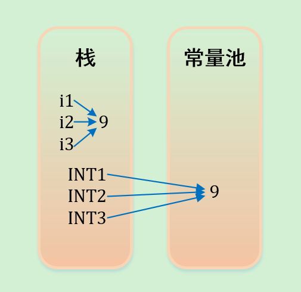

# Java内存管理以及常量池

Java的内存管理就是对象的分配和释放问题。在Java中，内存的分配是由程序完成的，而内存的释放是由垃圾回收器(Garbage Collection，GC)完成的，程序员不需要通过调用函数来释放内存，但它只能回收无用并且不再被其它对象引用的那些对象所占用的空间。

首先，想要了解JAVA的内存分配，就要先知道有哪些内存模块，也就是说要了解JAVA内存模型。Java虚拟机将其管辖的内存大致分三个逻辑部分：方法区(Method Area)、Java栈(Stack)和Java堆(Heap)。

- 方法区：方法区是静态分配的，编译器将变量在绑定在某个存储位置上，而且这些绑定不会在运行时改变。 常数池，源代码中的命名常量、String常量、代码段和数据段，静态域（用来存放static定义的静态成员）都保存在方法区。

  常量池(constant pool)指的是在编译期就被确定，并被保存在已编译的.class文件中的一些数据。除了包含代码中所定义的各种基本类型（如int、long等等）和对象型（如String及数组）的常量值(final)还包含一些以文本形式出现的符号引用，比如：

  - 类和接口的全限定名
  - 字段的名称和描述符
  - 方法和名称和描述符
  - 类和接口的全限定名

- Java栈：Java栈是一个逻辑概念，特点是后进先出。一个栈的空间可能是连续的，也可能是不连续的。用来保存局部变量的值，包括：1.用来保存基本数据类型的值；2.存放基本类型的数据和对象的引用，但对象本身不存放在栈中，而是存放在堆中。栈的优势是，存取速度比堆要快。但缺点是，存在栈中的数据大小与生存期必须是确定的，取决于线程的生命周期，缺乏灵活性。

- Java堆：堆分配意味着以随意的顺序，在运行时进行存储空间分配和收回的内存管理模型。Java堆用来存放动态产生的数据，比如通过new关键字创建出来的对象。注意创建出来的对象只包含属于各自的成员变量，并不包括成员方法，因为同一个类的对象拥有各自的成员变量，存储在各自的堆中，但是他们共享该类的方法，并不是每创建一个对象就把成员方法复制一次。堆是由垃圾回收来负责的，堆的优势是可以动态地分配内存大小，生存期也不必事先告诉编译器，因为它是在运行时动态分配内存的，Java的垃圾收集器会自动收走这些不再使用的数据。但缺点是，由于要在运行时动态 分配内存，存取速度较慢。

## 字符串的内存分配与常量池

对于字符串，其对象的引用都是存储在栈中的。如果是编译期已经创建好的字符串对象就存储在常量池中(如：直接用双引号定义的或者final修饰并且能在编译期就能确定的)，如果是运行期才能确定的就存储在堆中（如：new关键字创建出来的）。对于equals相等的字符串，在常量池中永远只有一份，在堆中有多份。

如以下代码：

```java
String s1 = "Hello";
String s2 = "Hello";
String s3 = "Hello";

String s4 = new String("Hello");
String s5 = new String("Hello");
String s6 = new String("Hello");
```

下图就是上述代码的内存模型。s1，s2和s3在编译期就能确定，在创建对象时，先在常量池中寻找相同的值，若没有，则在常量池中创建一个对象。对于通过new产生的一个字符串，会先去常量池中查找是否已经有了这个对象（此处为"Hello"），如果没有则在常量池中创建一个此字符串对象，然后堆中再创建一个常量池中此对象（此处为"Hello"）的拷贝对象。


若要问：`String s=new String("Hello")` 这个语句产生几个对象？答案是一个或两个，如果常量池中原来没有”Hello”，那就是两个。

String常量池问题的例子：

```java
【1】
String s0 = "HelloWorld";
String s1 = "World";
String s2 = "Hello" + s1;
System.out.println((s0 == s2));  // 结果为false

【2】
String s0 = "HelloWorld";
final String s1 = "World";
String s2 = "Hello" + s1;
System.out.println((s0 == s2)); // 结果为true

【3】
String s0 = "HelloWorld";
final String s1 = getWorld();
String s2 = "Hello" + s1;

System.out.println((s0== s2)); // 结果为false

private static String getWorld() {
	return "World";
}
```

分析：

【1】中，JVM对于字符串引用，由于在字符串的"+"连接中，有字符串引用存在，而引用的值在程序编译期是无法确定的，即"Hello" + s1无法被编译器优化，只有在程序运行期来动态分配并将连接后的新地址赋给s2。所以上面程序的结果也就为false。

【2】和【1】中唯一不同的是对字符串加了final修饰，对于final修饰的变量，它在编译时被解析为常量值的一个本地拷贝存储到自己的常量池中或嵌入到它的字节码流中。所以此时的 `"Hello" + s1` 和 `"Hello" + "World"` 效果是一样的。故上面程序的结果为true。

【3】JVM对于字符串引用s1，虽然它为final类型，但是它的值在编译期无法确定，只有在程序运行期调用方法后，将方法的返回值和"Hello"来动态连接并分配地址给s2，故上面程序的结果为false。

对字符串的操作，"abc"+"def"则会三个字符串对象，第三个是"abcdef"。也就是说，在Java中对字符串的一切操作，都会产生一个新的字符串对象。这是正确的，String创建字符串时不可变的，任何对String的改变都会引发新的String对象的生成，而那些不用的未被引用的对象将会作为垃圾回收。

### 基本类型的变量和常量在内存中的分配

对于基本类型的变量和常量，变量和引用存储在栈中，常量存储在常量池中。

如以下代码：

```java
int i1 = 9;
int i2 = 9;
int i3 = 9;

final int INT1 = 9;
final int INT2 = 9;
final int INT3 = 9;
```



编译器先处理int i1 = 9；首先它会在栈中创建一个变量为i1的引用，然后查找栈中是否有9这个值，如果没找到，就将9存放进来，然后将i1指向9。接着处理int i2 = 9；在创建完i2的引用变量后，因为在栈中已经有9这个值，便将i2直接指向9。这样，就出现了i1与i2同时均指向9的情况。最后i3也指向这个9。

基本类型和基本类型的包装类。基本类型有：byte、short、char、int、long、boolean。基本类型的包装类分别是：Byte、Short、Character、Integer、Long、Boolean（注意区分大小写）。

二者的区别是：**基本类型体现在程序中是普通变量，基本类型的包装类是类，体现在程序中是引用变量。因此二者在内存中的存储位置不同：基本类型存储在栈中，而基本类型包装类存储在堆中。上边提到的这些包装类都实现了常量池技术，另外两种浮点数类型的包装类则没有实现。**

如下代码：

```java
Integer i1 = 10;
Integer i2 = 10;
Integer i3 = new Integer(10);
Integer i4 = new Integer(10);
System.out.println(i1 == i2); // 输出为true
System.out.println(i2 == i3); // 输出为false
System.out.println(i3 == i4); // 输出为false
Double d1 = 1.0;
Double d2 = 1.0;
System.out.println(d1 == d2); // 输出为false
System.out.println(i1 == Integer.valueOf(10)); // 输出为 true
```

分析：

1. i1 和 i2 均是引用类型，在栈中存储指针，因为 Integer 是包装类。由于 Integer 包装类实现了常量池技术，因此 i1 和 i2 的 10 均是从常量池中获取的，均指向同一个地址，因此 i1=12。

2. i3 和 i4 均是引用类型，在栈中存储指针，因为 Integer 是包装类。但是由于他们各自都是 new 出来的，因此不再从常量池寻找数据，而是从堆中各自 new 一个对象，然后各自保存指向对象的指针，所以i3和i4不相等，因为他们所存指针不同，所指向对象不同。

3. d1 和 d2 均是引用类型，在栈中存储指针，因为Double是包装类。但 Double 包装类没有实现常量池技术，因此 `Doubled1=1.0;` 相当于 `Double d1=new Double(1.0);`，是从堆 new 一个对象，d2 同理。因此 d1 和 d2 存放的指针不同，指向的对象不同，所以不相等。实际上 Float 和 Double 都无法实现常量池技术，因为你不知道从 0 到 1 之间有多少个浮点数。

4. 将基本数据类型转换为包装数据类型，同样也会先去常量池中获取。具体可见 java.lang.Integer.IntegerCache 静态内部类，对于 [-128, 127] 之间的 Integer 数据都从常量池中获取。

### 成员变量和局部变量在内存中的分配

对于成员变量和局部变量：成员变量就是方法外部，类的内部定义的变量；局部变量就是方法或语句块内部定义的变量。局部变量必须初始化。 形式参数是局部变量，局部变量的数据存在于栈内存中。栈内存中的局部变量随着方法的消失而消失。 成员变量存储在堆中的对象里面，由垃圾回收器负责回收。

## String.intern()

参考：<https://blog.csdn.net/tyyking/article/details/82496901>

存在于 .class 文件中的常量池，在运行期被 JVM 装载，并且可以扩充。String 类的 `intern()` 方法就是扩充常量池的一个方法；当一个 String 实例 str 调用 intern() 方法时，Java查找常量池中是否有相同Unicode的字符串常量，如果有，则返回其引用，如果没有，则在常量池中增加一个 Unicode 等于 str 的字符串并返回它的引用。

如下代码：

```java
String s0 = "Java";
String s1 = new String("Java");
String s2 = new String("Java");

s2 = s2.intern();               // 把常量池中"Java"的引用赋给s2

System.out.println(s0 == s1);
System.out.println(s0 == s1.intern());
System.out.println(s0 == s2);
```

运行结果：

```language
false
true
true
```

