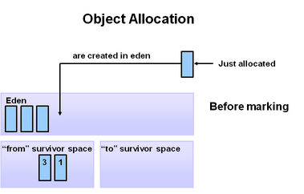
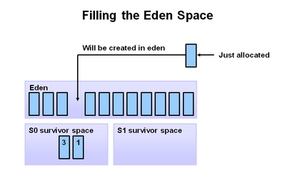
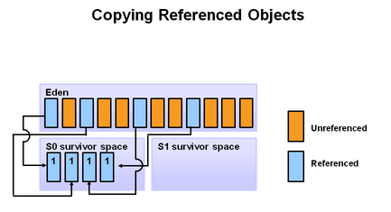
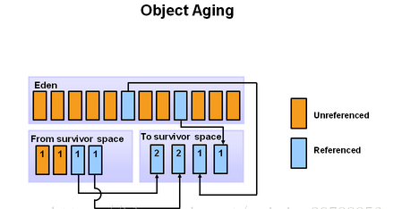
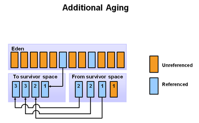
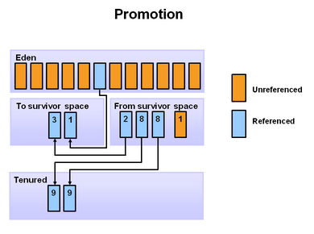
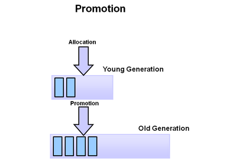

# Minor GC 和 Full GC的触发机制

## JVM 中 GC 的过程

要了解上面这两种GC的触发机制，我们首先就要了解JVM中的GC过程。

（1）初始阶段，新创建的对象被分配到 Eden 区，survivor  的两块空间都为空。

（2）当 Eden 区满了的时候，minor garbage collection 被触发。

（3）经过扫描和标记（复制垃圾回收算法），存活的对象被复制到 S0，不存活到对象被回收。

（4）在下一次的 Minor GC 中，Eden 区的情况和上面一致，没有引用的对象被回收，存活的对象被回收到 survivor 区。然而，在 survivor 区，S0 所有的对象都被复制到 S1，需要注意的是，在上次 Minor GC 过程中移动到 S0 中的两个对象在复制到 S1 后其年龄要加1。此时 Eden 区和 S0 区被清空，所有存活的数据都复制到了 S1 区，并且 S1 区存在着年龄不一样的对象，过程如下图所示：

（5）再下一次 Minor GC 则重复这个过程，这一次 survivor 的两个区对换，存活的对象被复制到 S0，被复制的存活的对象年龄加一，Eden 区和另一个 survivor 都被清空。

（6）再经过几次 Minor GC 之后，当存活对象的年龄到达一个阈值之后（可通过参数配置，默认是8），就会被从年轻代 promote 到老年代。

（7）随着 Minor GC 一次又一次的进行，不断会有新的对象被 promote 到老年代。

（8）上面基本上覆盖了整个年轻代所有的回收过程。最终，Full GC将会在老年代发生，老年代的空间将会被清除和压缩。

从上面看出 Eden 区始终是连续的空间，且 survivor 总一个为空。经过一次 GC 和复制，一个 survivor 中保存着当前还活着的对象，而 Eden 区和另外一个 survivor 区的内容不再需要了，可以直接清空，到下一次 GC 时，两个 survivor 的角色互换。因此这种方式分配内存和清理内存的效率都很高（因为对象的存活时间比较短），这种垃圾回收的方式就是著名的“停止-复制（stop-and-coy）”清理法，它将 Eden 和一个 survivor 中仍然存活的对象复制到另一个 survivor 中。这并不代表停止-复制清理法很高效，其实，它也只在这种情况下高效（基于大部分对象存活周期很短的事实），如果在老年代采用这种方式，则是非常不合适的。

老年代存储的对象比年轻代多得多，而且不乏大对象，对老年代进行内存清理时，如果使用停止-复制算法，则相当低效。一般，老年代用的算法是标记-压缩垃圾回收算法，即：标记出仍然存活的对象（存在引用的），将所有存活的对象向一端移动，以保证内存的连续。

在触发 Minor GC 时，虚拟机会检查每次所有晋升进入老年代对象的大小总和是否大于老年代的剩余空间大小，如果大于，则触发一次 Full GC，否则，就看是否设置了`-XX:+HandlePromotionFailure`（允许担保失败），如果允许，则只进行 Minor GC，此时可以容忍内存分配失败；如果不允许，则仍然进行 Full GC（这代表着如果设置`-XX:+Handle PromotionFailure`，则触发 Minor GC 就会同时触发Full GC，哪怕老年代还有很多内存，所以，最好不要这样做）。

关于方法区（即永久代）的回收，永久代的回收有两种：常量池中的常量和无用的类信息。

常量的回收很简单，没有引用了就可以被回收。

对于无用的类进行回收，必须保证3点：

1. 类的所有实例都已经被回收。
2. 加载类的 ClassLoader 已经被回收。
3. 类对象的 Class 对象没有被引用（即没有通过反射引用该类的地方）。

永久代的回收并不是必须的，可以通过参数来设置是否对类进行回收。

## 总结

**Minor GC触发条件：**当 Eden 区满时，触发Minor GC。

**Full GC触发条件：**

（1）调用System.gc时，系统建议执行Full GC，但是不必然执行  
（2）老年代空间不足  
（3）方法区空间不足  
（4）通过 Minor GC 后进入老年代的平均大小大于老年代的可用内存。  
（5）由Eden区、From Space区向To Space区复制时，对象大小大于To Space可用内存，则把该对象转存到老年代，且老年代的可用内存小于该对象大小。

