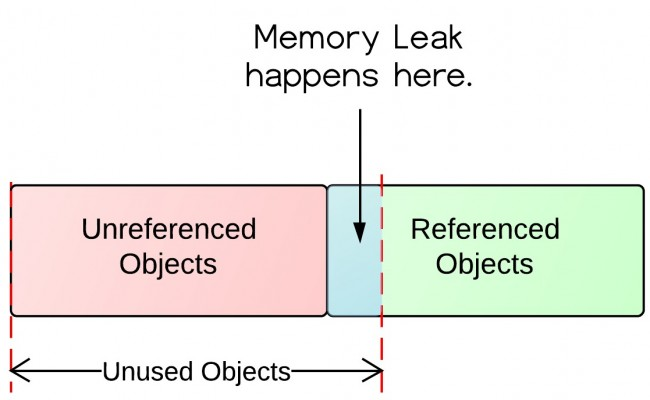

# 内存泄漏和内存溢出

## 概念

内存溢出（out of memory），是指在程序申请内存时，没有足够的内存空间供其使用，出现out of memory。

一个盘子用尽各种方法只能装4个果子，你装了5个，结果掉倒地上不能吃了。这就是溢出。比方说栈，栈满时再做进栈必定产生空间溢出，叫上溢，栈空时再做退栈也产生空间溢出，称为下溢。就是分配的内存不足以放下数据项序列,称为内存溢出。

内存泄漏的定义：对象已经没有被应用程序使用，但是垃圾回收器没办法移除它们，因为还在被引用着。

要想理解这个定义，我们需要先了解一下对象在内存中的状态。下面的这张图就解释了什么是无用对象以及什么是未被引用对象。



上面图中可以看出，里面有被引用对象和未被引用对象。未被引用对象会被垃圾回收器回收，而被引用的对象却不会。未被引用的对象当然是不再被使用的对象，因为没有对象再引用它。然而无用对象却不全是未被引用对象。其中还有被引用的，就是这种情况导致了内存泄漏。

## 分类

以发生的方式来分类，内存泄漏可以分为4类：

1. 常发性内存泄漏。发生内存泄漏的代码会被多次执行到，每次被执行的时候都会导致一块内存泄漏。

2. 偶发性内存泄漏。发生内存泄漏的代码只有在某些特定环境或操作过程下才会发生。常发性和偶发性是相对的。对于特定的环境，偶发性的也许就变成了常发性的。所以测试环境和测试方法对检测内存泄漏至关重要。

3. 一次性内存泄漏。发生内存泄漏的代码只会被执行一次，或者由于算法上的缺陷，导致总会有一块仅且一块内存发生泄漏。比如，在类的构造函数中分配内存，在析构函数中却没有释放该内存，所以内存泄漏只会发生一次。

4. 隐式内存泄漏。程序在运行过程中不停的分配内存，但是直到结束的时候才释放内存。严格的说这里并没有发生内存泄漏，因为最终程序释放了所有申请的内存。但是对于一个服务器程序，需要运行几天，几周甚至几个月，不及时释放内存也可能导致最终耗尽系统的所有内存。所以，我们称这类内存泄漏为隐式内存泄漏。

从用户使用程序的角度来看，内存泄漏本身不会产生什么危害，作为一般的用户，根本感觉不到内存泄漏的存在。真正有危害的是内存泄漏的堆积，这会最终消耗尽系统所有的内存。从这个角度来说，一次性内存泄漏并没有什么危害，因为它不会堆积，而隐式内存泄漏危害性则非常大，因为较之于常发性和偶发性内存泄漏它更难被检测到

一次内存泄露危害可以忽略，但内存泄露堆积后果很严重，无论多少内存，迟早会被占光。

memory leak会最终会导致out of memory！

## 内存溢出的原因以及解决方法

引起内存溢出的原因有很多种，这里列举一下常见的有以下几种：

1. 内存中加载的数据量过于庞大，如一次从数据库取出过多数据；

2. 集合类中有对对象的引用，使用完后未清空，使得JVM不能回收；

3. 代码中存在死循环或循环产生过多重复的对象实体；

4. 使用的第三方软件中的BUG；

5. 启动参数内存值设定的过小

内存溢出的解决方案：

内存溢出的解决方案：

第一步，修改JVM启动参数，直接增加内存。(-Xms，-Xmx参数一定不要忘记加。)

第二步，检查错误日志，查看“OutOfMemory”错误前是否有其它异常或错误。

第三步，对代码进行走查和分析，找出可能发生内存溢出的位置。

重点排查以下几点：

1. 检查对数据库查询中，是否有一次获得全部数据的查询。一般来说，如果一次取十万条记录到内存，就可能引起内存溢出。这个问题比较隐蔽，在上线前，数据库中数据较少，不容易出问题，上线后，数据库中数据多了，一次查询就有可能引起内存溢出。因此对于数据库查询尽量采用分页的方式查询。

2. 检查代码中是否有死循环或递归调用。

3. 检查是否有大循环重复产生新对象实体。

4. 检查对数据库查询中，是否有一次获得全部数据的查询。一般来说，如果一次取十万条记录到内存，就可能引起内存溢出。这个问题比较隐蔽，在上线前，数据库中数据较少，不容易出问题，上线后，数据库中数据多了，一次查询就有可能引起内存溢出。因此对于数据库查询尽量采用分页的方式查询。

## 常见场景

### 1. 静态集合类引起的内存泄漏

使用Set、Vector、HashMap等集合类的时候需要特别注意。当这些类对象被定义成静态的时候，由于他们的生命周期跟应用程序一样长，它们所引用的所有的对象Object也不能被释放，因为他们也将一直被集合引用着，这时候就有可能发生内存泄漏。

```java
class StaticTest {
    private static Vector v = new Vector(10);
    public void init() {
        for (int i = 1; i < 100; i++) {
            Object object = new Object(); v.add(object);
            object = null;
        } 
    }
}
```

在上面的代码中，循环申请了Object对象，并添加到Vector中，然后设置为null，可是这些对象呗vector引用着，因此必能 被GC回收，因此造成内存泄漏。因此要释放这些对象，还需要将它们从vector删除，最简单的方法就是将vector设置为null。

### 2. 集合里面的对象属性被修改，再调用remove()方法不生效

存在这样一种场景，我修改了HashMap中一个Key的属性，这个属性的改变会影响该Key的hashCode值，当你修改后再调用HashMap的remove()方法，就不会再找到之前的那个Key，并不会删除。

### 3. 各种连接

比如数据库连接（dataSourse.getConnection()），网络连接(socket)和io连接，除非其显式的调用了其close（）方法将其连接关闭，否则是不会自动被GC 回收的。对于Resultset和Statement对象可以不进行显式回收，但Connection 一定要显式回收，因为Connection 在任何时候都无法自动回收，而Connection一旦回收，Resultset 和Statement 对象就会立即为NULL。但是如果使用连接池，情况就不一样了，除了要显式地关闭连接，还必须显式地关闭Resultset和Statement对象（关闭其中一个，另外一个也会关闭），否则就会造成大量的Statement 对象无法释放，从而引起内存泄漏。这种情况下一般都会在try里面去的连接，在finally里面释放连接。

### 4. 监听器

在Java编程中，我们都需要和监听器打交道，通常一个应用当中会用到很多监听器，我们会调用一个控件的诸如addXXXListener()等方法来增加监听器，但往往在释放对象的时候却没有记住去删除这些监听器，从而增加了内存泄漏的机会。

### 5. 内部类和外部模块的引用

内部类的引用是比较容易遗忘的一种，而且一旦没释放可能导致一系列的后继类对象没有释放。此外程序员还要小心外部模块不经意的引用，例如程序员A 负责A 模块，调用了B 模块的一个方法如： public void registerMsg(Object b); 这种调用就要非常小心了，传入了一个对象，很可能模块B就保持了对该对象的引用，这时候就需要注意模块B 是否提供相应的操作去除引用。

### 6. 单例模式

不正确使用单例模式是引起内存泄漏的一个常见问题，单例对象在初始化后将在JVM的整个生命周期中存在（以静态变量的方式），如果单例对象持有外部的引用，那么这个对象将不能被JVM正常回收，导致内存泄漏，考虑下面的例子：

显然B采用singleton模式，它持有一个A对象的引用，而这个A类的对象将不能被回收。想象下如果A是个比较复杂的对象或者集合类型会发生什么情况。

