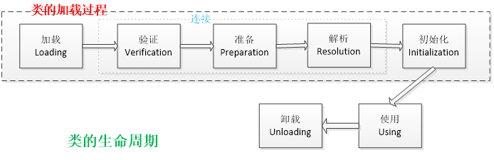
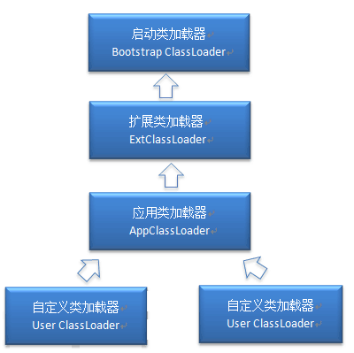

# Java类加载过程

1. 类加载机制

2. 内存管理模型

3. GC（垃圾回收机制）

4. GC分析 命令调优

## 概念

**类的加载是指将类的.class文件中的二进制数据读入到内存中，将其放在运行时数据区的方法区内，然后在堆区创建一个`java.lang.Class` 对象，用来封装类在方法区内的数据结构。**类的加载最终产品是位于堆区中的 `class` 对象，该对象封装了类在方法区内的数据结构，并且向Java程序员提供了访问方法区的数据结构的接口。

ClassLoader的主要职责就是负责加载各种 class 文件到 JVM 中，ClassLoader是一个抽象的class，给定一个class 的二进制文件名，ClassLoader会尝试加载并且在JVM中生成构成这个类的数据结构，然后使其分布在JVM对应的内存区域中。

类加载器并不需要等到某个类被“首次主动使用”时再加载它，JVM规范允许类加载器在预料某个类将要被使用时就预先加载它，如果在预先加载的过程中遇到了 .class 文件缺失或者存在错误，类加载器必须在程序首次主动使用该类时才报告错误（LinkageError）如果这个类一直没有被程序主动使用，那么类加载器就不会报告错误。

#### 加载 .class 文件的方式

- 从本地系统中直接加载

- 通过网络下载 .class 文件

- 从 zip， jar等归档文件中加载 .class 文件

- 从专有数据库中提取 .class 文件

- 将Java源文件动态编译为 .class文件

## 类的生命周期



上图描述了一个Java类的生命周期，图的上半部分就是类的加载过程。这里我们主要讲述类的加载过程

#### 加载

查找并加载类的二进制数据文件，其实就是 `.class` 文件。加载是类加载过程的第一个阶段，在加载阶段，虚拟机需要完成以下三件事情：

- 通过一个类的全限定名来获取其定义的二进制字节流。

- 将这个字节流所代表的静态存储结构转化为方法区的运行时数据结构。

- 在Java堆中生成一个代表这个类的`java.lang.Class`对象，作为对方法区中这些数据的访问入口。

相对于类加载的其他阶段而言，加载阶段（准确地说，是加载阶段获取类的二进制字节流的动作）是可控性最强的阶段，因为开发人员既可以使用系统提供的类加载器来完成加载，也可以自定义自己的类加载器来完成加载。

加载阶段完成后，虚拟机外部的二进制字节流就按照虚拟机所需的格式存储在方法区之中，而且在Java堆中也创建一个`java.lang.Class`类的对象，这样便可以通过该对象访问方法区中的这些数据。

#### 连接

##### 验证：确保被加载的类的正确性

验证是连接阶段的第一步，这一阶段的目的是为了确保Class文件的字节流中包含的信息符合当前虚拟机的要求，并且不会危害虚拟机自身的安全。验证阶段大致会完成4个阶段的检验动作：

- 文件格式验证：验证字节流是否符合Class文件格式的规范；例如：是否以0xCAFEBABE开头、主次版本号是否在当前虚拟机的处理范围之内、常量池中的常量是否有不被支持的类型。

- 元数据验证：对字节码描述的信息进行语义分析（注意：对比javac编译阶段的语义分析），以保证其描述的信息符合Java语言规范的要求；例如：这个类是否有父类，除了java.lang.Object之外。

- 字节码验证：通过数据流和控制流分析，确定程序语义是合法的、符合逻辑的。

- 符号引用验证：确保解析动作能正确执行。

验证阶段是非常重要的，但不是必须的，它对程序运行期没有影响，如果所引用的类经过反复验证，那么可以考虑采用-Xverifynone参数来关闭大部分的类验证措施，以缩短虚拟机类加载的时间。

##### 准备：为类的静态变量分配内存，并将其初始化为默认值

准备阶段是正式为类变量分配内存并设置类变量初始值的阶段，这些内存都将在**方法区**中分配。对于该阶段有以下几点需要注意：

1. 这时候进行内存分配仅包括类变量（static），而不包括实例变量，实例变量会在对象实例化时随着对象一块分配在Java堆中。

2. 这里所设置的初始值通常情况下是数据类型默认的零值（如0、0L、null、false等），而不是被在Java代码中被显式地赋予的值。

    | 数据类型 | 默认零值 |
    |--------|--------|
    | int | 0 |
    | long | 0L |
    | short | (short)0 |
    | char | '\u0000' |
    | byte | (byte)0 |
    | float | 0.0f |
    | double | 0.0 |
    | reference | null |

    假设一个类变量定义为：`public static int value=3;`

    那么变量value在准备阶段过后的初始值为0，而不是3，因为这时候尚未开始执行任何Java代码，而把value赋值为3的指令是在程序编译后，存放于类构造器 `<clinit>()` 方法之中的，所以把value赋值为3的动作将在初始化阶段才会执行。

    > 这里还需要注意如下几点：

    > 对基本数据类型来说，对于类变量（static）和全局变量，如果不显式地对其赋值而直接使用，则系统会为其赋予默认的零值，而对于局部变量来说，在使用前必须显式地为其赋值，否则编译时不通过。

    > 对于同时被static和final修饰的常量，必须在声明的时候就为其显式地赋值，否则编译时不通过；而只被final修饰的常量则既可以在声明时显式地为其赋值，也可以在类初始化时显式地为其赋值，总之，在使用前必须为其显式地赋值，系统不会为其赋予默认零值。

    > 对于引用数据类型reference来说，如数组引用、对象引用等，如果没有对其进行显式地赋值而直接使用，系统都会为其赋予默认的零值，即null。

    > 如果在数组初始化时没有对数组中的各元素赋值，那么其中的元素将根据对应的数据类型而被赋予默认的零值。

3. 如果类字段的字段属性表中存在ConstantValue属性，即同时被final和static修饰，那么在准备阶段变量value就会被初始化为ConstValue属性所指定的值。

    假设上面的类变量value被定义为： public static final int value = 3；

    **编译时**Javac将会为value生成ConstantValue属性，在准备阶段虚拟机就会根据ConstantValue的设置将value赋值为3。我们可以理解为static final常量在**编译期**就将其结果放入了调用它的类的常量池中，（编译时期要先于准备阶段）。

##### 解析：把类中的符号引用转换为直接引用

解析阶段是虚拟机将**常量池**内的符号引用替换为直接引用的过程，解析动作主要针对类或接口、字段、类方法、接口方法、方法类型、方法句柄和调用点限定符7类符号引用进行。符号引用就是一组符号来描述目标，可以是任何字面量。

直接引用就是直接指向目标的指针、相对偏移量或一个间接定位到目标的句柄。

#### 初始化

初始化，为类的静态变量赋予正确的初始值，JVM负责对类进行初始化，主要对类变量进行初始化，到了这一步，才是真正的执行Java程序代码。在准备阶段，类变量已经被赋过一次系统默认的的初始值，而在初始化阶段，则是根据程序员通过程序指定的主观计划去初始化类变量和其他资源，或者可以从另一个角度来表达：<font color="red">**初始化阶段是执行类构造器 `<clinit>()` 方法的过程**</font>。下面解释先一下类构造器：

- 类构造器 `<clinit>()` 方法是**由编译器自动收集类中的所有类变量的赋值动作和静态语句块中的语句合并产生的**，编译器收集的顺序是由语句在源文件中**出现的顺序**所决定的，**静态语句块中只能访问到定义在静态语句块之前的静态变量，定义在它之后的静态变量，在前面的静态语句中可以赋值，但是不能访问，而且静态语句块还不能访问和修改非静态的变量**。

	例如，下面程序将会编译不通过（只能赋值，不能访问）：

    ```java
	static {
		System.out.println(value);
	}

	public static int value = 123;
    ```

- 类构造器 `<clinit>()` 方法与实例构造器()方法（类的构造函数）不同，它不需要显式地调用父类构造器，虚拟机会保证在子类的类构造器()方法执行之前，父类的类构造器()方法已经执行完毕。因此，在虚拟机中第一个被执行的类构造器 `<clinit>()` 方法的类肯定是java.lang.Object。

- 类构造器 `<clinit>()` 方法对于类或接口来说并不是必须的，如果一个类中没有静态语句块，也没有对类变量的赋值操作，那么编译器可以不为这个类生成 `<clinit>()` 方法。

- 接口中不能使用静态语句块，但仍然有类变量（static final）初始化的赋值操作，因此接口与类一样会可以生成类构造器 `<clinit>()` 方法。但是接口与类不同的是：执行接口的 `<clinit>()` 方法不需要先执行父接口的 `<clinit>()` 方法，只有当父接口中定义的变量被使用时，父接口才会被初始化。另外，接口的实现类在初始化时也一样不会执行接口的类构造器 `<clinit>()` 方法。

- 虚拟机会保证一个类的类构造器 `<clinit>()` 方法在多线程环境中被正确地加锁和同步，如果多个线程同时去初始化一个类，那么只会有一个线程去执行这个类的 `<clinit>()` 方法，其他线程都需要阻塞等待，直到活动线程执行 `<clinit>()` 方法完毕。如果在一个类的类构造器 `<clinit>()` 方法中有耗时很长的操作，那就可能造成多个线程阻塞，在实际应用中这种阻塞往往是很隐蔽的。

好了，回到初始化这个阶段上来，在Java中对类变量进行初始值设定有两种方式：

- 声明类变量时指定初始值
- 使用静态代码块为类变量指定初始值（使用static限定的代码块）

JVM初始化步骤

- 假如这个类还没有被加载和连接，则程序先加载并连接该类
- 假如该类的直接父类还没有被初始化，则先初始化其直接父类
- 假如类中有初始化语句，则系统依次执行这些初始化语句

类初始化时机：只有当对类的主动使用的时候才会导致类的初始化，类的主动使用包括以下六种：

- 创建类的实例，也就是new的方式
- 访问某个类或接口的静态变量，或者对该静态变量赋值
- 调用类的静态方法
- 反射加载类或实例化（如Class.forName(“com.li.Test”)等）
- 初始化某个类的子类，则其父类也会被初始化
- Java虚拟机启动时被标明为启动类的类（Java Test），直接使用java.exe命令来运行某个主类

下面给出一个简单的例子，以便更清晰地说明如上规则：

```java
class SSClass {
	static {
		System.out.println("SSClass");
	}
}

class SuperClass extends SSClass {
	static {
		System.out.println("SuperClass init!");
	}

	public static int value = 123;

	public SuperClass() {
		System.out.println("init SuperClass");
	}
}

class SubClass extends SuperClass {
	static {
		System.out.println("SubClass init");
	}

	static int a;

	public SubClass() {
		System.out.println("init SubClass");
	}
}

public class Test {

	public static void main(String[] args) {
		System.out.println(SubClass.value);
	}
}
```

运行结果如下：

```
SSClass
SuperClass init!
123
```

我们可以分析一下：因为访问的 value 实际上是 SuperClass 类中的静态变量，所以导致 SuperClass 初始化，但是在这之前，得先初始化其直接父类，这就完好解释了我们的运行结果，并不会像我们想象中的会输出 SubClass init。

结束生命周期

在如下几种情况下，Java虚拟机将结束生命周期

- 执行了System.exit()方法
- 程序正常执行结束
- 程序在执行过程中遇到了异常或错误而异常终止
- 由于操作系统出现错误而导致Java虚拟机进程终止

给出一个有趣的程序：

```java
package com.general;

public class Test {

	public static void main(String[] args)
    {
        staticFunction();
    }

    static Test st = new Test();

    /*静态语句块*/
    static
    {
        System.out.println("1");
    }

    /*非静态语句块，属于类对象，只有在类实例化时才执行*/
    {
        System.out.println("2");
    }

    Test()
    {
        System.out.println("3");
        System.out.println("a="+a+",b="+b);
    }

    public static void staticFunction(){
        System.out.println("4");
    }

    int a=110;
    static int b =112;
}

```

输出结果：

```language
2
3
a=110,b=0
1
4
```

输出结果是不是和你推的一样呢？那么一起来分析一下吧。类的生命周期是：加载->验证->准备->解析->初始化->使用->卸载，只有在准备阶段和初始化阶段才会涉及类变量的初始化和赋值，因此只针对这两个阶段进行分析；

类的准备阶段需要做是为类变量分配内存并设置默认值，因此类变量st为null、b为0（需要注意的是如果类变量是final，编译时javac将会为value生成ConstantValue属性，在准备阶段虚拟机就会根据ConstantValue的设置将变量设置为指定的值，如果这里这么定义：static final int b=112,那么在准备阶段b的值就是112，而不再是0了。）

类的初始化阶段需要做的就是是执行类构造器，类构造器是编译器收集所有静态语句块和类变量的赋值语句按语句在源码中的顺序合并生成类构造器。（对象的构造方法是 `<init>()` ，类的构造方法是 `<clinit>()`，可以在堆栈信息中看到），因此先执行第一条静态变量的赋值语句即st = new StaticTest ()，此时会进行对象的初始化，对象的初始化是先初始化成员变量再执行构造方法，因此设置a为110->打印2->执行构造方法(打印3,此时a已经赋值为110，但是b只是设置了默认值0，并未完成赋值动作，因为还未执行到此位置)，等对象的初始化完成后继续执行之前的类构造器的语句，接下来就不详细说了，按照语句在源码中的顺序执行即可。

## 类的主动使用和被动使用

JVM虚拟机规范规定类，每个类或者接口被Java程序首次主动使用时才会对其进行初始化，当然随着 JTI 技术越来越成熟，JVM运行期间的编译也越来越智能，不排除JVM在运行期间提前预判并且初始化某个类。

JVM同时规范了一下6种主动使用类的场景，具体如下。

## <font color="red">类加载器</font>

寻找类加载器的一个小例子：

```java
public class ClassLoaderTest {
     public static void main(String[] args) {
        ClassLoader loader = Thread.currentThread().getContextClassLoader();
        System.out.println(loader);
        System.out.println(loader.getParent());
        System.out.println(loader.getParent().getParent());
    }
}
```

运行输出结果：

```
sun.misc.Launcher$AppClassLoader@64fef26a
sun.misc.Launcher$ExtClassLoader@1ddd40f3
null
```

从上面的结果可以看出，并没有获得`ExtClassLoader`的父Loader，原因是 `Bootstrap Loader` （引导类加载器）是用C语言实现的。找不到一个确定的返回父Loader的方式，就返回一个null。

这几个类加载器的层次关系如下：



> 这里的父类加载器并不是通过继承关系来实现的，而是采用组合实现的

站在Java虚拟机的角度讲，存在两种不同的类加载器：一是启动类加载器，它是用C++实现的（这里仅限于HotSpot，也就是JDK1.5之后默认的加载器，有许多其他的加载器是用Java实现的），是虚拟机自身的一部分；二是所有其他类加载器：这些类加载器都是用Java实现的，独立于虚拟机之外，并且全部继承自抽象类 `java.lang.ClassLoader`，这些类加载器需要由启动类加载器将其加载到内存中之后才能加载其他类。

站在Java开发人员的角度来看，类加载器可以大致划分为以下三类：

- 启动类加载器：`Bootstrap ClassLoader`，负责加载存放在`JDK\jre\lib`(JDK代表JDK的安装目录，下同)下，或被-Xbootclasspath参数指定的路径中的，并且能被虚拟机识别的类库（如rt.jar，所有的`java.`开头的类均被Bootstrap ClassLoader加载）。启动类加载器是无法被Java程序直接引用的。

- 扩展类加载器：`Extension ClassLoader`，该加载器由`sun.misc.Launcher$ExtClassLoader`实现，它负责加载`JDK\jre\lib\ext`目录中，或者由java.ext.dirs系统变量指定的路径中的所有类库（如javax.开头的类），开发者可以直接使用扩展类加载器。

- 应用程序类加载器：`Application ClassLoader`，该类加载器由`sun.misc.Launcher$AppClassLoader`来实现，它负责加载用户类路径（ClassPath）所指定的类，开发者可以直接使用该类加载器，如果应用程序中没有自定义过自己的类加载器，一般情况下这个就是程序中默认的类加载器。

应用程序都是由这三种类加载器互相配合进行加载的，如果有必要，我们还可以加入自定义的类加载器。因为JVM自带的ClassLoader只是懂得从本地文件系统加载标准的java class文件，因此如果编写了自己的ClassLoader，便可以做到如下几点：

- 在执行非置信代码之前，自动验证数字签名。

- 动态地创建符合用户特定需要的定制化构建类。

- 从特定的场所取得java class，例如数据库中和网络中。
