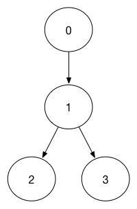

# 接口幂等性

## 1. 背景

现如今我们的系统大多拆分为分布式SOA，或者微服务，一套系统中包含了多个子系统服务，而一个子系统服务往往会去调用另一个服务，而服务调用服务无非就是使用 RPC 通信或者 Restful。既然是通信，那么就有可能在服务器处理完毕后返回结果的时候挂掉，这个时候用户端发现很久没有反应，那么就会多次点击按钮，这样请求有多次，那么处理数据的结果是否要统一呢？那是肯定的！尤其在支付场景。

我们实际系统中有很多操作，要求不管做多少次，都应该产生一样的效果或返回一样的结果。

例如：

1. 前端重复提交选中的数据，应该后台只产生对应这个数据的一个反应结果；
2. 我们发起一笔付款请求，应该只扣用户账户一次钱，当遇到网络问题重试或系统bug重发，也应该只扣一次钱；
3. 发送消息，也应该只发一次，同样的短信发给用户，用户会哭的；
4. 创建业务订单，一次业务请求只能创建一个，创建多个就会出大问题。

等等很多重要的情况，这些逻辑都需要幂等的特性来支持。

## 2. 幂等性概念

幂等（idempotent、idempotence）是一个数学与计算机学概念，常见于抽象代数中。

在编程中.一个幂等操作的特点是其任意多次执行所产生的影响均与一次执行的影响相同。幂等函数，或幂等方法，是指可以使用相同参数重复执行，并能获得相同结果的函数。

这些函数不会影响系统状态，也不用担心重复执行会对系统造成改变。例如，`getUsername()` 和 `setTrue()` 函数就是一个幂等函数。

举个最简单的例子，那就是支付，用户购买商品后支付，支付扣款成功，但是返回结果的时候网络异常，此时钱已经扣了，用户再次点击按钮，此时会进行第二次扣款，返回结果成功，用户查询余额返发现多扣钱了，流水记录也变成了两条，这就没有保证接口的幂等性。

更复杂的操作幂等保证是利用唯一交易号(流水号)实现.

## 3. 什么情况下需要保证接口的幂等性

在增删改查这四种操作中，尤为要注意增加和修改这两种操作接口的幂等性。

1. 查询

   查询对于结果是不会有改变的，查询一次和查询多次，在数据不变的情况下，查询结果是一样的。查询是天然的幂等操作。

2. 删除

    删除一次和多次删除都是把数据删除。可能返回结果不一样，删除的数据不存在，返回0，删除的数据多条，返回结果多个，在不考虑返回结果的情况下，删除操作也是具有幂等性的。

3. 更新

   修改在大多场景下结果一样，但是如果是增量修改，那就需要保证幂等性的，如下例子：

   - 把表中id为XXX的记录的A字段值设置为1，这种操作不管执行多少次都是幂等的
   - 把表中id为XXX的记录的A字段值增加1，这种操作就不是幂等的

   所以，更新操作的是否幂等也要视情况而定。

4. 新增

    增加在重复提交的场景下会出现幂等性问题，如以上的支付问题。

## 4. 技术方案

### 4.1. 代码逻辑判断

通过代码逻辑判断来实现。这种实现方式其实就是 select + insert 组合。

对于一些并发不高的后台系统，或者一些任务JOB，为了支持幂等，支持重复执行，可以采取的这种简单处理方法，先根据一些关键数据到表中查询记录，以此来判断是否已经执行过，判断后再进行业务处理就可以了。

要注意的是，核心高并发流程不要用这种方法，因为要查询一遍数据（你想想为什么要会把数据放到Redis中），性能太低了。

例如：在用户购买商品的订单系统与支付系统中，支付系统已经扣款，但是订单系统因为网络原因，没有获取到确切的结果，因此订单系统需要重试。
这个时候支付系统需要支持幂等性，那么支付接口可以接受一个 orderId 字段来标定订单的唯一性，付款系统只要检测到订单已经支付过，则第二次调用不会扣款而会直接返回结果。

### 4.2. 状态机幂等

在设计单据相关的业务，或者是任务相关的业务，肯定会涉及到状态机(状态变更图)，就是业务单据上面有个状态，状态在不同的情况下会发生变更，一般情况下存在有限状态机

如果状态机已经处于下一个状态，这时候来了一个上一个状态的变更，理论上是不能够变更的，这样的话，保证了有限状态机的幂等。

注意：订单等单据类业务，存在很长的状态流转，一定要深刻理解状态机，对业务系统设计能力提高有很大帮助。

示例：在上面中提到的订单系统，订单具有自己的状态（orderStatus)，订单状态存在一定的流转。订单首先有提交（0），付款中（1），付款成功（2），付款失败（3），简化之后其流转路径如图：



当orderStatus = 1 时，其前置状态只能是0，也就是说将 orderStatus 由 0 变为 1 是需要幂等性的。

```sql
update Order set orderStatus = 1 where OrderId = 'orderid' and orderStatus = 0
```

当 orderStatus 处于 0 或 1 两种状态时，对订单执行 0->1 的状态流转操作应该是具有幂等性的。这时候需要在执行 update 操作之前检测 orderStatus 是否已经等于1，如果已经等于 1 则直接返回true即可。

但是如果此时 orderStatus = 2，再进行订单状态 0->1 时操作就无法成功，但是幂等性是针对同一个请求的，也就是针对同一个 requestid 保持幂等。

```sql
update Order set orderStatus = 1 where OrderId = 'orderid' and orderStatus = 0
```

### 4.3. Token机制

使用token机制来实现接口幂等性，是一种通用性强的实现方法。

token机制步骤：

1. 生成全局唯一的token，token放到redis或jvm内存，token会在页面跳转时获取，存放到pageScope中，支付请求提交先获取token
2. 提交后后台校验token，执行提交逻辑，提交成功同时删除token，生成新的token更新redis ，这样当第一次提交后token更新了，页面再次提交携带的token是已删除的token后台验证会失败不让提交

token的特点：要申请，一次有效性，可以限流

注意： redis要用删除操作来判断token，删除成功代表token校验通过，如果用select+delete来校验token，存在并发问题，不建议使用。